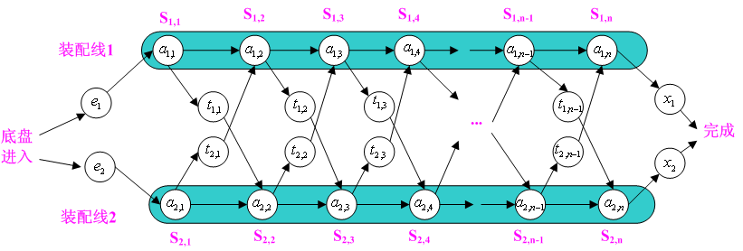
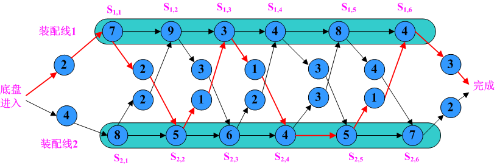

# Dynamic Programming （动态规划）

参考：

博客园 http://www.cnblogs.com/Anker/archive/2013/03/15/2961725.html

适合于求解多阶段决策问题的最优解

常见的有以下几类问题：
- 装配站问题
- 背包问题
- 最长公共子序列问题

## 装配站问题

问题描述：

　一个汽车公司在有2条装配线的工厂内生产汽车，每条装配线有n个装配站，不同装配线上对应的装配站执行的功能相同，   
但是每个站执行的时间是不同的。在装配汽车时，为了提高速度，可以在这两天装配线上的装配站中做出选择，即可以将部   
分完成的汽车在任何装配站上从一条装配线移到另一条装配线上。装配过程如下图所示：



装配过程的时间包括：进入装配线时间e、每装配线上各个装配站执行时间a、从一条装配线移到另外一条装配线的时间t  
离开最后一个装配站时间x。举个例子来说明，现在有2条装配线，每条装配线上有6个装配站，各个时间如下图所示：  
  

从图中可以看出按照红色箭头方向进行装配汽车最快，时间为38。分别现在装配线1上的装配站1、3和6，装配线2上装配站2、4和5。

### 分析  
- 最小子问题与状态：求到第几个站的最短时间 f\[0]\[i],f\[1]\[i]
- 状态转换方程：f\[0]\[i] = min{f\[0]\[i-1]+a\[0]\[j],f\[1]\[i-1]+t\[1]\[i-1]+a\[0]\[i]},f\[2]\[i]同理
- 边界条件：f\[0]\[0],f\[1]\[0]，这个可以根据状态转换方程加以确定


### 代码实现
```
#include<iostream>

using namespace std;

const int a[2][6] = {{7,9,3,4,8,4},{8,5,6,4,5,7}};
const int t[2][5] = {{2,3,1,3,4},{2,1,2,2,1}};
const int e[2] = {2,4};
const int x[2] = {3,2};
int f[2][6];
int l[2][6];
int fs,ls;

void dp() {
    f[0][0] = e[0]+a[0][0];
    f[1][0] = e[1]+a[1][0];
    for(int j=1;j<6;j++) {
        if(f[0][j-1] + a[0][j] <= f[1][j-1] + t[1][j-1] + a[0][j]) {
            f[0][j] = f[0][j-1] + a[0][j];
            l[0][j] = 0;
        } 
        else {
            f[0][j] = f[1][j-1] + t[1][j-1] + a[0][j];
            l[0][j] = 1;
        }
        if(f[1][j-1] + a[1][j] <= f[0][j-1] + t[0][j-1] + a[1][j]) {
            f[1][j] = f[1][j-1] + a[1][j];
            l[1][j] = 1;
        }
        else {
            f[1][j] = f[0][j-1] + t[0][j-1] + a[1][j];
            l[1][j] = 0;
        }  
    }
    if(f[0][5]+x[0] <= f[1][5]+x[1]) {
        fs = f[0][5]+x[0];
        ls = 0;
    }
    else {
        fs = f[1][5]+x[1];
        ls =1;
    }

}
void print_station(int r,int i) {
    r = l[r][i];
    if(i == 1) {
        cout<<"装配站："<<l[r][i]<<endl;
    }
    else {
        print_station(r,i-1);
        cout<<"装配站："<<r<<endl;
    }

}

int main() {
    dp();
    int r;
    cout<<"最短时间为"<<fs<<endl;
    cout<<"装配站："<<ls<<endl;
    r = ls;
    for(int j=5;j>0;j--) {
        cout<<"装配站："<<l[r][j]<<endl;
        r = l[r][j];
    }
    cout<<"reverse output!"<<endl;
    print_station(ls,5);
    cout<<"装配站："<<ls<<endl;
    return 0;
}
```

