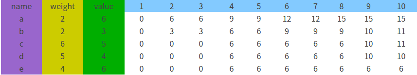

# Dynamic Programming （动态规划）


## 背包问题（0-1背包问题）

### 问题描述  
```
小偷发现了n个商品，第i个商品重量为wi,价值为vi。小偷希望尽量拿走价值高的商品，但是他的背包只能容纳W重的商品。  
求如何取舍这些商品？   
由于对一个商品，要么被拿走要么不被拿走，所以被称为0-1背包问题
```
### 分析
- 最小子问题：拿到第i-1个商品是最优的，这个怎么考虑呢？（即在容量为**w-vi**的背包里，这里其实是错的），拿到第i-1个商品时，此时达到最优情况
- 状态：由以上分析，状态参数应该至少有2个，g\[i]\[v]代表在v的容量下，第i次是最优的，g当然代表v之和啦
- **第i次该如何选取呢？**这个不像装配站问题，有前面确定的路可走，这里考虑**拿与不拿**,什么意思？拿，g\[i-1]\[W-Wi]最优；不拿，g\[i-1]\[W]最优；
- 状态转换方程：**g\[i]\[v] = max{g\[i-1]\[W],g\[i-1]\[W-Wi]+vi}** 为什么会有拿与不拿呢？当然是背包总容量限制啦
- 边界条件：g\[0]\[0] = 0 肯定是最优的

### 题目引用 
```
有编号分别为a,b,c,d,e的五件物品，它们的重量分别是2,2,6,5,4，它们的价值分别是6,3,5,4,6，现在给你个承重为10的背包，如何让背包里装入的物品具有最  
的价值总和
```


### 代码实现
```
#include<iostream>

using namespace std;


const int w[6]={0,2,2,6,5,4};//商品重量 第一数值为0，为了方便编程
const int v[6]={0,6,3,5,4,6};//商品价值 第一数值为0，为了方便编程
const int W = 10; //背包容量
int c[6][11] = {0};//c[i][j]表示在商品1到i中，背包容量为j时，最大价值
int l[6]={0};

void dp_package() {
    for(int i=1;i<=W;i++)               //i 代表此时背包容量
        for(int j=1;j<6;j++) {          //j 代表第j个背包
            if(i>=w[j]) {
                if(c[j-1][i] < c[j-1][i-w[j]] + v[j]) {
                    c[j][i] = c[j-1][i-w[j]] + v[j];        //此时为拿第i个商品的情况
                    
                }
                else {
                    c[j][i] = c[j-1][W];                    //此时为不拿第i个商品的情况
    
                } 
            }
            else {
                c[j][i] = c[j-1][i];                         
            }           
        }
}

int main () {
    dp_package();
    cout<<c[5][10]<<endl;
    return 0;
}
```
### 总述
第一遍看这个算法，没看明白！后来看到这个http://blog.csdn.net/mu399/article/details/7722810#reply 才有点头绪；  
- 从容量为1-W递归考虑，这个是由于每次我们需要的是试探i-Wi时的最优情况，因此不得不从头考虑  

### 部分背包问题  
部分背包问题的意思是商品可以拿去部分，这样就可以用**贪心算法**做了，每次寻求**商品价值/商品重量**最大的加入到背包中


## 最大公共子序列问题(LCS:Longest Common Sequence)

### 问题描述
- 公共子序列：两个序列中公共的子序列，如:"1A2C3D4B56"与"B1D23CA45B6A" 的公共子序列有 123456 或者其它
- 最长公共子序列即最长的：上题中，LCS即”123456“与"12C4B6"

### 题目
给定两个字符串str1和str2，返回两个字符串的最长公共子序列

### 分析
```
LCS的最优子结构定理：设X={x1，x2，……，xm}和Y={y1，y2，……，yn}为两个序列，并设Z={z1、z2、……，zk}为X和Y的任意一个LCS，则：
（1）如果xm=yn，那么zk=xm=yn，而且Zk-1是Xm-1和Yn-1的一个LCS。
（2）如果xm≠yn，那么zk≠xm蕴含Z是是Xm-1和Yn的一个LCS。
（3）如果xm≠yn，那么zk≠yn蕴含Z是是Xm和Yn-1的一个LCS。
定理说明两个序列的一个LCS也包含两个序列的前缀的一个LCS，即LCS问题具有最优子结构性质。
```
状态转换方程与边界条件：
```
          |- 0; i,j=0
c[i][j]-- |- c[i-1][j-1]+1; i,j>0,Xi=Yj
          |- max{c[i-1][j],c[i][j-1]};i,j>0,Xi!=Yj

```
如何求得该LCS呢？贴出一段伪码
```
PRINT_LCS(b,X,i,j)
    if i==0 or j==0
        then return
    if b[i][j] == '\'
        then PRINT_LCS(b,X,i-1,j-1)
             print X[i]
     else if b[i][j] == '|'
                then PRINT_LCS(b,X,i-1,j)
             else PRINT_LSC(b,X,i,j-1)
```
这里分析了一下思想就是在一路走来的路上留下痕迹，最后便于通过递归来寻迹，不过这样开销太大了

### 代码实现


