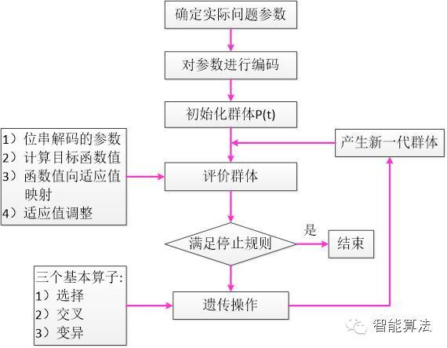
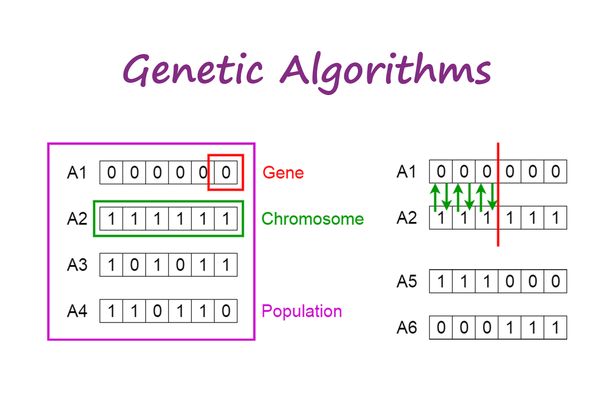
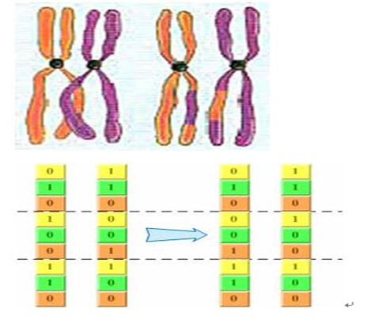
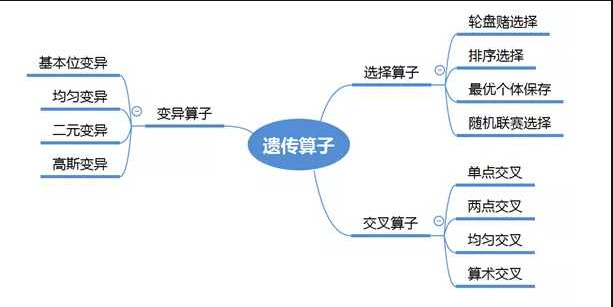

# 优化问题（一）遗传算法

> 遗传算法（Genetic Algorithm, GA）起源于对生物系统所进行的计算机模拟研究。它是模仿自然界生物进化机制发展起来的随机全局搜索和优化方法，借鉴了达尔文的进化论和孟德尔的遗传学说。其本质是一种高效、并行、全局搜索的方法，能在搜索过程中自动获取和积累有关搜索空间的知识，并自适应地控制搜索过程以求得最佳解。

## 简介

**遗传算法是以面为单位的搜索，比以点为单位的搜索，更能发现全局最优解。**

## 验证函数

$$f(x)=xsin(10\pi x)+2$$

## 遗传算法的几个重要步骤

### 1. 基因的编码

编码的主要目的是为后期的遗传变异建立基础。

1.1 基因的编码方式

- 二进制编码
- 浮点数编码

在我们常用的问题中，基因型--编码；表现型--坐标；我们只需要在相应的坐标精度下使用一种编码表方式将坐标编码出来。

### 2. 适应性评价与选择函数

这里是对个体的评价和选择的过程，也是对搜索空间的修剪。

2.1 适应度函数（fitness function）--- 目标函数

适应度函数即是衡量该基因型的个体对环境的适应度评估标准。它是我们作为选择函数选择的依据。我们可以很明显地以**目标函数**作为我们的适应度函数

2.2 选择函数（selection）

*为什么这里会出现选择函数而不是直接对适应度最高的函数进行选择呢？*

模拟生物界的遗传进化规律，并不是所有的优良个体都会被保存，也不是所有的劣势个体都会被淘汰。

常用方法：

- 轮盘赌（Roulette Wheel Selection）
  
*转盘游戏*

### 3. 基因重组与基因突变

这部分是对搜索空间的扩大，通过对个体进行变异从而得到更多基因型和表现型的个体，这部分会有大量的随机操作

3.1 基因重组

通过对两个基因的编码进行部分替换得到

3.2 基因突变

对单个个体的基因型进行改变

- 二进制的编码： `0` 与 `1` 之间的互换
- 浮点数的编码：对浮点数增加/减少一个随机数

### 4. 遗传算子总结

## 参考

- [遗传算法详解](https://blog.csdn.net/u010451580/article/details/51178225)
- [遗传算法python实现](https://blog.csdn.net/zzzzjh/article/details/80633573)