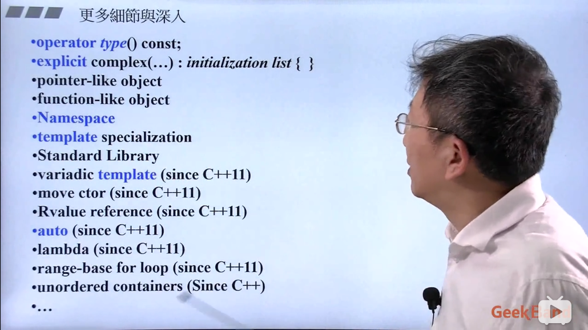
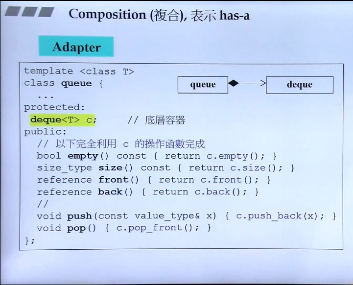
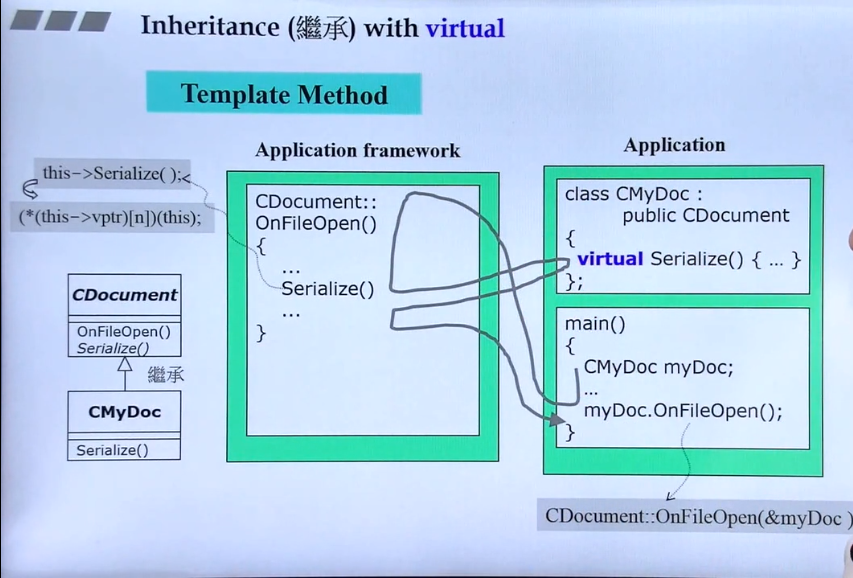
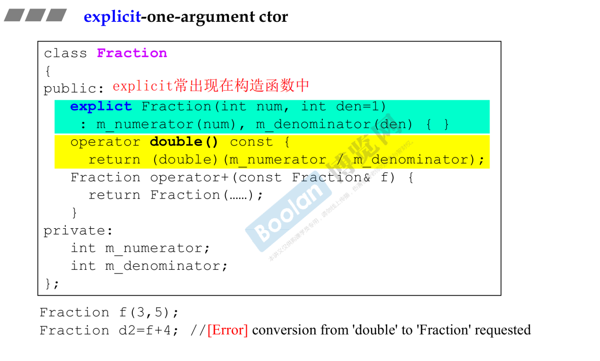
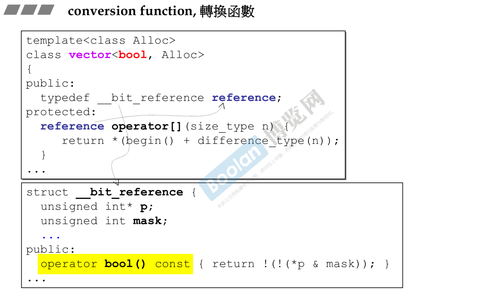
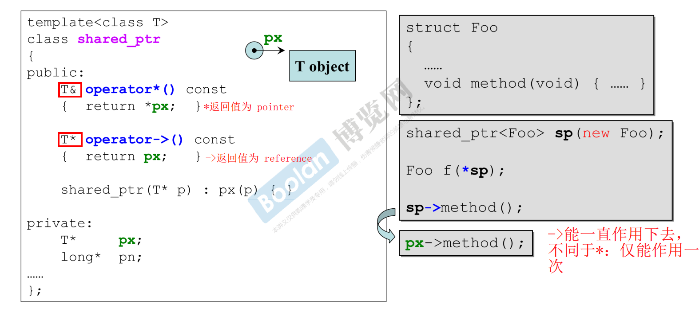
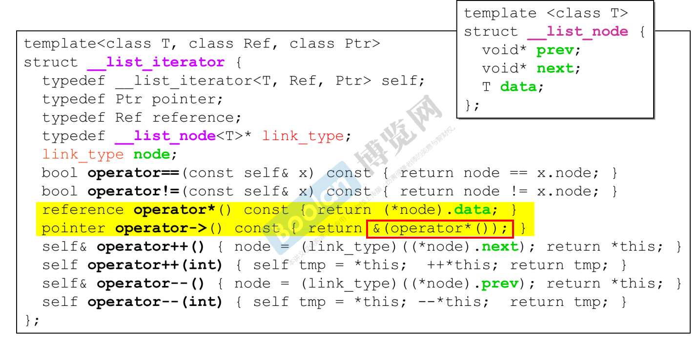

# C++ 程序设计要点

## 几个比较成熟的设计准则

- 多使用 `initialization list`

```c++
complex (double r = 0, double i = 0)
    : re(r), im(i)
    {}
```

- 注意成员函数能否加上 `const`

```c++
double real () const { return re; }
```

- `inline` 多写无害，编译器会根据函数的复杂程度自动决定是否应该 `inline`；函数若在 class body 内定义完成，便自动成为 inline 候选人

- 尽量使用 `pass by reference`，少使用 `pass by value`，同时还要注意 `const` 是否加入
- 同理，尽量使用 `return by reference`, 少使用 `return by value`
- function 尽量 public, data 尽量 private
- 当 `static` 用在成员函数中时，没有 `this` 指针，因此只能修改 `static variable`，不能修改 `object variable`

- 兄弟之间互为友元，可以互相访问对方的 private data.

```c++

```

- 类模板（class template）与函数模板（function template）

```c++
// 类模板
template<typename T>
class complex
{
    public:
        complex (T r= 0, T i = 0)
            : re (r), im (i)
            {}
        ...
}

// 函数模板
template<class T> // or template<typename T>
// template<typename T>
inline
const T& min(const T& a, const T& b)
{
    return b < a ? b : a;
}

// 使用
// 类模板需要声明变量的类型：double
complex<double> c1(2.5, 1.5);
// 函数模板不需要声明变量类型：编译器自动推导
stone r1(2,3), r2(3,3), r3;
r3 = min(r1, r2);
```

- 相同 class 的各个 objects 互为 friends（友元）

```c++
inline
String::String(const String& str)
{
    m_data = new char[ strlen(str.m_data) + 1 ];
    strcpy(m_data, str.m_data);
}
```

- `new` 与 `delete`：`array new` -- `array delete`

```c++
inline
String::~String()
{
    delete[] m_data;
}
```

- 临时对象（temporary object）的声明与定义

```c++
complex();
complex(4, 5);
// 当程序执行到这一行的时候前面两个对象的生命周期结束
```

Class 的两种经典分类：
- Class without pointer member(s)
- Class with pointer member(s)

对于 `Class with pointer members`，要显式定义三大函数`Big Three`：拷贝构造函数、拷贝赋值函数、析构函数

```c++
// 拷贝构造函数
String(const String& str);

// 拷贝赋值函数
String& operator=(const String& str);

// 析构函数
~String();
```

显式地定义三大函数的原因是，编译器会自动为 class 添加默认的拷贝构造与拷贝赋值函数，两个函数的行为均为对 object 的逐个字节复制，这样会使 指针 指向同一个地址。析构函数是为了释放指针指向的地址空间，防止内存泄漏。（memory leak）

## `Static`内存布局

见 [CPP-by-hou-jie](./CPP-by-hou-jie.md)

### namespace

- using directive

`using namespace std;`

- using declaration

`using std::cout;`

### 未完待续

    

## OOP

### 类和类之间的关系

- Inheritance（继承）
- Composition（复合）
- Delegation（委托）

### Composition（复合）`has-a`

反映的是一种 `has-a` 的关系 <--> `Adapter` 模式



- composition下的构造与析构函数

由内而外的构造
由外而内的析构

### Delegation（委托）. Composition By Reference


### Inheritance（继承）`is-a`

- `non-virtual`：不可以被重写（覆写）
- `virtual`：可以被重写（`override`）注意：`override`仅发生在虚函数的过程中；
- `pure-virtual`：一定需要被覆写

    

## C++ OOP Advanced Programming（Part II）

### `explicit` keyword

    

### Conversion Function（转换函数）

实话说，这部分我没看明白

    

### pointer-like classes

`pointer-like` class 的主要特点是实现了对 `operator */->` 的重载

- 智能指针

    

- 迭代器

    

    

### function-like classess

`function-like class`即实现了对 `operator ()` 的重载  


## template

### class template


### function template


### member template

## specialization

### specialization


### partial specialization（偏特化）
