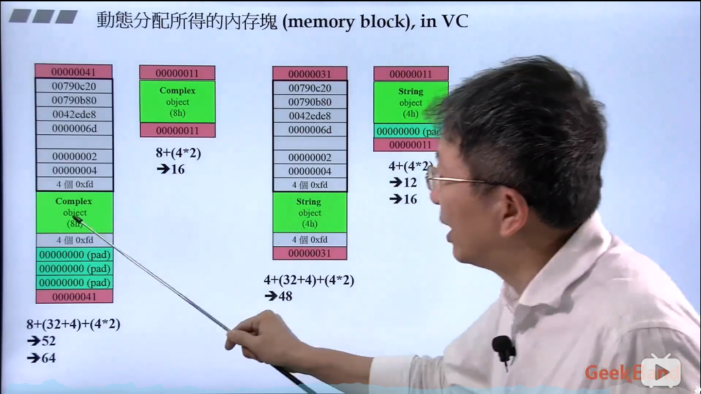

# C++中的内存管理

## 引言

## `ptmalloc`对于内存的管理

## 结构体之内存对齐

## 参考

- [C++面向对象高级编程-侯捷](https://www.bilibili.com/video/BV14s411E772?p=8)
- [ptmalloc内存管理剖析-华庭](https://paper.seebug.org/papers/Archive/refs/heap/glibc%E5%86%85%E5%AD%98%E7%AE%A1%E7%90%86ptmalloc%E6%BA%90%E4%BB%A3%E7%A0%81%E5%88%86%E6%9E%90.pdf)
- [聊聊glibc ptmalloc内存管理那些事儿](https://yangrz.github.io/blog/2017/12/20/ptmalloc/)
- [内存对齐规则之我见](https://levphy.github.io/2017/03/23/memory-alignment.html)