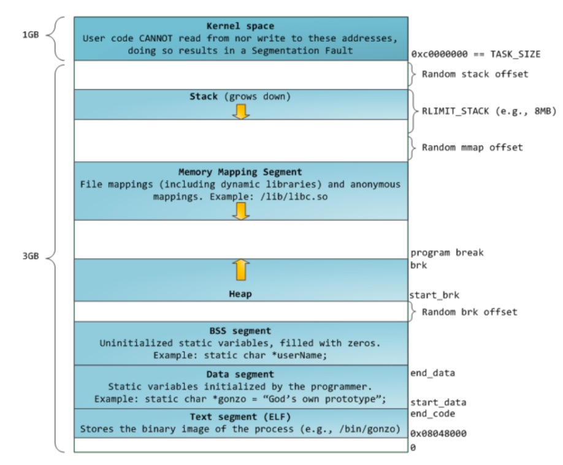
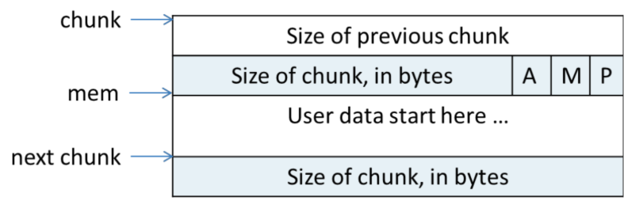
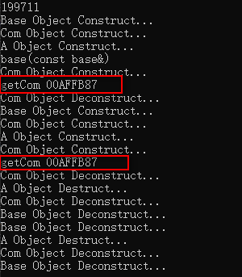

# C++中的内存管理

## 引言


在看到侯捷老师讲解关于C++内存管理一节中，关于Object内存分配的问题，总是以16Byte对齐内存空间，想到了以前在玩 `ctf` 的时候看到的有关 `glibc` 内存管理的内容，特地翻看了一下，复习了下关于 `glibc中ptmalloc`

在介绍 `ptmalloc` 之前，先来看下 32位linux 系统的内存经典布局（大小为4GB）：

，这里图中已经标识各个segment的功能，其中注意几点：

- stack的生长方向为由高地址->低地址；
- heap的生长方向为由低地址->高地址；
- 局部变量（stack）、全局变量（Data segment/BSS segment）、静态变量（Data segment/BSS segment）的存储空间；

## `ptmalloc`对于内存的管理

`ptmalloc`是啥？
> a fast, memory-efficient implementation of malloc for Unix systems.

这里关于 `ptmalloc` 如何进行内存分配不再赘述，具体可参考 **ptmalloc内存管理剖析-华庭**，与本篇主题相关的是内存管理单元--`chunk`这一数据结构，它是以下这种形式，并且32位系统中按照 16Bytes 对齐：



这也与侯捷老师所说的申请内存时的 cookie 相照应？

## C++ 变量何时分配内存空间

在一日执行下面这段函数代码的时候：

```c++
void getCom() {
	Com local_c;
	cout << "getCom " << &local_c << endl;
}
int main() {
	cout << __cplusplus << endl;
	A a;
	base b = base(a);
	getCom();
	A a1;
	getCom();
	return 0;
}
```

发现结果如下：



为什么两次局部变量申请到的地址空间是一样的呢？猜想应该是在编译过程中会将函数中的所有变量提前（提到最前面，类似C语言），统一申请内存空间，通过在 Visual Studio 中调试观察发现：
- 确实是变量的空间先进行申请，但局部变量的初值是不确定的；
- 即使 `int a=0`的方式，也是先申请`a`的内存空间，后进行赋值；

## 结构体之内存对齐

结构体的内存空间是属于 `内存对齐` 方面的知识，主要参考以下3点（3大规则）

> 1. 对于结构体的各个成员，第一个成员的偏移量是0，排列在后面的成员其当前偏移量必须是当前成员类型的整数倍
>
> 2. 结构体内所有数据成员各自内存对齐后，结构体本身还要进行一次内存对齐，保证整个结构体占用内存大小是结构体内最大数据成员的最小整数倍
>
> 3. 如程序中有#pragma pack(n)预编译指令，则所有成员对齐以n字节为准(即偏移量是n的整数倍)，不再考虑当前类型以及最大结构体内类型


## 参考

- [C++面向对象高级编程-侯捷](https://www.bilibili.com/video/BV14s411E772?p=8)
- [ptmalloc内存管理剖析-华庭](https://paper.seebug.org/papers/Archive/refs/heap/glibc%E5%86%85%E5%AD%98%E7%AE%A1%E7%90%86ptmalloc%E6%BA%90%E4%BB%A3%E7%A0%81%E5%88%86%E6%9E%90.pdf)
- [聊聊glibc ptmalloc内存管理那些事儿](https://yangrz.github.io/blog/2017/12/20/ptmalloc/)
- [内存对齐规则之我见](https://levphy.github.io/2017/03/23/memory-alignment.html)