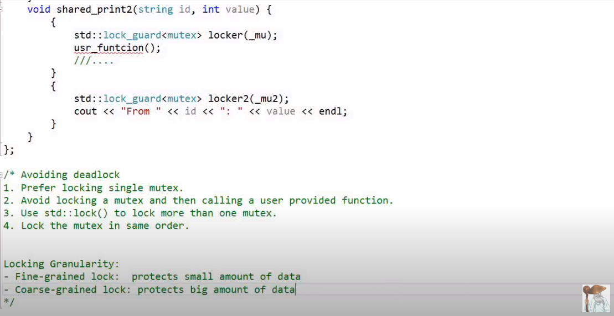

# C++并发

## C++并发的两种方式

C++的并发主要可以分为 多进程 与 多线程的方式：
- 多进程的方式：
  - windows: `CreateProcessA`
  - linux: `fork`
- 多线程的方式：
  - C++11: thread


> 并发编程的核心问题从来就不是并发容器或者同步原语，而是并发模式，你要处理什么问题？你需要什么样的语义？这才是核心问题。

这里主要介绍C++中的并发库 `#include <thread>`

### `multithread` v.s. `multiprocess`

Pros:
- Fast to start
- Low overhead

Cons:
- Difficult to implement
- Can't run on distributed system

### `thread`

```c++
#include <iostream>
#include <thread>

using namespace std;

void function_1() {
    std::cout<< "Beauty is only skin-deep" << std::endl;
}

int main() {
    std::thread t1(function_1);
//    t1.join();
    t1.detach();
//  t1.join();          //once detach, forever detach
    return 0;
}
```

### pass by `value` or pass by `reference`

在C++ thread中默认是使用 `pass by value` 的方式，并不能简单地进行 `pass by reference`，想要使用 `pass by reference`，可以采用：
- `std::ref()`
- `std::move()`

并且 thread 具有单例的性质，不能使用普通的拷贝构造，需要使用 `std::move()` 的方式，

```c++
class Fctor {
public:
    void operator()(string& s) {
        cout<<"t1 says"<<s<<endl;
        s = "the vale is changed in fctor";
    }
};

int main() {
    // thread 中默认是 pass by value，想要 pass by reference 需要使用 std::ref 建立 reference
    string msg = "where there is no trust, there is no love";
    std::thread t1{Fctor(), std::ref(msg)};
    t1.join();
    cout<<"from main: "<<msg<<endl;
    return 0;
}
```
### data race and mutex

- `std::mutex mu`

```c++
    mu.lock()
    // do_something()
    mu.unlock()
```

在使用 `std::mutex` 时，当在 do_something 时出现了异常 exception时会出现一直 lock() 的情况，可以使用 `lock_guard()`，在作用域结束时，会自动进行回收。

`RAII` - `resource acquisition is initialization`，即是采用 `std::lock_guard()` 这种方式

- `std::lock_guard()`

```c++
    std::mutex m;
    std::lock_guard<mutex> locker(m);
```

但使用这种方式，是采用的一种用户侧声明的手法，但 临界资源 `cout` 虽说可以被该 thread 加锁访问，但我们可以用 `std::mutex` 对其进行保护，**mutex与resource进行绑定的方式**

```c++
class logFile {
private:
    std::mutex m;
    ofstream f;

public:
    logFile(const string& s) {
        f.open(s);
    }
    void shared_print(const string& msg, int id) {
        std::lock_guard<mutex> lg(m);
        f<<msg<<id<<endl;
    }
};
```

避免 Data Race 的方式：
- Use mutex yo synchronize data access;
- Never leak a handle of data to outside;
- Design interface appropriately.Use mutex yo synchronize data access

### deadlock

```c++
void shared_print() {
    std::mutex _mu, _mu2;
    // 同时获得两个锁
    std::lock(_mu, _mu2);
    std::lock_guard<mutex> lk1(_mu, std::adopt_lock);
    std::lock_guard<mutex> lk2(_mu2, std::adopt_lock);
}
```
避免 deadlock 的几条原则：



### Unique_lock and lazy initialization

refer:[C++多线程unique_lock详解](https://cloud.tencent.com/developer/article/1583807)

关于 `C++ unique_lock` 方法详解：
- C++`unique_lock`同 `lock_guard` 相同，都可以通过对象管理 `mutex` 的 lock 与 unlock，不同的是 `unque_lock` 提供了更灵活的方式
- 当 `defer_lock` 与 `unique_lock` 结合使用时，在使用之前不能 lock，（`std::lock_guard<mutex> lk(_mu, std::adopt_lock)`要求使用之前一定先被 lock
- 当使用 `std::unqiue<mutex> lk2(_mu, std::defer_lock)` 时，需要借助手动 `lock` 与 `unlock` 加锁与解锁

`std::unique_lock<mutex> locker(_mu, std::defer_lock);`

### Condition Variable

```c++
std::condition_variable cond;
cond.notify_one();
cond.notify_all();

cond.wait(locker);
```

### Future, Promise and async()

## little tricks

- `std::thread::hardware_concurrency()`可以获得机器的最大线程数量。
- `std::this_thread::get_id()` 获取当前线程号

## 参考

- https://www.youtube.com/user/BoQianTheProgrammer