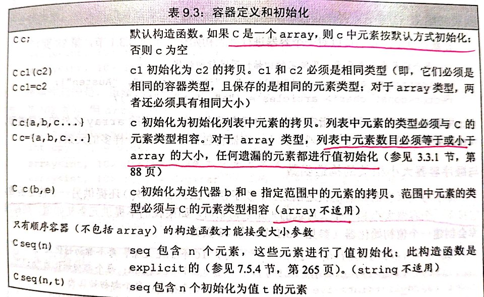

# STL总结

## 

## Notes

- 并不是所有 container 都支持 subscript operator，支持的有 `std::string`、`std::vector`

## 容器定义和初始化

顺序容器中有个特殊的存在即：`array`，`array`的大小也是类型的一部分，因此，当定义一个 `array` 时，除了指定元素类型，还要指定容器大小：`array<int, 10>`.

- `array` 从开始构造就不是空的，若使用列表初始化，初始化方式为：列表+默认初始化；
- 不接受大小参数的构造函数；
- 两个 `array` 之间的拷贝，必须满足类型与大小都相同的条件；



## 赋值和`swap`

*赋值 !=  初始化*

容器类型常用的赋值方式为：
- `=`
- `assign function`

以上两种运算符对于可变空间的容器来说，是适用的，如

```c++
vector<string> a = {"a","b","c"};
vector<string> b = {"c", "d", "e", "f"};
auto be = b.begin();
// 赋值运算导致 左边容器的迭代器、引用和指针失效
cout<<"before =: "<<*be<<endl;
// before =: c
b = a;
cout<<"after =: "<<*be<<endl;
// after =: a

cout<<"before assign: "<<*be<<endl;
// before assign: c
b.assign({"a","b","c"})
cout<<"after assign: "<<*be<<endl;
// after assign: a

// swap 操作不会导致上述情况的发生， array 和 string 除外
cout<<"before swap: "<<*be<<endl;
// before swap: c
swap(a, b);
cout<<"after swap: "<<*be<<endl;
// after swap: c
```

```c++
// array 对空间要求较高，并不支持 assign
array<int,10> a = {1,2,3,4};
// {1,2,3,4,0,0,0,0,0,0}
array<int,10> b = {2};
// {2,0,0,0,0,0,0,0,0,0,0}

cout<<"before =: "<<*be<<endl;
// before =: 2
b = a;
cout<<"after =: "<<*be<<endl;
// after =: 1

// Do not support assign

cout<<"before swap: "<<*be<<endl;
// before swap: 2
swap(a, b);
cout<<"after swap: "<<*be<<endl;
// after swap: 1
```