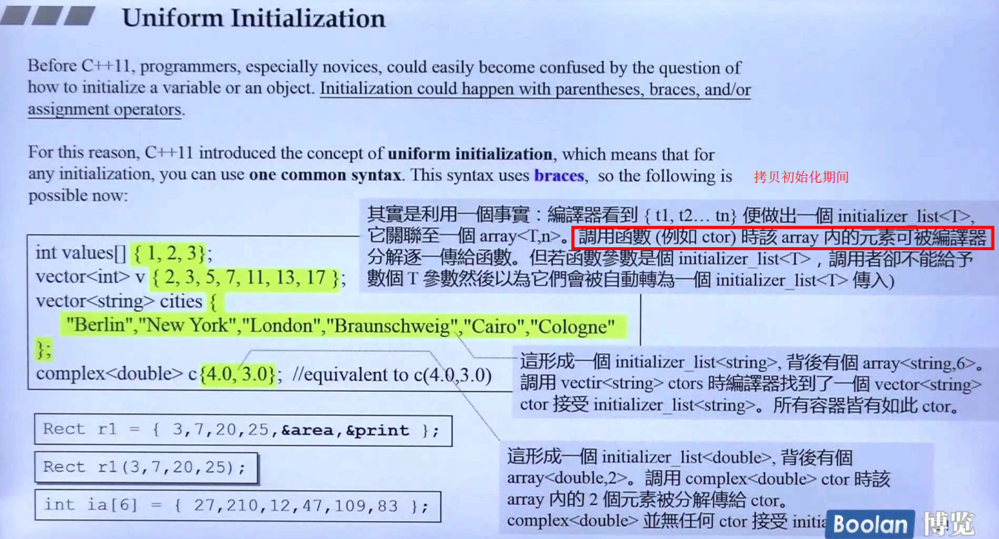
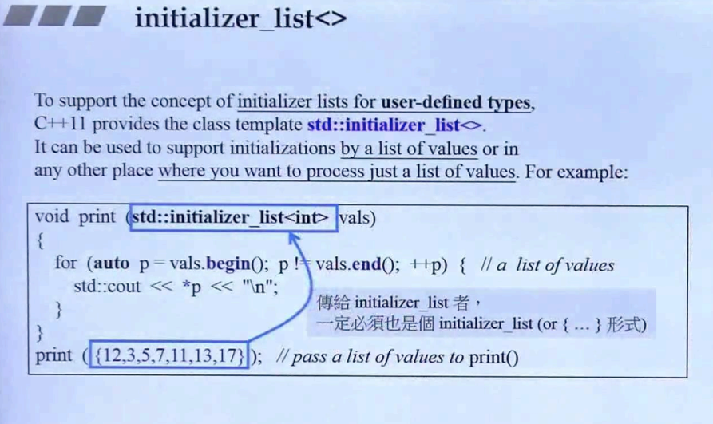
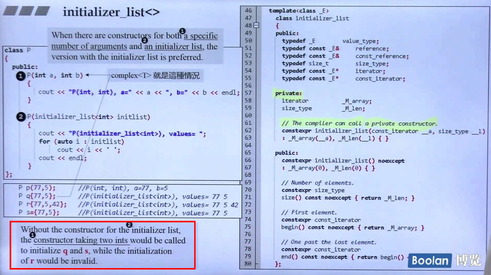

# C++ 2011（C++ 2.0）中的一些新特性

## **`variadic template parameter`**


## `auto`


## `ranged-base for`


## `lambda`

戳 [lambda](./lambda.md)

## `unordered container`

## `Initizlizer Lists`

列表初始化

> Before C++11, initialization could happen with parentheses `()`, braces `{}`, and/or assignment operators `=`.
> 
> C++ 11 introduced the concept of uniform initialization, which means that for any initizlization, you can use one common syntax. This syntax uses braces.

## 详解 `initialization list`背后的原理

```c++
int value[] {1,2,3};
vector<int> c {2,3,5,7,11,13};
vector<string> cities {
    "Berlin", "New York", "London"
};
complex<double> c{4.0, 3.0};
```

> 其实是利用一个事实：编译器看到 {t1, t2, t3...tn} 便做出一个 initializer_list<T>，它关联至一个 `array<T,n>`。调用函数（例如 ctor）时该 array 内的元素可被编译器分解逐一传给函数。但若函数参数是个 initializer_list<T>，调用者会将它们自动转化为一个 initializer_list<T> 传入



- 列表初始化会执行值初始化

```c++
int i;              //  undefined
int j{};            //  0
int* p;             //  undefined
int* q{};           //  nullptr
```

## `std::initializer_list` 的其他用法

- 当做函数形参传入，此时不再像列表初始化一样，逐个进行复制，而是作为整体参数传入



- 对于 `ctor` 中包含了：列表初始化 与 `std::initializer_list` 两种方式，Prefer 后者



## `string` 与 `vector` 的初始化

`string` 的初始化方式

```c++
string s1;          // 默认初始化，s1 为空串
string s2 = s1;     // 拷贝初始化
string s3 = "hiya"; // 拷贝初始化
string s4("hiya");  // 直接初始化
string s5(10, 'c'); // 直接初始化
```

`vector` 的初始化方式

```c++
vector<T> v1;       // 空 vector，执行默认初始化
vector<T> v2(v1);
vector<T> v2 = v1;
vector<T> v3(n, val);
vector<T> v4(n);
// vector<int> v4(10); // 10个0值构成的 vector
// vector<string> v4(10); // 10个空串构成的 vector
vector<T> v5 {a,b,c...};    // 列表初始化，v5 包含了初始值的元素
vector<T> v6 = {a,b,c...}
```

需要注意的是：

```c++
vector<int> v1(10, 1);          //  10个1
vector<int> v2{10,1};           //  10和1
vector<int> v3(10);             //  10个0

vector<string> vs1{10};         //  不能列表初始化，考虑其他初始化 10 个空串
vector<string> vs2{"hi"};
vector<string> vs3("hi");       //  错误！不能使用字符串字面值构建 vector
vector<string> vs4{10, "hi"};   //  10个 hi
```