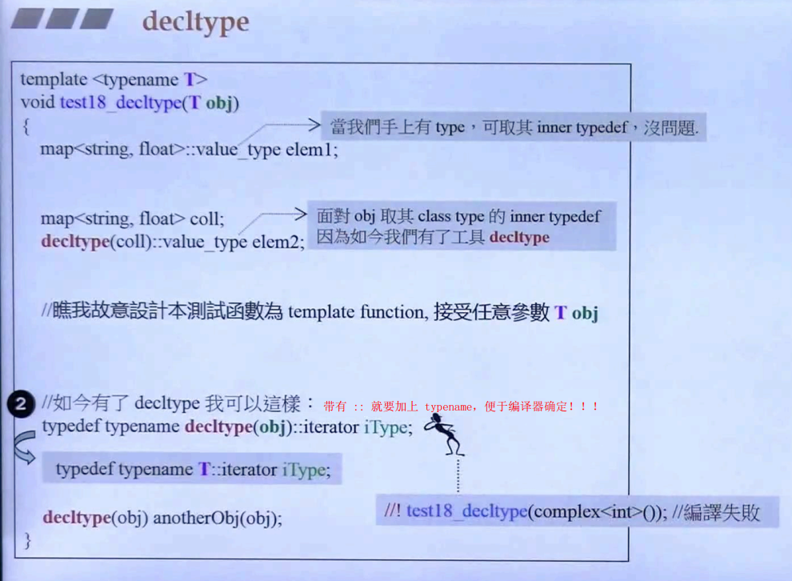

# decltype

> By using the new `decltype` keyword, you can let the compiler find ouy the type of an expression. This is the realization of the often requested typeof feature.
>
> One application of `decltype` is to declare return types. Another is to use it in metaprogramming or to pass trhe type of a lambda.

## usage

- `decltype`, used to declare return types

用在函数模板中，函数的返回值类型与模板参数有关，可使用 `decltype`

```c++
template <typename T1, typename T2>
decltype(x+y) add(T1 x, T2 y);           // was not possible before c++11, because the return expression uses objects not introduced or in scope yet.
```

在 C++11 中，你可以这样写，即把函数返回值类型写在函数参数列表之后

```c++
template <typename T1, typename T2>
auto add(T1 x, T2 y)->decltype(x+y);
```

这种用法和 `lambdas` 声明返回值类型的语法是一样的

`[...](...)mutable throwSpec -> retType {...}`

- `decltype`, used in metaprogramming



- `decltype`, used to pass the type of a lambda

```c++
auto cmp = [](const Person& p1, const Person& p2) {
    return p1.lastname() < p2.lastname() ||
    (p1.lastname()==p2.lastname() &&
    p1.firstname() < p2.firstname());
}
// 对于 lambdas 常常只有 object，我们可以使用 `decltype` 取其 type
std::set<Person, decltype(cmp)> coll(cmp);
```

## 参考

- [C++11新特性-侯捷](https://www.bilibili.com/video/BV1p4411v7Dh?p=13)