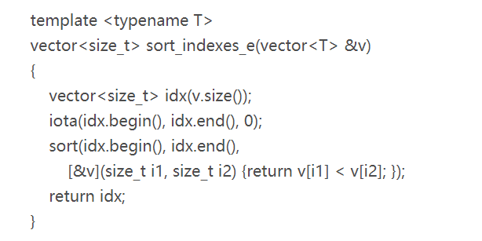

# lambda 表达式

lambda 表达式是 c++ 11 引入的新特性，c++中 lambda 表达式的声明：

`[capture list] (params list) mutable exception-> return type { function body }`

- `capture list` 为外部捕获参数列表
- `params list` 为形参列表
- `mutable` 用来修饰是否修改捕获的外部变量
- `exception` 异常设定
- **可以省略参数列表（省略为空）和返回类型（lambda自动推断返回类型），但必须永远包含捕获列表和函数体**

常用的几种 lambda 表达式

```c++
// 使用了返回类型后置的新特性
[capture list] (params list) -> return type { function body }
[capture list] (params list) { function body }
[capture list] { function body }
```

## 关于外部变量的捕获方式

- 捕获列表仅适用于局部非static变量，lambda可以直接使用局部static变量和在它函数之外声明的名字
- 与参数不同，被捕获的变量的值是在lambda创建时拷贝，而不是调用时拷贝；创建！！！！

### 1. 值捕获

值捕获的方式不能修改传入的 value，如果修改需要加上 `mutable` 关键字

```c++
int main()
{
    int a = 123;
    auto f = [a] { cout << a << endl; };
    a = 321;
    f(); // 输出：123
}
```

### 2. 引用捕获

引用捕获的方式可以修改传入的引用参数，不用加上 `mutable` 关键字；



```c++
int main()
{
    int a = 123;
    auto f = [&a] { cout << a << endl; };
    a = 321;
    f(); // 输出：321
}
```

### 3. 隐式捕获

不在捕获列表中显式写明需要捕获的变量，使用编译器自动推导，既可以是隐式值捕获，也可以是隐式引用捕获，还可以是混合捕获方式

```c++
// 隐式值捕获
int main()
{
    int a = 123;
    auto f = [=] { cout << a << endl; };
    f(); // 输出：123
}
// 隐式引用捕获
int main()
{
    int a = 123;
    auto f = [&] { cout << a << endl; };
    a = 321;
    f(); // 输出：321
}
// 混合捕获方式，见下
int main()
{
    int a = 123;
    string b = "abc";
    auto f = [&, b] {
        cout<<"capture by reference "<<a<<endl;
        cout<<"capture by value "<<b<<endl;
    }
    f();

}
```

### 4. 混合方式

混合方式是对于既有值捕获又有引用捕获的方式，


## 返回类型

当lambda只包含单一的return语句时，不用指定返回类型。默认情况下，如果一个lambda包含return之外的任何语句，编译器就不能自动 infer，只能假定返回类型为 `void`，但 `void` 往往不是我们需要的，因此需要我们手动指定返回类型。

```c++
// OK
transform(vi.begin(), vi.end(), vi.begin(), [](int i) {return i < 0 ? -i : i;})
// compile error, can not infer return type
transform(vi.begin(), vi.end(), vi.begin(), [](int i) {if (i < 0) return -i; else return i;})
// manualy specify the return type
transform(vi.begin(), vi.end(), vi.begin(), [](int i) -> int {if (i < 0) return -i; else return i;})
```

# 参考

1. https://www.cnblogs.com/DswCnblog/p/5629165.html