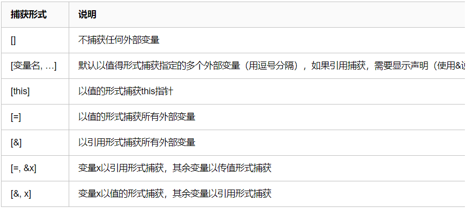

# lambda 表达式

lambda 表达式是 c++ 11 引入的新特性，c++中 lambda 表达式的声明：

`[capture list] (params list) mutable exception-> return type { function body }`

- `capture list` 为外部捕获参数列表
- `params list` 为形参列表
- `mutable` 用来修饰是否修改捕获的外部变量
- `exception` 异常设定

常用的几种 lambda 表达式

```c++
// 使用了返回类型后置的新特性
[capture list] (params list) -> return type { function body }
[capture list] (params list) { function body }
[capture list] { function body }
```

## 关于外部变量的捕获方式

### 1. 值捕获

```c++
int main()
{
    int a = 123;
    auto f = [a] { cout << a << endl; };
    a = 321;
    f(); // 输出：123
}
```

### 2. 引用捕获

```c++
int main()
{
    int a = 123;
    auto f = [&a] { cout << a << endl; };
    a = 321;
    f(); // 输出：321
}
```

### 3. 隐式捕获

不在捕获列表中显式写明需要捕获的变量，使用编译器自动推导

```c++
// 隐式值捕获
int main()
{
    int a = 123;
    auto f = [=] { cout << a << endl; };
    f(); // 输出：123
}
// 隐式引用捕获
int main()
{
    int a = 123;
    auto f = [&] { cout << a << endl; };
    a = 321;
    f(); // 输出：321
}
```

### 4. 混合方式

混合方式是对于既有值捕获又有引用捕获的方式，



# 参考

1. https://www.cnblogs.com/DswCnblog/p/5629165.html