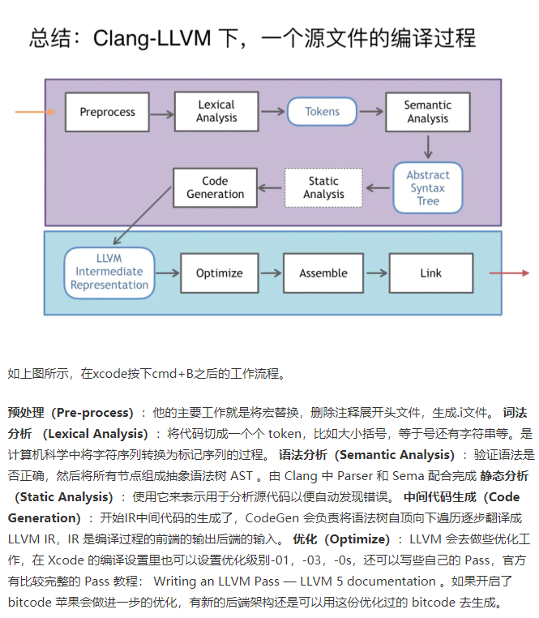

# LLVM

LLVM（Low Level Virtual Machine）底层虚拟机

## LLVM 与 clang

> Clang（发音为/ˈklæŋ/） 是一个C、C++、Objective-C和Objective-C++编程语言的编译器前端。它采用了底层虚拟机（LLVM）作为其后端。它的目标是提供一个GNU编译器套装（GCC）的替代品。作者是克里斯·拉特纳，在苹果公司的赞助支持下进行开发，而源代码授权是使用类BSD的伊利诺伊大学厄巴纳-香槟分校开源码许可。
Clang项目包括Clang前端和Clang静态分析器等

## LLVM 与 clang 的安装

## LLVM IR表示

- IR

`LLVM`的 IR 包含了几个部分，主要是：Modules、Functions、Basic Block、Instructions几类。

- Pass：
    > The passes, which transform IR to IR. In ordinary circumstances, passes usually optimize the code: that is, they produce an IR program as output that does the same thing as the IR they took as input, except that it’s faster. This is where you want to hack. Your research tool can work by looking at and changing IR as it flows through the compilation process.

## LLVM 使用

## 参考

- [LLVM for Grad Students](https://www.cs.cornell.edu/~asampson/blog/llvm.html)
- [Clang-LLVM](https://juejin.im/post/5a30ea0ff265da43094526f9)
- [LLVM/clang在ubuntu下的安装](https://www.zhihu.com/question/60299862)