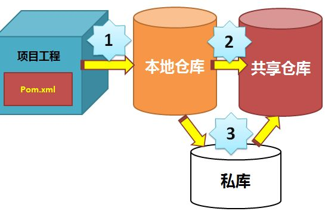

# Maven

## 1. 安装与配置

*Maven3要求JDK1.7以上*

设置环境变量：

- `M2_HOME="/usr/local/maven"`
- `M2=/usr/local/maven/bin`
- `PATH`

## 2. 仓库的配置

这些配置都位于 `maven/conf/setting.xml`　文件中

### 2.1 本地仓库的配置

- `localRepository` 关键字中

### 2.2 中央仓库的配置

maven 下载依赖包的执行流程：

\

修改默认中央仓库的位置（以阿里云为例）：

```xml
<mirror>
    <id>nexus-aliyun</id>  
    <mirrorOf>*,!jeecg,!jeecg-snapshots</mirrorOf>  
    <name>Nexus aliyun</name>  
    <url>http://maven.aliyun.com/nexus/content/groups/public</url>  
</mirror>
```

## 3. 项目的创建

### 3.1 POM(Project Object Model)项目对象模型

### 3.2 坐标

- `groupId`
- `artifactId`
- `version`

## 4. 常用命令

### 4.1 项目的创建

```maven
mvn archetype:generate -DgroupId=packageName -DartifactId=projectName -DarchetypeArtifactId=maven-archetype-quickstart/maven-archetype-webapp -DinteractiveMode=false   # 普通　java 项目/Web项目
mvn archetype:create
```

### 4.2 代码的编译

```maven
mvn compile         # 源代码的编译
mvn test-compile    # 测试代码的编译
```

### 4.3 运行测试

```maven
mvn test
```

### 4.4 打包

```maven
mvn package         #　打包
mvn jar:jar         #  打jar包
```

### 4.5 生成其他项目

```maven
mvn idea:idea       # 生成IDEA项目
mvn eclipse:eclipse # 生成eclipse项目
```

### 4.6 下载依赖包

```maven
mvn dependency:sources  #　下载依赖的源码包
```

### 4.7 清理

```maven
mvn clean
```

## 5. 参考

- [知乎](https://zhuanlan.zhihu.com/p/73444114)
- https://www.iteye.com/blog/stevenfeng-987623
- https://zhuanlan.zhihu.com/p/73444114