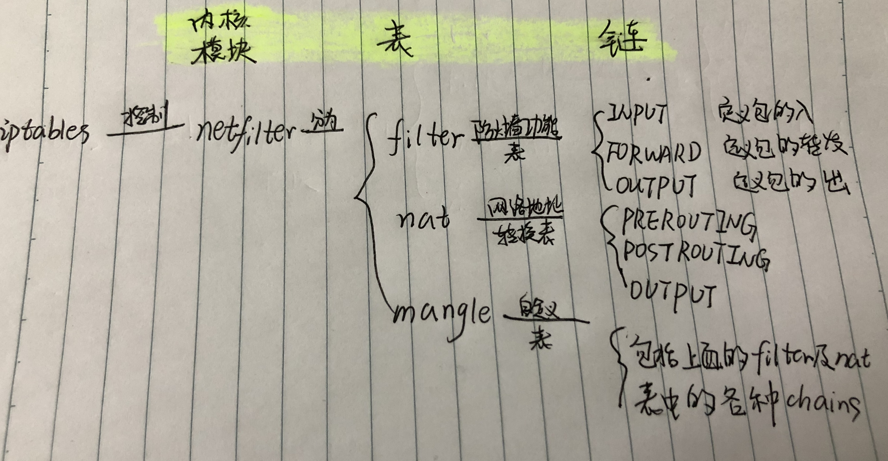

# Linux 不同发行版本 firewall 的使用

> iptables 是一个通过控制 Linux 内核的 netfilter 模块来管理网络数据包的流动与出传送的应用软件，其功能包括不仅仅防火墙的控制出入流量，还有端口转发等等。iptables 内部有表 tables、链 chains、规则 rules这三种概念。iptables 的每一个表都和不同的数据包处理有关、决定数据包是否可以穿越的是 “链”、而一条 “规则” 在链里面则可以决定是都送往下一条链（或其它动作）
    

iptables 常用的配置命令
```bash
iptables -F     # 所有 chains 的规则都被清空了
iptables -L     # 显示现有的规则
iptables -t nat -A PREROUTING -p tcp --dport 502 -j REDIRECT --to-ports 5020
# -t: 指定表
# -A: 表示在对应的 Chains 中添加规则
# -I: 表示在 Chains 的首行添加规则
# -j: 指定当前规则对应的动作为 REDIRECT
# -D: 表示删除某条 Chains 中的第几条规则
# -L: 指定 Chains

service iptables status/start/stop/restart
```
## ubuntu/debian

`ufw`（uncomplicated firewall） 是 ubuntu 系统上配置 iptables 的工具。

```bash
sudo ufw status
sudo ufw enable/disable/reset

# 基于 port 设置规则，可以使用 port number 或者 服务名称
sudo ufw allow 22/ssh   # 允许 SSH 连接
sudo ufw deny 111

# 基于 IP 设置规则
sudo ufw allow from 123.45.67.89
sudo ufw allow from 123.45.67.89/24

# 基于 IP 和 port 进行配置规则
sudo ufw allow from 123.45.67.89 to any port 22 proto tcp

# 删除规则
sudo ufw delete allow 22        # 按添加规范删除规则
sudo ufw status numberd         # 先找到规则对应的编号
sudo ufw delete [number]        # 再删除对应编号的规则
```
参考： https://linux.cn/article-8087-1.html

## centos/red hat

> iptables 在 CentOS 7 之前和之后的版本，有重大的改动。
>
> CentOS 7 之前的版本，默认使用 iptables 服务作为防火墙，使用 service iptables stop 代码，iptables 服务会先清空规则，然后卸载 iptables 模块。重新 start 时，会从配置文件中加载规则。停止 iptables 服务可以测试是否为防火墙限制。
>
> CentOS 7 及其之后的版本，默认使用 firewall 服务作为防火墙，为了兼容，同时加载了 iptables_filter 模块，但是没有了 iptables 服务。所以 CentOS 7 及其之后的版本， 可以使用 iptables 命令添加规则，但是 iptables 服务默认关闭。用户确认 iptable_filter 模块加载，规则即可生效。

##  关于Firewalld的配制与使用  

引用 http://www.sa-log.com/282.html

- FirewallD 提供了支持网络/防火墙区域(zone)定义网络链接以及接口安全等级的动态防火墙管理工具  

- 什么是动态防火墙

> 我们首先需要弄明白的第一个问题是到底什么是动态防火墙。为了解答这个问题，我们先来回忆一下 iptables service 管理防火墙规则的模式：用户将新的防火墙规则添加进 /etc/sysconfig/iptables 配置文件当中，再执行命令 service iptables reload 使变更的规则生效。在这整个过程的背后，iptables service 首先对旧的防火墙规则进行了清空，然后重新完整地加载所有新的防火墙规则，而如果配置了需要 reload 内核模块的话，过程背后还会包含卸载和重新加载内核模块的动作，而不幸的是，这个动作很可能对运行中的系统产生额外的不良影响，特别是在网络非常繁忙的系统中。
>
> 如果我们把这种哪怕只修改一条规则也要进行所有规则的重新载入的模式称为静态防火墙的话，那么 firewalld 所提供的模式就可以叫做动态防火墙，它的出现就是为了解决这一问题，任何规则的变更都不需要对整个防火墙规则列表进行重新加载，只需要将变更部分保存并更新到运行中的 iptables 即可。

- 什么是区域(zone)

> firewalld将网卡对应到不同的区域（zone），zone 默认共有9个，block dmz drop external home internal public trusted work.
不同的区域之间的差异是其对待数据包的默认行为不同，根据区域名字我们可以很直观的知道该区域的特征，在CentOS7系统中，默认区域被设置为public.
在最新版本的fedora（fedora21）当中随着 server 版和 workstation 版的分化则添加了两个不同的自定义 zone FedoraServer 和 FedoraWorkstation 分别对应两个版本。

## 配置的几条常用命令  

```bash
firewall-cmd --version      # 查看版本

systemctl start firewalld  # 启用firewalld  
systemctl stop firewalld   # 停止firewalld  
firewall-cmd --state       # 查看firewalld运行状态

firewall-cmd --reload      # 配置完毕后重新加载  
firewall-cmd --get-active-zones # 获取启用的 zone
firewall-cmd --get-default-zone   # 获取默认的zone  
firewall-cmd --get-all-zones     # 获取所有的zone

# services 和 zones 配置  
cat /etc/firewalld/zones/public.xml  # 查看pulic zone 的服务有哪些  

# 查看 zone 查看 zone 对应的配置
firewall-cmd --zone=public --list-all 
firewall-cmd --zone=public --add-port=3311-3350/tcp --permanent  # 添加开放端口
firewall-cmd --zone=public --remove-port=3311/tcp --permanent # 删除开放的端口
```
参考：https://www.jianshu.com/p/59acef4e267a

## 关于配置（还是直接更改xml文件比较好）

>- `/etc/firewalld/services`  ，  `/etc/firewalld/zones`   配置完成的 services 和 zones
>- `/usr/lib/firewalld/services`  ，  `/usr/lib/firewalld/zones`   services 和 zones 库

**当firewalld加载配置文件的服务时首先读取 `/etc/firewalld/services` ,然后会读取 `/usr/lib/firewalld/services` 因此我们可以把 `/usr/lib/firewalld/services` 复制到  `/etc/firewalld/services` 中为了配置方便，当然了这是不必要的**  

除了自己加入系统自带的一些服务外，我们还可以自己定义服务，方法就是在/usr/lib/firewalld/services里 touch xxx.xml文件或者更改一下其他的文件，主要在于port的更改  

## shadowsocks入坑详解  

在搬瓦工上配置ss时，遇到了防火墙的一些坑，并且渐渐地明白了这些防火墙运作的原理，主要是对端口与连接的具体方式进行限定来保护  
我们所开放的端口都是指的是入站的端口，当然端口除了入站的以外还有出站的，这些就不是我们所要考虑的了，操作系统应该会为进程分配对应的端口   
配置ss时需要开放一个服务器端口，这里我用的是8388默认端口，在services里编辑一条加上去就可以了

**最最重要的是reload之后重启才会生效哦**


