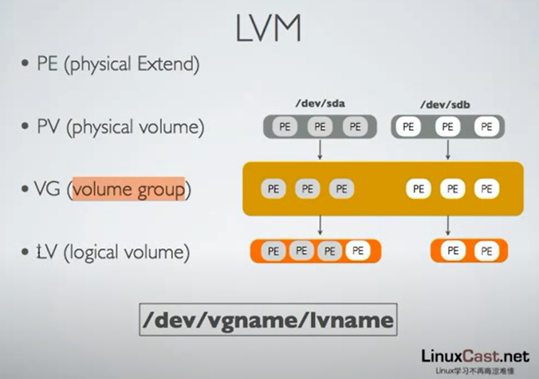
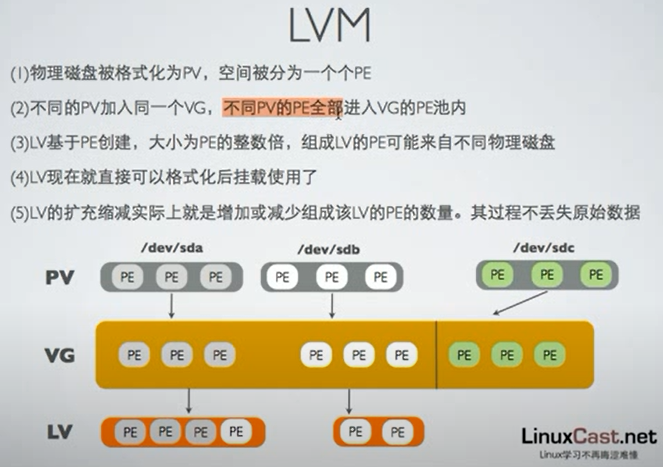
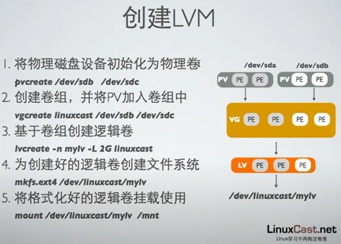
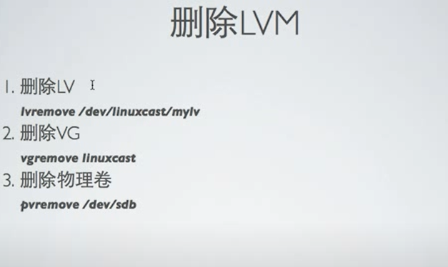
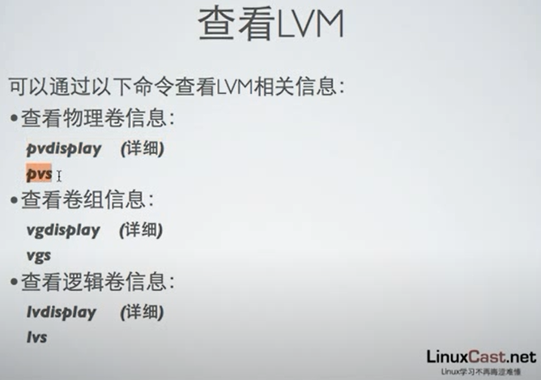
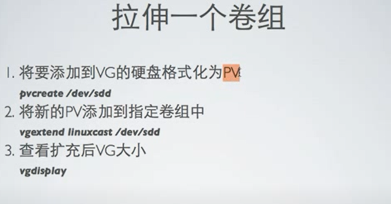
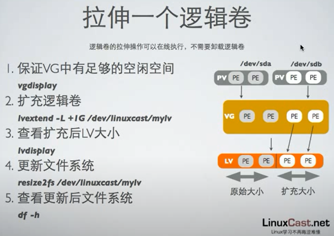
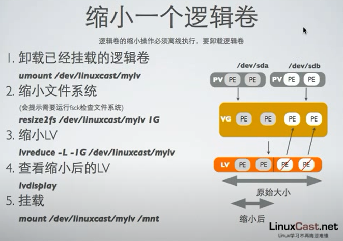
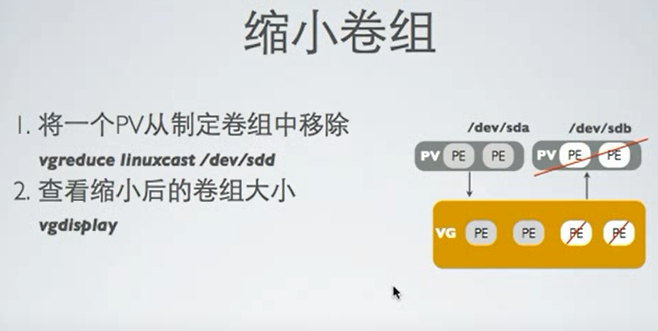
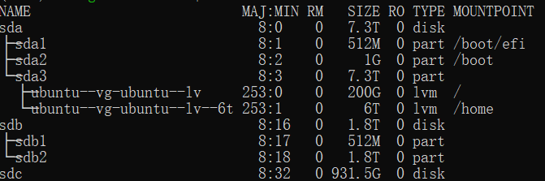

# LVM(Logical Volume Manager)逻辑卷管理

## LVM 出现的动机

传统磁盘管理：当分区大小不够用时无法扩展其大小，只能通过添加磁盘，创建新的分区来扩展空间，新添加进来的磁盘作为独立的文件系统存在，原有的文件系统并没有得到扩充，上层应用很多时候只能访问一个文件系统，因此只能让现有的磁盘下线，换上新的磁盘后，再将原来的数据导入。

## LVM 逻辑卷管理

LVM(Logical Volume Manager)逻辑卷管理通过将底层物理硬盘封装起来，以逻辑卷的形式表现给上层系统，逻辑卷的大小可以动态调整，而且不会丢失现有的数据。新加入的硬盘也不会改变现有的上层的逻辑卷。作为一种动态磁盘管理机制，逻辑卷技术大大提高了磁盘管理的灵活性。

## LVM 的分层组织结构

- PV(Physical Volume)
- PE(Physical Extend)
- VG(Volume Group)
- LV(Logical Volume)

## LVM 的管理命令

### 创建 LV（Logical Volume）

### 删除 LV（Logical Volume）

### 查看 LV

### 扩展 LV

扩展从下往上扩展，分别为：PV -> VG -> LV

### 缩小 LV

缩小从上往下缩小，分别为：LV -> VG -> PV

## tips 

除了 `fdisk -l`，使用 `lsblk` 是查看块设备的一个好方法，结果形式如下：

## 参考

- Linux cast：https://www.youtube.com/watch?v=tSyXYRyZIW8&list=PLCJcQMZOafICYrx7zhFu_RWHRZqpB8fIW&index=21
- Linux 逻辑卷的创建、扩展、删减：https://blog.51cto.com/13805636/2154846