# 正则化

## 过拟合矛欠拟合问题的引入

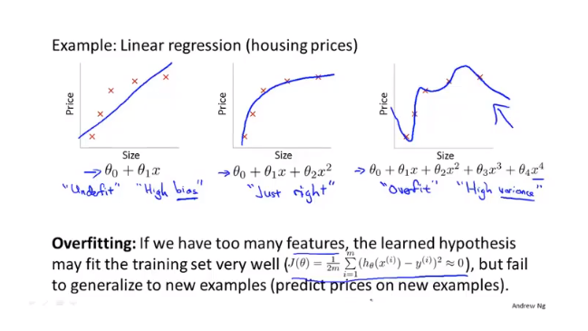

- 欠拟合（underffit）： 高偏置（high bias）
- 过拟合（overfit）：   高方差（high variance）

## 代价函数的正则化

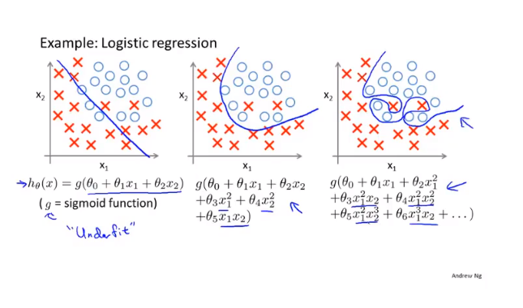

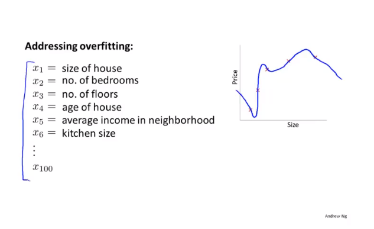

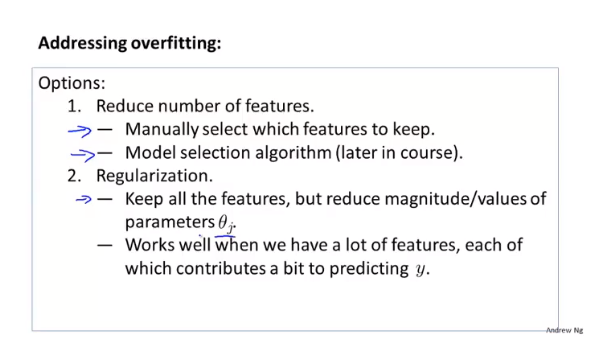

解决正则化的两个思路：

- 减少参数的数量
- 保持参数的数量，但使用正则化参数控制参数的大小

## 线性回归的正则化

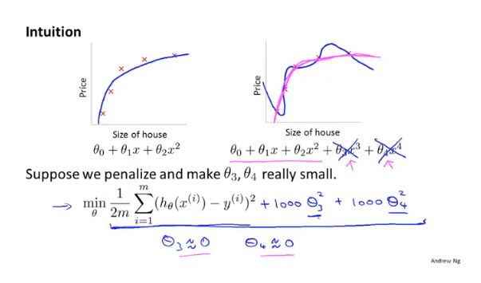

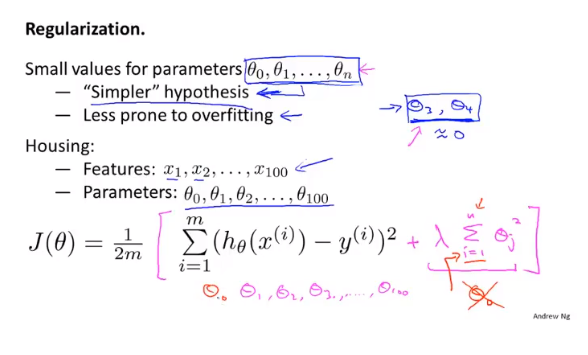

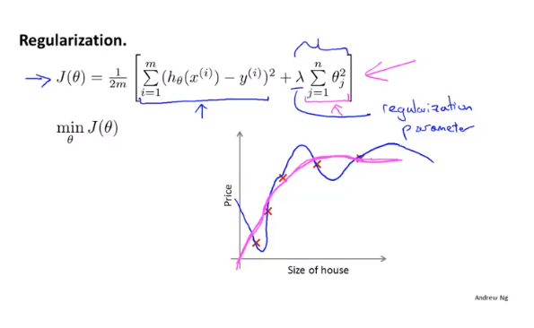

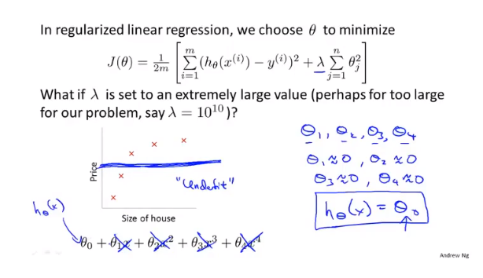

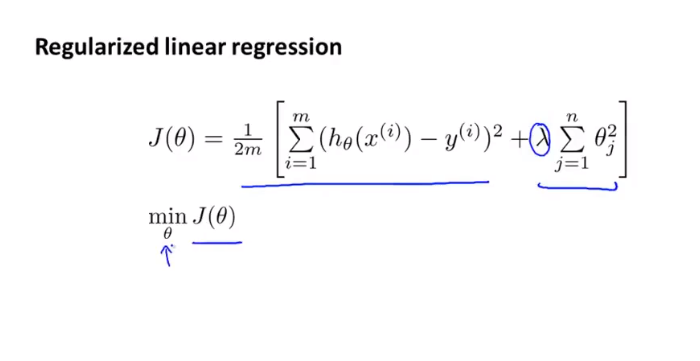

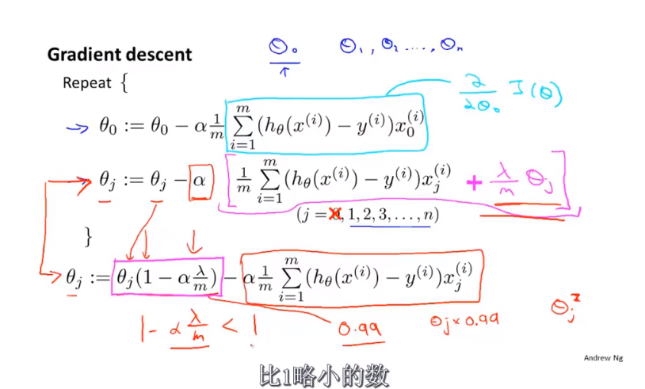

求导的结果表明，加入正则化参数只是对参数乘上一个比1略小的因子。

使用线性代数的思想来解释（讨论方阵是否可逆）：

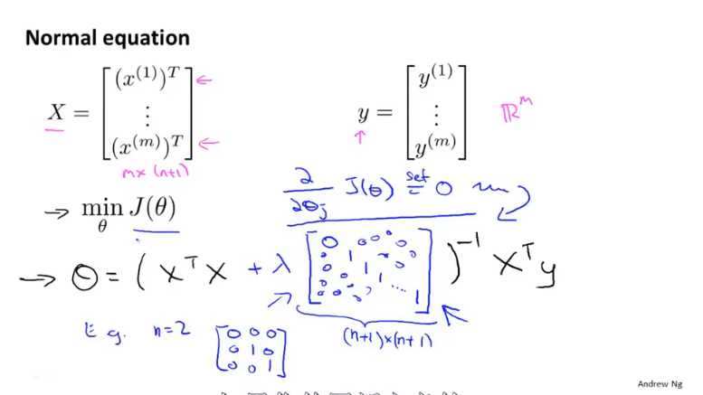

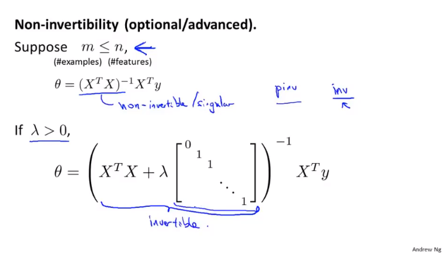

## Logistic回归的正则化

对Logistic求解算法的改进

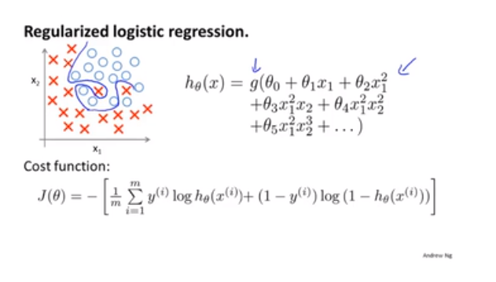

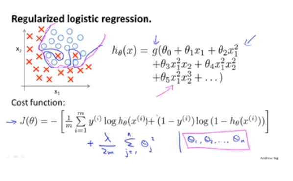

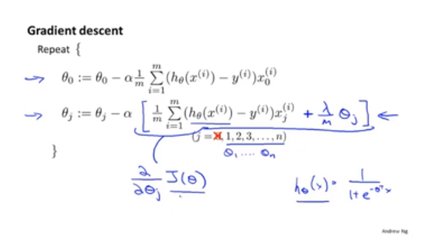

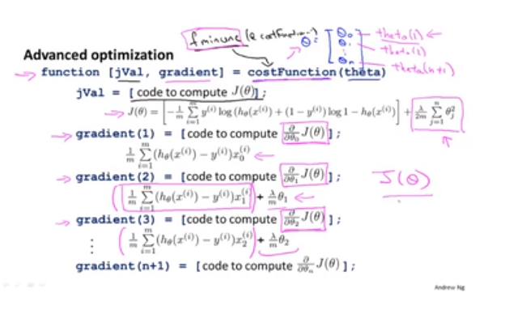