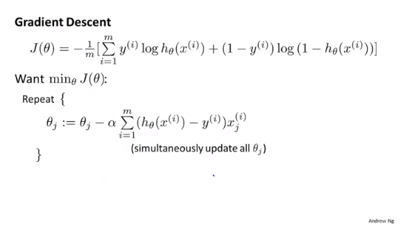

# Classifier 分类器

- Linear Regression
- Logistic Regression ！！！

## 1. 分类问题

**以下考虑的均为二分类问题：`y=0/y=1`**

分类问题的引入，由最初的线性函数（`linear function`），得到的值往往存在于 0 与 1 之外，并且线性函数得出的值往往会受到样本的扰动比较大，因此考虑将线性函数的值再经过映射到0-1的空间内。

## 2. 假设（Hypothesis）

## 3. 决策界限（Decision Boundary）

## 4. 代价函数（Cost Function）

在线性回归（`Linear Regression`）里，使用平方差函数作为损失函数是可以的，但是在逻辑回归（`Logistic Regression`）里，使用平方差函数作为损失函数，该函数并不是凸函数（`non-convex function`），就不能使用梯度下降 `gradient descent` 找到全局最小值（`global minimum`）

## 5. 简化代价函数与梯度下降

对代价函数进行简化，写成一个整体，则成为下面的函数：

对代价函数进行求导：

## 6. 高级优化

梯度下降是一个比较常用算法，但由于其在实际的比较大的问题中，速度较慢，因此往往使用比较快速的方法：

- Conjugate Descent （共轭梯度）
- BFGS
- L-BFGS

这些算法的优点是不用手工设置学习率`α`，它们算法的内部往往包含一个内循环来自动设置这些学习率，并且每一步的学习率也比较不同，收敛速度较快。

Andrew NG 使用 Octave 演示的梯度下降的例子:

## 7. 多元分类（Multi-Class Classification）

`one-vs-all` 的方法：思想很简单，即把多元分类的问题看成多个二元分类问题，来选取置信度最高的那一个；

