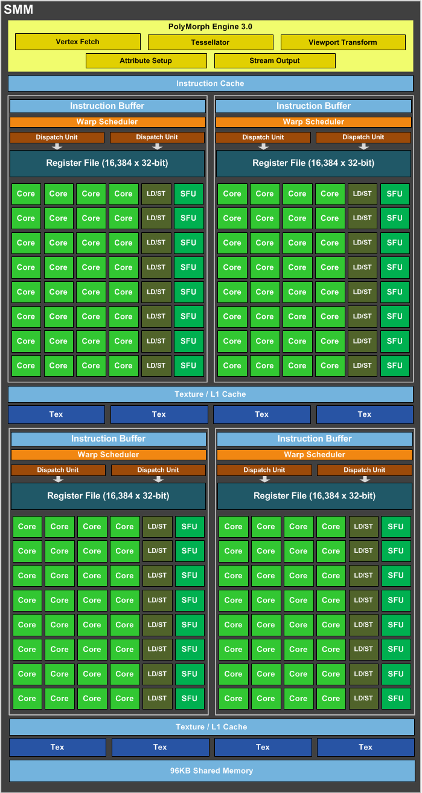
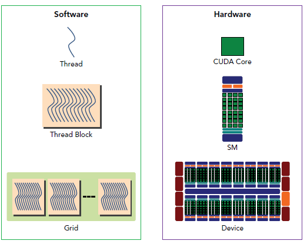

# CUDA

## 1. 前言

暑假实习的是关于一个 GPU 开发库的Python版本项目，该项目 C++ 版本与 Python 版本进行同步开发，Python版本使用 `swig` 进行 C++ interface 的 wrap，这些 GPU 编程库往往都有很多相似的地方，当时借鉴了很多 CUDA 的相关资料，这里进行记录

### 1.2 高效的 GPU 任务具备条件

1. 具有成千上万的独立工作
   - 尽量利用大量的 ALU 单元
   - 大量的片元切换隐延迟
2. 可以共享指令流
   - 适用于 SIMD 处理
3. 最好是计算密集型任务
   - 通信和计算开销比例适合
   - 不要受制于访存带宽

**CUDA这一部分应该掌握GPU软硬件之间的对应关系**

## 2. GPU的体系结构

### 2.1 硬件

- SP（Streaming Processor），亦称 CUDA core，指令和任务的实际执行者
- SM（Streaming Multiprocessor），GPu大核，拥有除SP外的其它资源如： wrap scheduler、register、shared memory等。

展示GPU的一个SM的示意图（绿色部分为 SP）：

GPU 中的内存按照访存速度划分：

- Register
- shared memory (block)
- local memory
- global memory (device)
- constant memory (device)
- texture memory
- instruction memory (invisible)

### 2.2 软件

软件的三级结构： 

- thread
- block
- grid

### 2.3 软硬件之间的对应关系

## 3. CUDA的编程模型

### 3.1 CUDA 的算法框架

1) 在 GPU 上分配显存，拷贝数据 host to device
2) kernel invocation code
3) 运算结束后，输出数据拷贝 device to host

## 参考

- [Introduction-to-GPUs.pdf](./CUDA/Introduction-to-GPUs.pdf
- [CUDA编程](https://blog.csdn.net/junparadox/article/details/50540602)
- [《CUDA编程教程》 B站视频](https://www.bilibili.com/video/av10436982?from=search&seid=450076380525809673)
- 《CUDA并行程序设计 GPU编程指南》
- [超算课堂-CUDA编程实训](https://www.easyhpc.net/lab/detail/22/) 
- [Nvidia-introductoion-of-cuda-c-and-c](https://devblogs.nvidia.com/easy-introduction-cuda-c-and-c/)