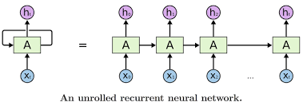
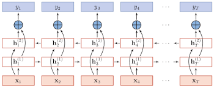
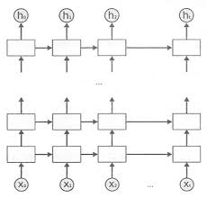
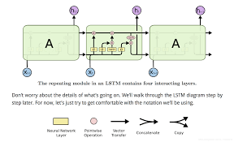
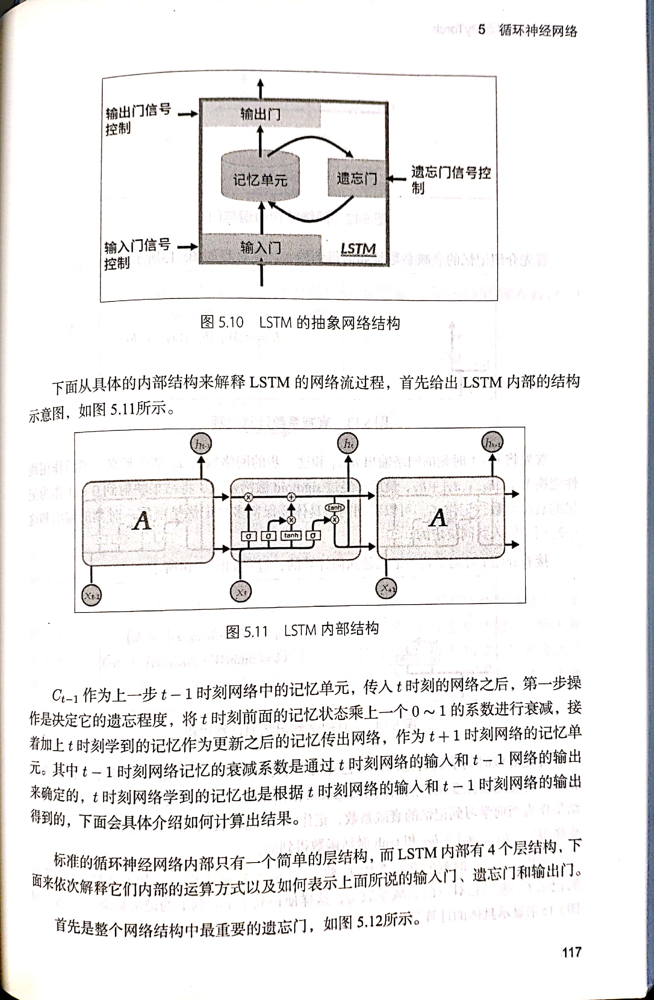
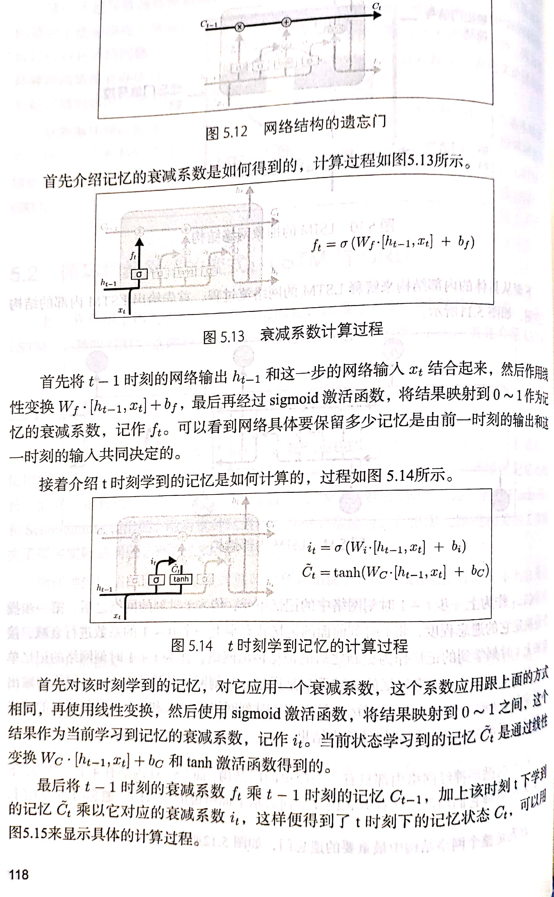
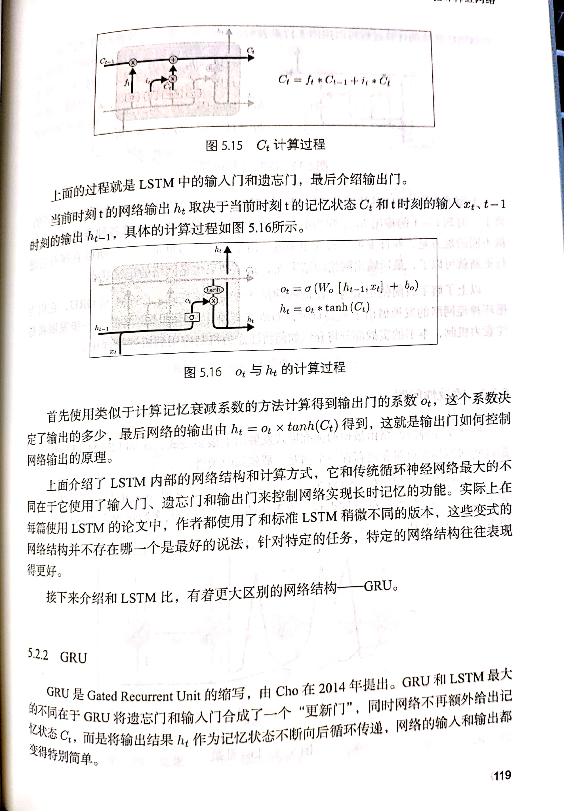
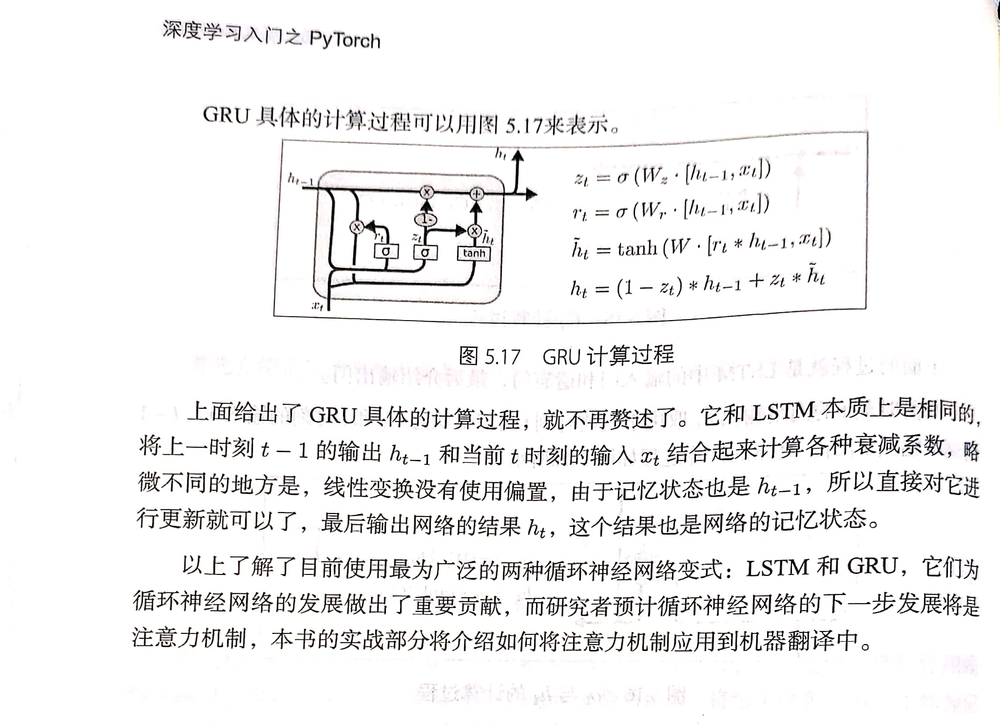

# RNN(循环神经网络)

*参考：《深度学习入门之PyTorch》配套代码地址：https://github.com/L1aoXingyu/code-of-learn-deep-learning-with-pytorch*

## 1. 前言
卷积神经网络相当于人类的视觉，但是它没有记忆能力，只能处理一种特定的视觉任务，没办法根据以前的记忆来处理新的任务。

循环神经网络的提出是基于记忆模型的想法，期望网络能够记住前面出现的特征，并依据特征推断后面的结果，并且整体的网络结构不断循环，因此得名循环神经网络。

## 2. 网络结构

使神经网络具有记忆性，一个很直观的做法是将隐藏层的信息进行保留作为下一个的输入，由此产生出的有以下几种网络结构：

### 2.1 基本 RNN

### 2.2 双向 RNN（BiRNN)

### 2.3 深层 RNN

*以上图示均为按照时间线展开，实际只是网络的循环，故名循环神经网络*

## 3. 存在的问题

早期的循环神经网络具有特别好的记忆性，能够记住当前情景下的内容，但这种循环神经网络能够解决短时依赖问题，对于长时依赖问题，由于记忆的信息和预测位置之间的跨度太大，网络并不能记忆这么长时间的信息，而且随着时间跨度的增大，循环神经网络也越来越难学习这些信息。

## 4. 循环神经网络的变式：LSTM 与 GRU

### 4.1 LSTM

LSTM 是 Long Short Term Memory Networks的缩写，长短期记忆模型。LSTM 比基本的循环神经网络的网络结构内部要复杂。

LSTM 的三个门：

- 输入门，输入门控制着网络的输入
- 遗忘门，遗忘门控制着记忆单元
- 输出门，输出门控制着网络的输出

### 4.2 GRU

GRU是 Gated Recurrent Unit的缩写，由 cho 在2014年提出。GRU 和 LSTM 最大的不同在于 GRU 将遗忘门和输入门合成了一个 “更新门”， 同时网络只进行传递和保存的状态是 `ht`.

### 4.3 收敛性问题

RNN 的误差曲面上存在很多陡峭的斜坡，斜坡上误差的变化率特别大，正是这个原因导致道路 loss 曲线在不断跳跃。

> 正是因为网络在训练过程中，梯度的变化范围很大，所以设置一个固定的学习率并不能有效收敛，同时梯度的变化并没有规律，所以设置衰减的学习率也不能满足条件。

可以采用的办法是： **梯度裁剪**，使用梯度裁剪能够将大的梯度裁，在一定程度上避免收敛不好的问题。

## 5. 循环神经网络的 pytorch 实现

### 5.1 PyTorch 的循环网络模块

#### 1. 标准 RNN

- `nn.RNN()`

关于参数设置：

- `input_size` 表示输入 x 的特征维度
- `hidden_size` 表示输出 h 的特征维度
- `num_layers` 表示网络层数，默认是 1 层
- `nonlinearity` 表示非线性激活函数的选择，默认是 `tanh`，可以选择 `relu`
- `bias` 表示是否使用偏置，默认是 `True`
- `batch_first` 决定网络输入的维度顺序，默认网络输入按照 `(seq, batch, feature)` ，解释为：序列长度、批量、特征维度；如果该参数设置为 `True`，则顺序变成 `(batch, seq, feature)`
- `dropout` 参数接收0-1的数值，会在网络中除了最后一层之外的其他输出层加上 `dropout` 层
- `bidirectional` 默认参数是 False