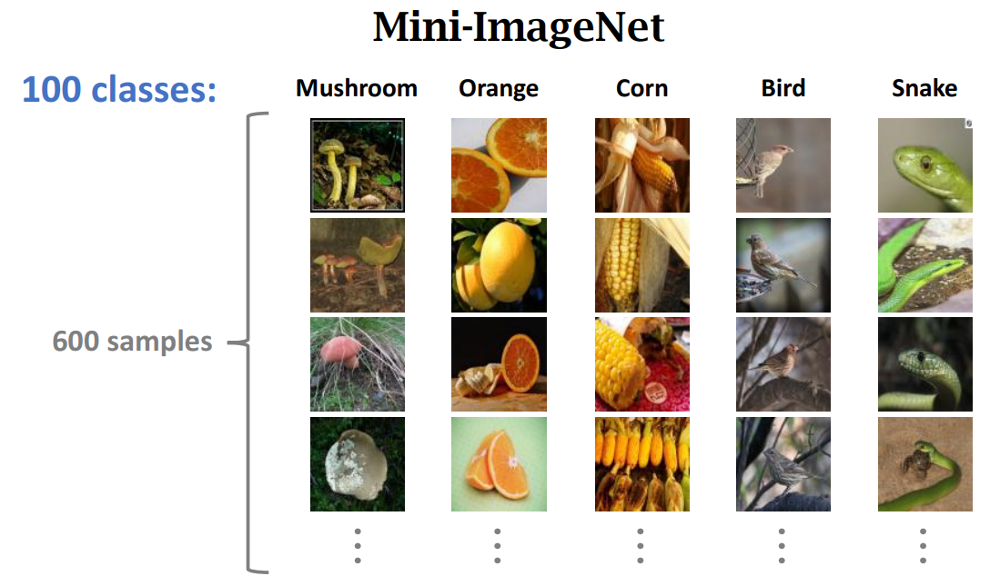

# Few Shot Learning

Few Shot learning 是 meta-learning 的一种，"Learn to learn"

## Few Shot learning v.s. Supervised learning

Supervised Learning

- Test 集 model 没见过，但类别已知

    

Few Shot Learning

- Training Set 用于Pre-train Model
- Support Set 用于Low Resource Class
- Query Set 用于Test

    

    

Support Set

- k-way: the support set has k classes
- n-shot: every class has n samples

训练过程（Few-Shot Learning, FSL的 episode 学习）：

> 每次训练（spisode）都会采样得到不同 meta-task。总体上来看，训练包含了不同的类别组合，这种机制使得模型学会不同 meta-task 中的共性部分，比如如何提取样本特征级比较样本相似等，忘掉 meta-task 中 task 相关部分。通过这种学习机制学习到的模型。在面对未见过的 meta-task 时，也能较好地进行分类。
>
> meta training 阶段构建一系列 meta-task 来让模型学习如何根据 support set 预测 batch set 中的样本的标签；meta testing 阶段的输入数据的形式与训练阶段一致（K-way, N-shot），但是会在全新的类别上构建 support set 和 batch set
>
> 摘自 https://zhuanlan.zhihu.com/p/61215293

## Few-Shot Learning 的基本思想

1. 基于 **High-Resources Classes** 部分的数据集训练 Pre-train Model
2. 基于 1 中的 model，得到 **Support Set** 中的 class embedding
3. 基于 1 中的 model，得到 **Query Set** 中的 class embedding
4. 计算 3 与 2 中每个 class 之间的 Similarity

    

## 常用的 CV Few-Shot Learning 数据集

- Omniglot 多种语言手写字母 few-shot 数据集

    

    

    

## Few-Shot 的常用 Model, Metric-Based -- Siamese Network

计算两两直接的相似度
    

### 改进：Triplet Loss

计算 Positive Sample，Negative Sample 和 Anchor 之间的 相似度
    

## Pretrain + Fine-tuning 提升性能

### Trick1

使用 support set mean vector/centric vector 初始化 W，b设置为 0

### Trick2

### Trick3

参考：

- CS853 Deep Learning by wangshusen: https://github.com/wangshusen/DeepLearning
- 小样本学习综述：https://zhuanlan.zhihu.com/p/61215293