# Few Shot Learning

Few Shot learning 是 meta-learning 的一种，"Learn to learn"

## Few Shot learning v.s. Supervised learning

Supervised Learning

- Test 集 model 没见过，但类别已知

    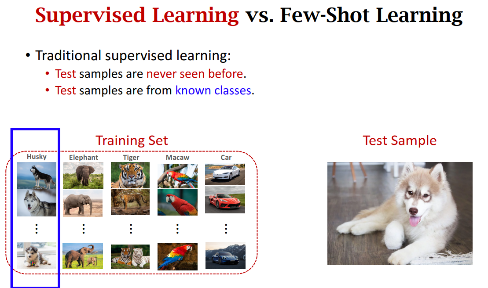

Few Shot Learning

- Training Set 用于Pre-train Model
- Support Set 用于Low Resource Class
- Query Set 用于Test

    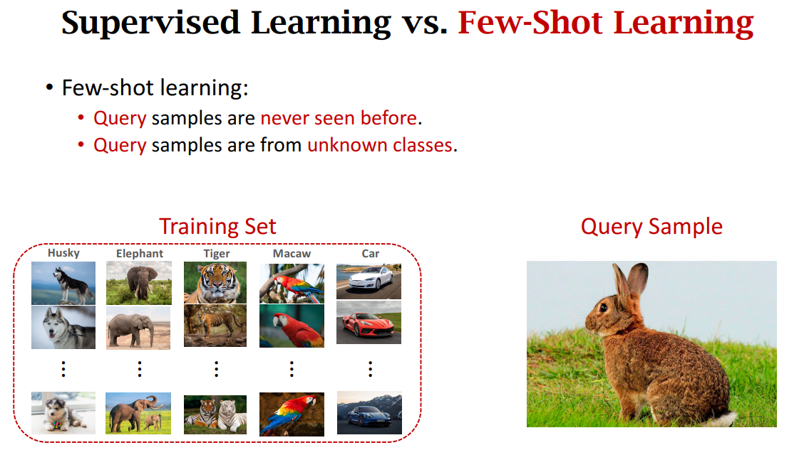

    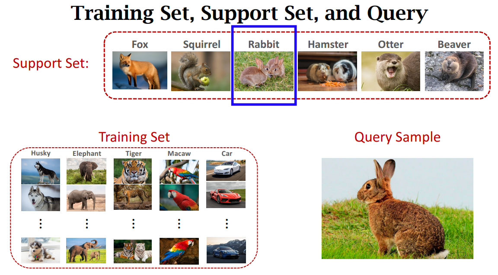

Support Set

- k-way: the support set has k classes
- n-shot: every class has n samples

## Few-Shot Learning 的基本思想

1. 基于 **High-Resources Classes** 部分的数据集训练 Pre-train Model
2. 基于 1 中的 model，得到 **Support Set** 中的 class embedding
3. 基于 1 中的 model，得到 **Query Set** 中的 class embedding
4. 计算 3 与 2 中每个 class 之间的 Similarity

    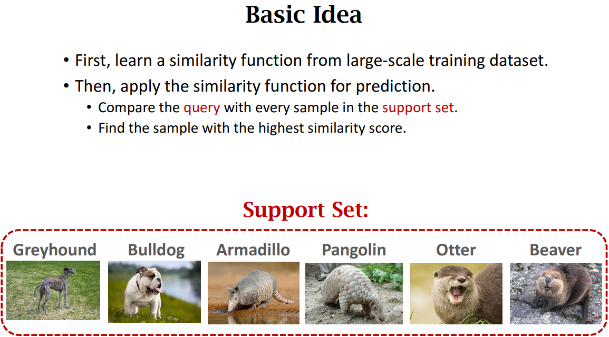

## 常用的 CV Few-Shot Learning 数据集

- Omniglot 多种语言手写字母 few-shot 数据集

    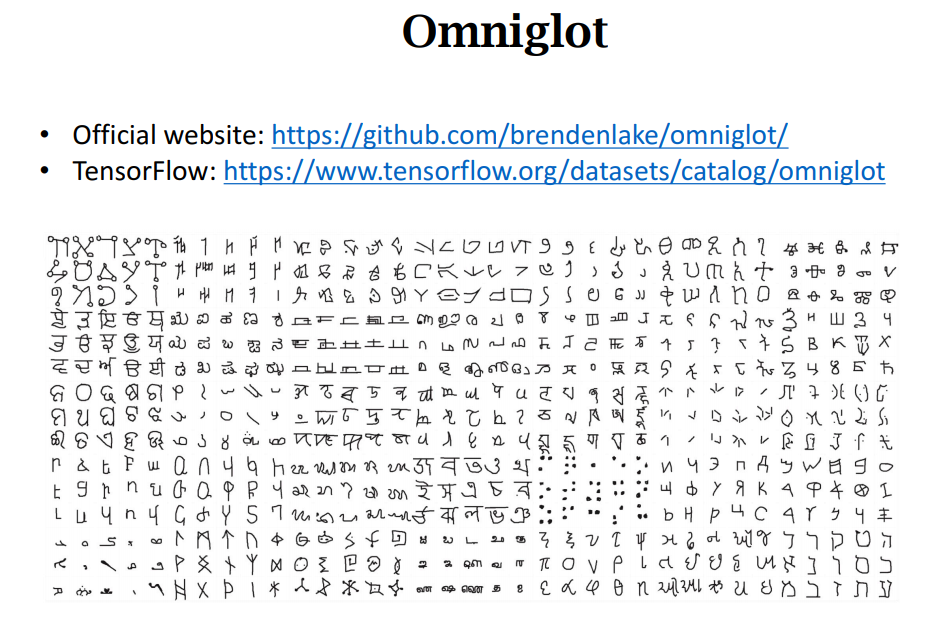

    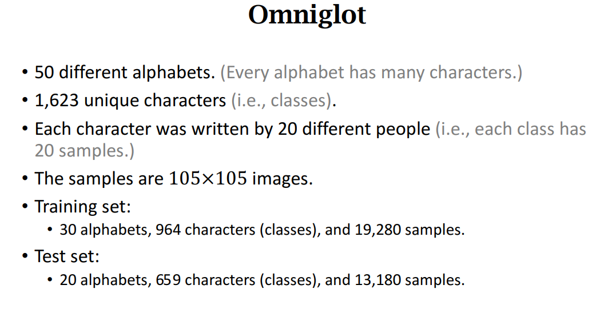

## Few-Shot 的常用 Model-- Siamese Network

计算两两直接的相似度
    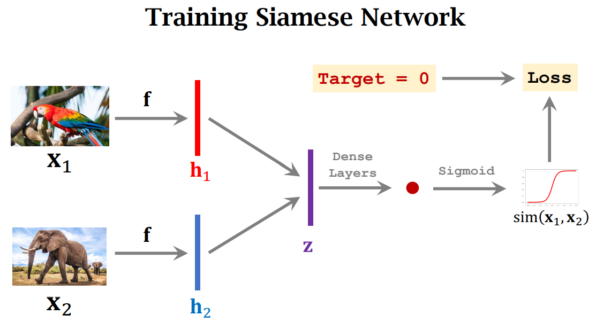

### 改进：Triplet Loss

计算 Positive Sample，Negative Sample 和 Anchor 之间的 相似度
    

## Pretrain + Fine-tuning 提升性能

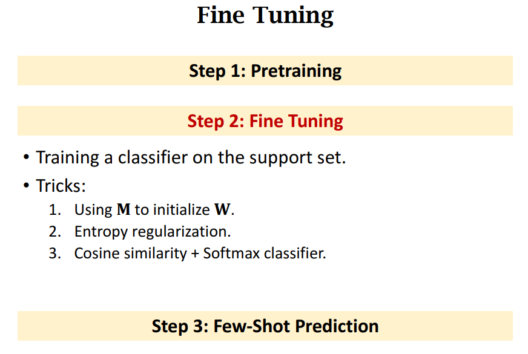

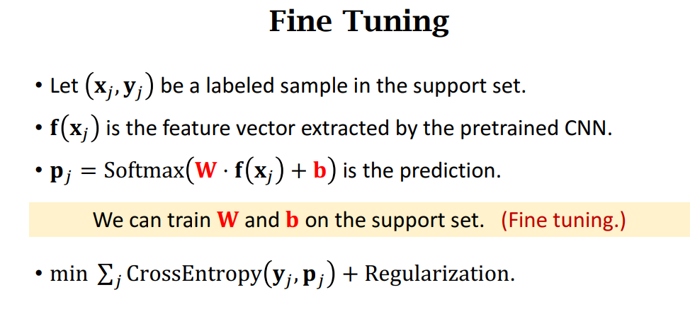

### Trick1

使用 support set mean vector/centric vector 初始化 W，b设置为 0

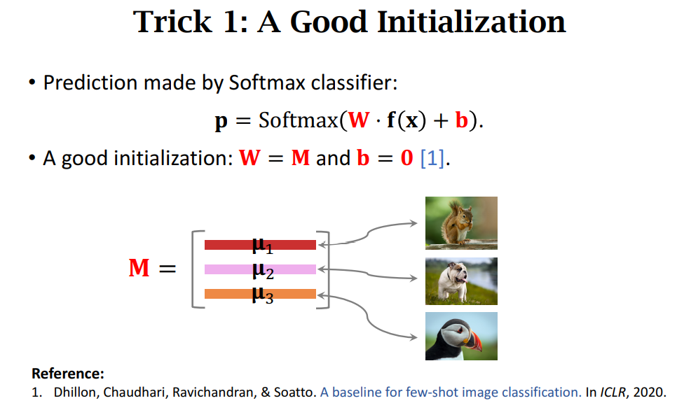

### Trick2

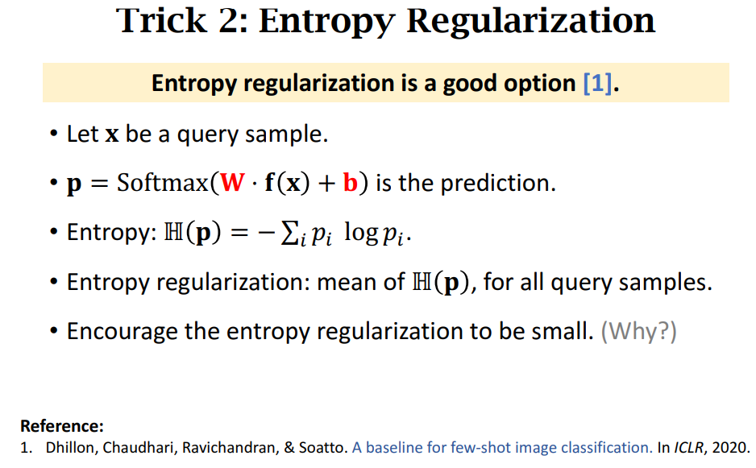

### Trick3

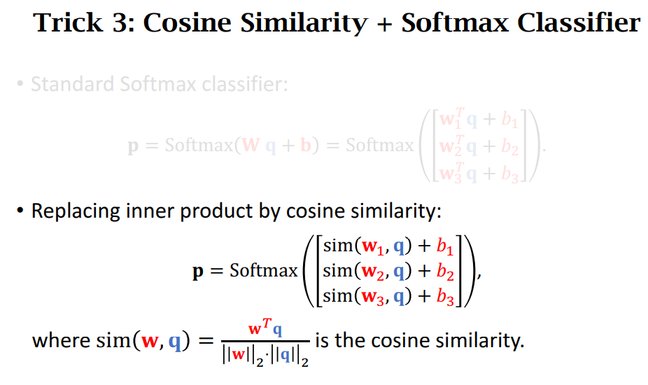

参考：

- https://github.com/wangshusen/DeepLearning