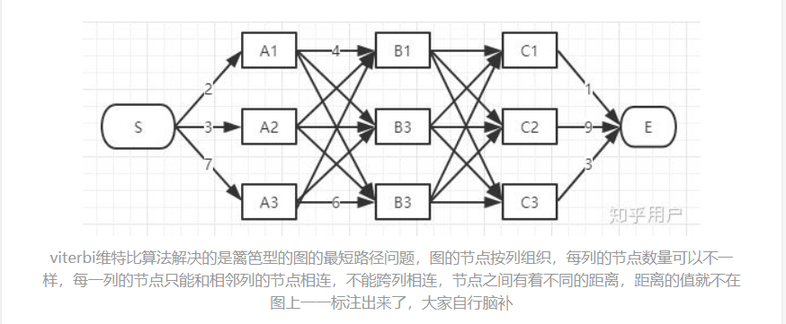

# 前言

`Viterbi` 算法常用于解决`预测问题`，如：在`HMM`、`CRF`中由已知序列推出得到观测序列；是一种`DP`算法。

# 问题

维特比算法适用于解决的问题：

# 流程

维特比算法的主要思想同其他求解图中的最优路径一样，不能单纯的认为某一条子路径一定时全局最优路径的一部分，因此采用`动态规划的思想`，对于经过的每一个节点都从前到后计算并保留最优路径。

# 参考

- [知乎-如何通俗地讲解 viterbi 算法？](https://www.zhihu.com/question/20136144)