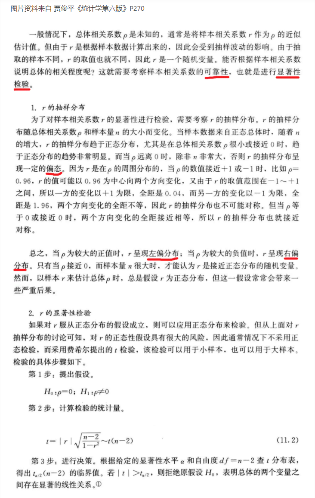

# 相关性分析

相关分析的主要任务：
- 判断两个或多个变量之间的统计学关联；
- 如果存在关联，进一步分析关联强度和方向；

用相关系数 `r` 来描述，分为：正相关，负相关，无线性相关

## 相关性分析的过程

### 判断拟研究变量的数量

2个变量？多个变量？

### 判断拟研究变量的类型

- 连续变量
- 二分类变量：二分类变量之间没有顺序，且是互斥的；如：男女，是否患病等
- 无序分类变量：具有三个及以上的分类变量，类别之间没有内在顺序，如：乘坐的出行方式；
- 有序分类变量：可以有两个或多个已排序的类别，可以进行排序，但不一定是等距的；如：患者对医疗效果的满意程度：1-非常满意，2-不满意；3-一般；4-满意；5-非常满意等，此为等距有序分类变量

### 选择检验方法

1. 均为连续变量：
    - Pearson 相关
    - 简单线性回归
2. 均为有序分类变量：
    1. 可以认为是定距变量
        - Mantel-Haenszel 趋势检验
    2. 不能认为是定距变量
        - Spearman相关又称Spearman秩相关
        - Kendall's tau-b相关系数
3. 均为无序分类变量
    - 卡方检验
    - Fisher精确检验
4. 均为二分类变量
    1. 区分自变量与因变量
        - 相对风险（RR值）
        - 比值比（OR值）
    2. 不区分自变量与因变量
        - 卡方检验和Phi (φ)系数
        - Fisher精确检验
5. 一个二分类变量，一个是连续变量
    - Point-biserial相关
6. 一个二分类变量，一个有序分类变量
    1. 有序分类变量是因变量
        - 有序Logistic回归
    2. 二分类变量是因变量
        - Cochran-Armitage 检验
        - Mantel-Haenszel卡方检验
    3. 不区分自变量与因变量
        - Biserial秩相关
7. 一个有序分类变量，一个连续变量
    - Spearman相关

# 假设检验

## 假设检验的几个重要概念

- 显著性水平：显著性水平是一个概率值，原假设为真时，拒绝原假设的概率，表示为α，常取值为0.05、0.01、0.10。
- 原假设与备择假设：待检验的假设又叫原假设(零假设)，一般表示为H0，原假设一般表示两者没有显著性差异。与原假设进行对比的叫备择假设，表示为H1。一般在比较的时候，主要有等于、大于、小于。
- 检验统计量：即计算检验的统计量。根据给定的显著性水平，查表得出相应的临界值。再将检验统计量的值与该显著性水平的临界值进行比较，得出是否拒绝原假设的结论。
- P值：是一个概率值，如果原假设为真，p值是抽样分布中大于或小于样本统计量的概率。
- 假设检验的两种错误：类型I错误（弃真），类型II错误（采伪）
- 单双侧检验：当假设关键词有不得少于/低于的时候用左侧检验，当假设关键词有不得多于/高于的时候用右侧检验

## 小概率原理

> 发生概率很小的随机事件，在一次实验中是几乎不会发生

如果发生，我们就有理由拒绝原假设

## 相关系数的假设检验

假设检验的必要性：

> 原因：在对实际现象进行分析时，往往是利用样本数据计算相关系数作为总体相关系数的估计值，但由于样本相关系数具有一定的随机性，它能否说明总体的相关程度往往同样本容量有一定关系。当样本容量很小时，计算出的不一定能反映总体的真实相关关系，而且，当总体不相关时，利用样本数据计算出的也不一定等于零，有时还可能较大，这就会产生虚假相关现象。为判断样本相关系数对总体相关程度的代表性，需要对相关系数进行显著性检验。若在统计上是显著的，说明它可以作为总体相关程度的代表值，否则不能作为总体相关程度的代表值。
>
> 显著性检验（significance test）：就是事先对总体（随机变量）的参数或总体分布形式做出一个假设，然后利用样本信息来判断这个假设（备则假设）是否合理，即判断总体的真实情况与原假设是否有显著性差异。或者说，显著性检验要判断样本与我们对总体所做的假设之间的差异是纯属机会变异，还是由我们所做的假设与总体真实情况之间不一致所引起的。 显著性检验是针对我们对总体所做的假设做检验，其原理就是“小概率事件实际不可能性原理”来接受或否定假设。
> 
> 引用来自：https://zhidao.baidu.com/question/1923851737619550587.html

## 如何进行相关系数的显著性检验

# 参考

- [相关系数的显著性检验](https://www.jianshu.com/p/00fd0ca895d5)
- [相关性分析的统计方法](https://zhuanlan.zhihu.com/p/94070722)
- [一文搞懂假设检验](https://mp.weixin.qq.com/s/6MdY0mTQ6JzrqQFxS1UzHQ)