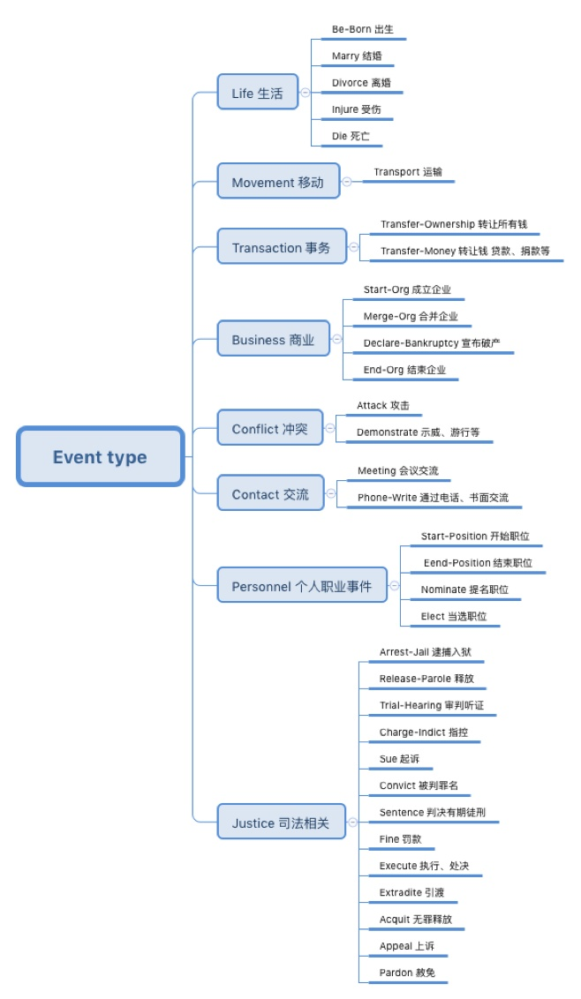

# ACE 2005 数据集详解

`ace_2005_td_v7_LDC2006T06`

## 1. 介绍

## 2. 事件抽取任务

- 事件检测（Event Detection），主要是根据上下文识别出触发词以及代表的事件类型和子类型；
- 事件元素识别（Argument Detection）：事件元素是指事件的参与者。

## 3. 标注类型

ACE2005定义了8种事件类别以及33种子类别。



## 4. 文件类型分析

### 4.1 `xxx.apf.xml` 文件

噶该文件为 `ACE annotation file format`，里面包含了多种标注：`entity`、`relation`、`event`；

#### 4.1.1 `entity` 的标注

```xml
<entity ID="CNN_CF_20030303.1900.00-E1" TYPE="PER" SUBTYPE="Individual" CLASS="SPC">
  <entity_mention ID="CNN_CF_20030303.1900.00-E1-2" TYPE="NOM" LDCTYPE="NOMPRE" LDCATR="TRUE">
    <extent>
      <charseq START="490" END="498">Secretary</charseq>
    </extent>
    <head>
      <charseq START="490" END="498">Secretary</charseq>
    </head>
  </entity_mention>
  <entity_mention ID="CNN_CF_20030303.1900.00-E1-14" TYPE="NAM" LDCTYPE="NAM" LDCATR="FALSE">
    <extent>
      <charseq START="754" END="793">Secretary of Homeland Security Tom Ridge</charseq>
    </extent>
    <head>
      <charseq START="785" END="793">Tom Ridge</charseq>
    </head>
  </entity_mention>
  ...
</entity>
```

#### 4.1.2 `relation` 的标注

```xml
<relation ID="CNN_CF_20030303.1900.00-R2" TYPE="PART-WHOLE" SUBTYPE="Geographical" TENSE="Unspecified" MODALITY="Asserted">
  <relation_argument REFID="CNN_CF_20030303.1900.00-E99" ROLE="Arg-1"/>
  <relation_argument REFID="CNN_CF_20030303.1900.00-E3" ROLE="Arg-2"/>
  <relation_mention ID="CNN_CF_20030303.1900.00-R2-1" LEXICALCONDITION="Possessive">
    <extent>
      <charseq START="1873" END="1882">our shores</charseq>
    </extent>
    <relation_mention_argument REFID="CNN_CF_20030303.1900.00-E99-69" ROLE="Arg-1">
      <extent>
        <charseq START="1873" END="1882">our shores</charseq>
      </extent>
    </relation_mention_argument>
    <relation_mention_argument REFID="CNN_CF_20030303.1900.00-E3-70" ROLE="Arg-2">
      <extent>
        <charseq START="1873" END="1875">our</charseq>
      </extent>
    </relation_mention_argument>
  </relation_mention>
  ...
</relation>
```

#### 4.1.3 `event` 的标注

```xml
<event ID="CNN_CF_20030303.1900.00-EV1" TYPE="Movement" SUBTYPE="Transport" MODALITY="Asserted" POLARITY="Positive" GENERICITY="Specific" TENSE="Past">
  <event_argument REFID="CNN_CF_20030303.1900.00-E96" ROLE="Vehicle"/>
  <event_argument REFID="CNN_CF_20030303.1900.00-E98" ROLE="Person"/>
  <event_argument REFID="CNN_CF_20030303.1900.00-E99" ROLE="Destination"/>
  <event_argument REFID="CNN_CF_20030303.1900.00-E4" ROLE="Agent"/>
  <event_mention ID="CNN_CF_20030303.1900.00-EV1-1">
    <extent>
      <charseq START="369" END="449">a 30-foot Cuban patrol boat with four heavily armed men landed on
American shores</charseq>
    </extent>
    <ldc_scope>
      <charseq START="277" END="514">Even as the
secretary of homeland security was putting his people on high alert last
month, a 30-foot Cuban patrol boat with four heavily armed men landed on
American shores, utterly undetected by the Coast Guard Secretary Ridge
now leads</charseq>
    </ldc_scope>
    <anchor>
      <charseq START="425" END="430">landed</charseq>
    </anchor>
    <event_mention_argument REFID="CNN_CF_20030303.1900.00-E96-178" ROLE="Vehicle">
      <extent>
        <charseq START="369" END="423">a 30-foot Cuban patrol boat with four heavily armed men</charseq>
      </extent>
    </event_mention_argument>
    <event_mention_argument REFID="CNN_CF_20030303.1900.00-E98-180" ROLE="Person">
      <extent>
        <charseq START="402" END="423">four heavily armed men</charseq>
      </extent>
    </event_mention_argument>
    <event_mention_argument REFID="CNN_CF_20030303.1900.00-E99-181" ROLE="Destination">
      <extent>
        <charseq START="435" END="449">American shores</charseq>
      </extent>
    </event_mention_argument>
  </event_mention>
  ...
</event>
```

### 4.2 `xxx.sgm` 文件

`.sgm`文件为 SGM 格式的文件，其中保存的为新闻的原文

```xml
<DOC>
<DOCID> CNN_CF_20030303.1900.00 </DOCID>
<DOCTYPE SOURCE="broadcast conversation"> STORY </DOCTYPE>
<DATETIME> 2003-03-03T19:00:00-05:00 </DATETIME> 
<BODY>
<HEADLINE>
New Questions About Attacking Iraq; Is Torturing Terrorists Necessary?
</HEADLINE>
<TEXT>
<TURN>
<SPEAKER> BEGALA </SPEAKER>
Well, we'll debate that later on in the show. We'll have a couple of
experts come out, so I'll withhold my comments until then. Even as the
secretary of homeland security was putting his people on high alert last
month, a 30-foot Cuban patrol boat with four heavily armed men landed on
American shores, utterly undetected by the Coast Guard Secretary Ridge
now leads. Now, why has our president placed homeland security in the
hands of Republican political hacks instead of professionals, by the way?
Attorney General John Ashcroft, for example, is a career politician. He
lost an election to a dead man. Secretary of Homeland Security Tom Ridge
is another career politician who was passed over by Mr. Bush for the vice
presidency. And Deputy Secretary of Homeland Security Asa Hutchinson is
yet another career politician and a graduate of the disgraceful Bob Jones
University. Apparently, Mr. Bush only turns to professionals when it's
...
```

### 5. 事件抽取

因为用ACE2005数据集多用来做事件抽取的任务，这里详细介绍下事件抽取相关。

关于 event-type 以及 event-argument 的相关，可以参考 [ldc-document](https://www.ldc.upenn.edu/sites/www.ldc.upenn.edu/files/english-events-guidelines-v5.4.3.pdf)