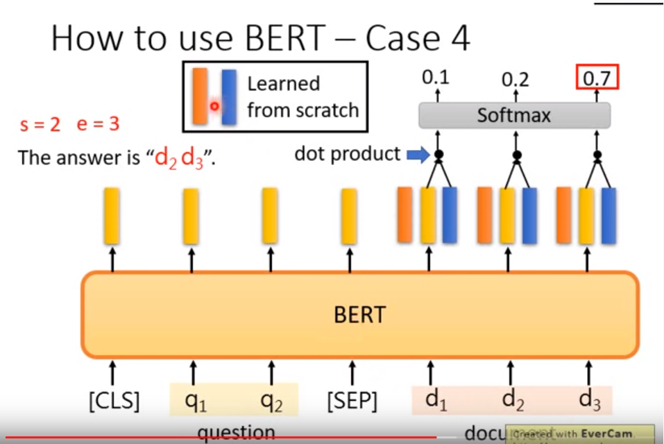

# Introduction of Bert, ELMO, GPT

## 结构

- 传统的 encoding 方式
- 现在的 word embedding 的几种方式

## 1. 传统的 encoding 方式

- 1-of-N encoding

    one hot 的方式，但缺乏词汇之间的语义相似度

- word embedding

    refer: https://www.youtube.com/watch?v=X7PH3NuYW0Q

*In the typical embedding, the same type hase the same embedding.*

**首先明确：下图中的 word， 属于相同的 type，但是不同的 token**

*Motivaton:* 那怎么做才能让language 在不同的 context 中，根据不同的 token拥有不同的 word embedding 呢？，一下介绍几种常见的 model

## 2. ELMO

Embeddings from Language Model (ELMO)

### 2.1 RNN-based ELMO

- RNN-based language model
- 不需要标注数据，直接 trainning

对于每个 input 的 hidden ，都可以代表该 token 在 context 中的 embedding，因为在不同的语境中，虽然是相同的 type， 但 token 的不同能产生不同的 embedding

### 2.2 LSTM-based ELMO

- 考虑进正向及反向的 contex 信息

- how to choose hidden layer?

当深度的 LSTM 进行训练的时候，train 得到的有很多 layer 的 hidden ，如何选取不同的 hidden layer作为 output 呢？？

ELMO says, utilize all!

- how to train ?

进行 weight sum，这里的 weight 是 α1，α2，α3...，表示出 deep RNN中 hidden layer 的 weight，这里把 α1，α2...当做 parameter 与 down stream 的 task 接起来一起 train！！

在上图中可以看出，down stream 的 tasks 的不同， train 出来的不同 hidden layer 的 weight 也不同，是与 down stream tasks 紧密相关的。

- SRL: Semantic Role Labelling
- Coref: co-reference ...

## 3. BERT

**Encoder of Transformer**

BERT 是 transformer 的 encoder，相比于前面的 transformer 需要大量的 annotation text， *Bert 不需要 annotation text*，train 之后的 model，输入 word 输出 embedding. Bert 的内部并不是 RNN，而是 self-attention 的 transformer 的 encoder.

*在中文中，也许使用 character 更为有效，因为中文中的词（word）是无穷无尽的，字（character）是有限的*

### 3.1 Training of Bert

**How to train Bert network?**

- Approach 1: Masked LM

1. input 的 word 会有 15% 被替换为一个特殊的 token，即 mask；
2. Bert 的 train goal 是把 mask 的 token 补充回来

当使用 Linear Multi-class Classifier做分类任务时，可能需要很多层的 Bert 用来 representation. 并且由此也可以看出当两个 word 填到一个 mask ，没有违和感则说明两个 word 有相似的 semantic

- Approach 2: Next Sentence Prediction

*Train goal:* next sentence prediction.

- SEP: 代表了两个句子的分界点
- CLS：代表了 Bert 的分类结果输出点，当 Bert 判断两个句子应当相接，CLS 输出 yes，否则输出 no.

> 当 Bert 同时使用者两个 tasks 进行 train 的的时候，learn 的效果最好！！

### 3.2 How to use Bert

最直接的想法是用 Bert 当作抽 feature 的工具，利用 Bert 输出的 word embedding进行 down stream tasks 的 训练。一下所有 tasks 的训练不同于上述中 Bert 的训练，下面的 task 属于 down streeam tasks of Bert，需要 labelled data.

- 把 bert 的训练和下游的任务放在一起进行 train

#### case1: Sequence -> class 分类任务

在开头的地方给一个分类的符号，再通过 接一个 linear classifier 进行分类，

Model:

- Bert + Linear Classifier for CLS position
- Input: single sentence
- Output: class
- Example: Sentiment Analysis ...

Train：

- Linear Classifier: Trained from scratch
- Bert: fine-tune
- model 需要学习到的参数的数量还是比较少的

#### case2: sentences' word slot

句子的词分类问题，将句子中的每个词填入一个class slot

Model:

- Bert + Linear Classifier for each embedding position
- Input: single sentence
- Output: class of each word
- Example: Slot filling

Train:

- 同上

#### case3: premise -> 判断 hypothesis

输入两个句子，一个作为 premise，一个作为 hypothesis，判断是否正确：T/F/unknown

Model:

- Bert + Linear Classifier for CLS position
- Input: two sentences
- Output: class
- Example: Natural Language Inference

Train:

- 同上

#### case4: Extraction-based QA

主要的任务是给 model 一篇文章和几个问题，model 能够正确地回答问题（Extraction-based Question Answering(QA) E.g. SQuAD）

Model:

- Bert + s-vector + e-vector，通过 s-vector, e-vector 与 word embedding做 dot product --- softmax 得到分数；
- Input: questions + documents
- Output: integers: s, e
- Example: Extraction-based Question Answering(QA) E.g. SQuAD

Train:

- 同上

对这种任务进行解释：这种是 Extraction-style，只能在原文中找答案

- 输入：Document D = {d1, d2, ... dn}，Query Q = {q1, q2, q3 ...}
- 输出：two integers（s, e), 两个 position 的标记， Answer: A = {ds,...,de}

### 3.3 中文版本的 bert -- Erine

这里在对 Bert 进行训练的时候不同于 以上 Bert mask LM 方法中对 character 进行 mask，这里是对 word 进行 mask。

### 3.4 What bert learns?

研究者通过将 bert 24层的 embedding 输出对比（这个过程是类似于 ELMO 的 weigt sum 方式，抽出 Bert 的 24 层的 hidden layer， 进行 weight sum 并与 down stream task 一起 train 发现， bert 的24层从低到高学习到了 NLP 的大部分过程：`one Bert = 文法->句法->语义`

> 图中横坐标代表 Bert 的24层的 representations，颜色越深代表该 task 利用该部分的 representation 越大。

### 3.5 Multilingual Bert

多语言的 bert，google 的研究者爬取104种语言的 wiki进行训练 多语言版本的 bert

## 4. GPT

**Generative Pre-Training**
特别大特别大的一个预训练模型

*GPT 是 transformer 的 decoder*，由 openAI 制作

GPT-2 model 特别巨大，能够在**没有训练资料**的情况下，做：

- Reading Comprehension
- Summarization
- Translation

GPT-2 OpenAI 最大的model 拥有的参数有 1542M，但考虑到到多种问题并没有被 release，release 的 model 的版本与 bert 差不多.

## 例子

- https://talktotransformer.com/
