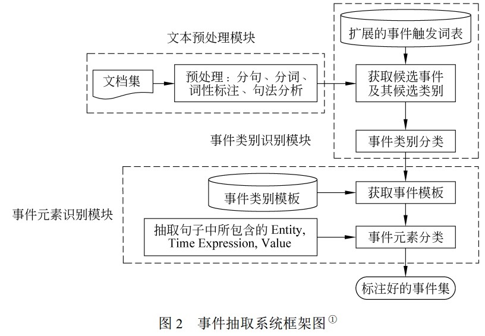
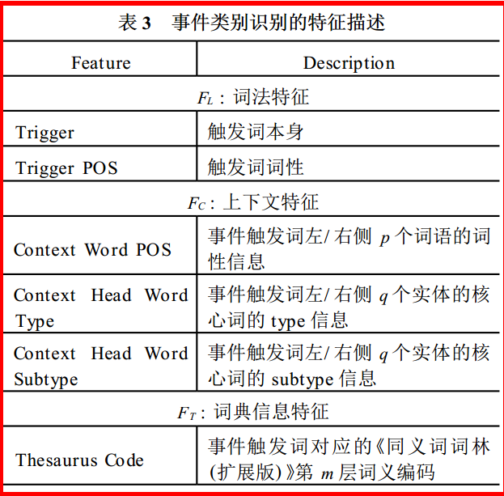
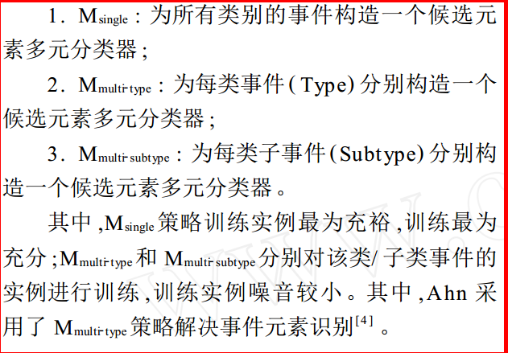
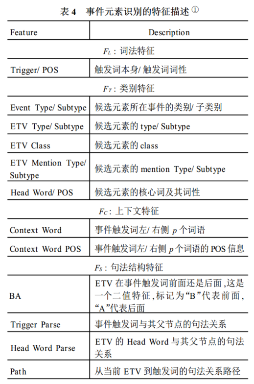

## 中文事件抽取技术研究

*C:/Users/wangc/Desktop/newsGrid/paper/事件抽取*

### 1. Motivation

#### 1.1 事件抽取的三大关键技术：
- EMD（Entity Mention Detection），实体识别
- ED（Event Detection），事件的识别
- ARP（Argument Role Prediction），论元角色的识别

#### 1.2 事件抽取的方法：
- 基于模式匹配的方法
- 基于机器学习的方法

#### 1.3 基于机器学习的方法把事件抽取的任务看作分类问题，
> Hai Leong Chieu 和 Hwee Tou
Ng 于 2002 年首次在事件抽取中引入最大熵分类
器[9 ] ,用于事件元素的识别 ; David Ahn 2006 年结
合 MegaM 和 Timbl 两种机器学习方法分别实现了
事件抽取中事件类别识别和事件元素识别这两个主
要步骤 , 在 ACE 英文语料上均取得了不错的效
果[4 ] 。 但 Ahn 的方法由于将每个词作为一个实例
来训练机器学习模型 ,引入了大量的反例 ,导致正反
例严重不平衡 ;此外 ,事件类别的多元分类以及为每
类事件元素单独构造多元分类器在语料规模较小的
时候存在着一定的数据稀疏问题 。

### 2. Method
> 本文提出一种基于触发
词扩展和二元分类相结合的识别方法进行事件类别
的识别 ,多元分类模型的方法进行事件元素的识别 ,
较好的避免了正反例不平衡和数据稀疏问题 。

**keywords: 基于触发词扩展和二元分类的事件识别，多元分类用于事件元素识别**

#### 2.1 系统架构图

#### 2.2 事件类别的识别

a. 通过对句子的分词查看扩充之后的触发词表，并对每一个候选事件划定一个候选事件类别的范围；

b. 通过将候选事件类别识别看作一个二元分类的问题，判断是否为满足候选类别的事件；

#### 2.3 事件元素的识别

将事件元素的识别任务看成分类问题，转换为对文本中每个候选元素进行类别标签的识别，再进行挑选

a. 三种多元分类的策略

b. 特征的选取

### 3. Performance

使用 ACE 2005 中文语料作为实验数据，使用 F值的评价方法进行评测。

### 4. Conclusion

这篇文章采用的是对事件识别和事件论元识别的分类方法，一种典型的 Pipe Model，在模型的改进方面并没有多大的创新。