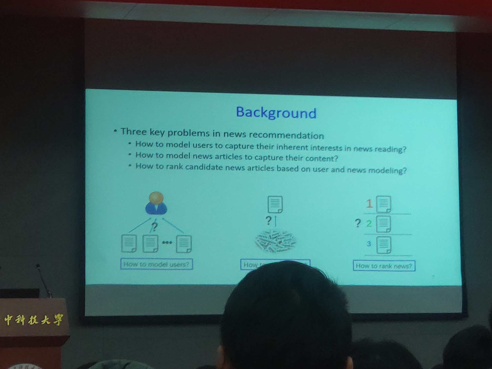
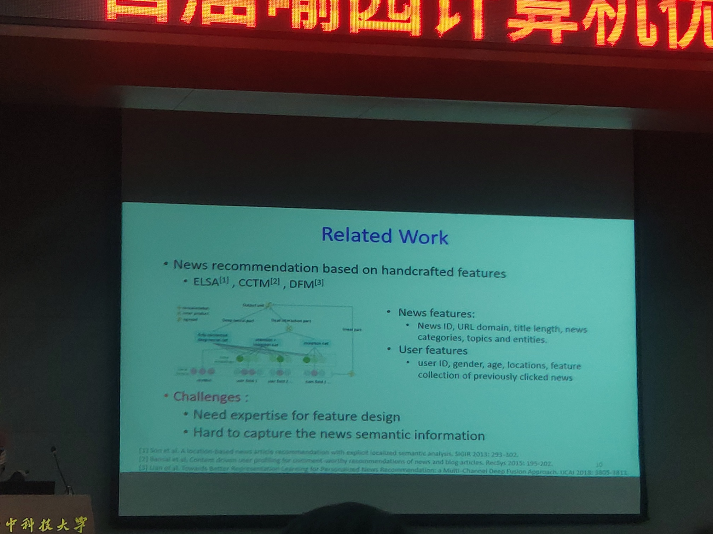
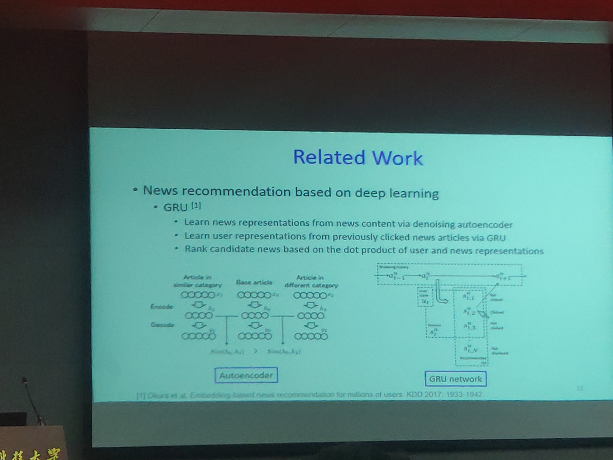
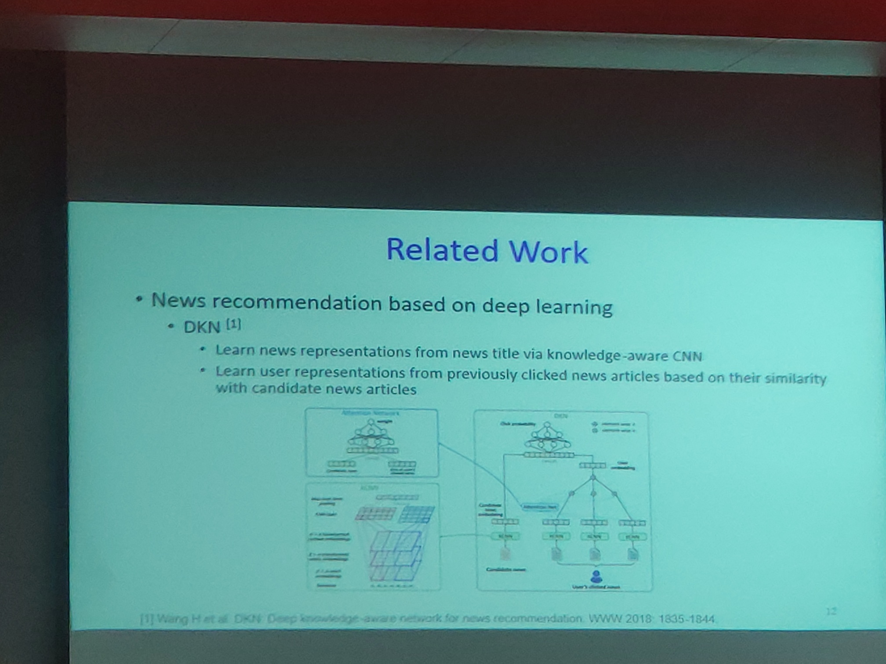
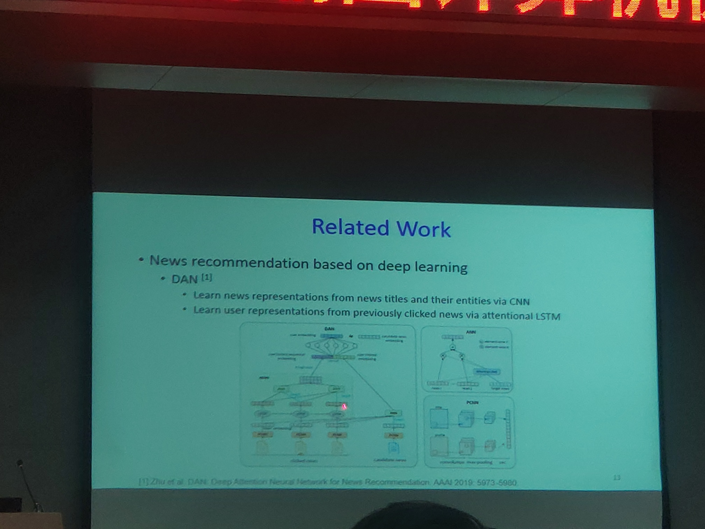
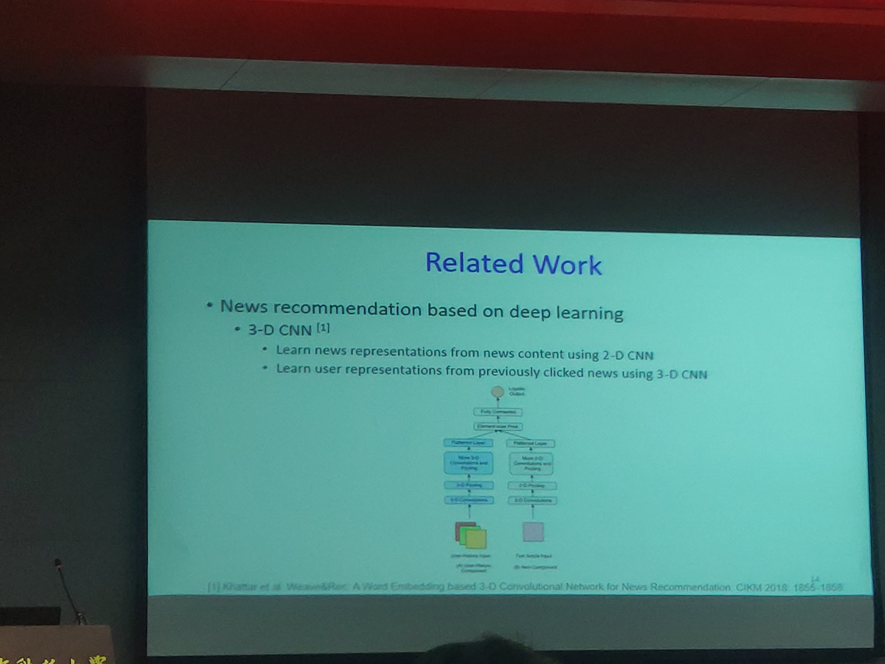
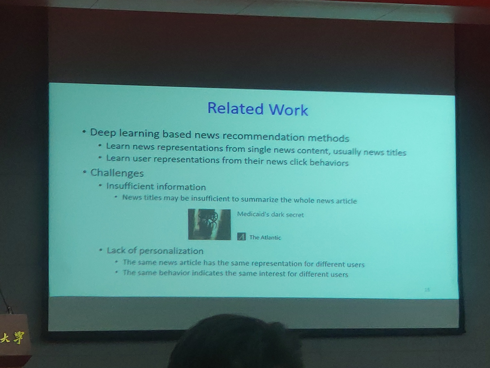
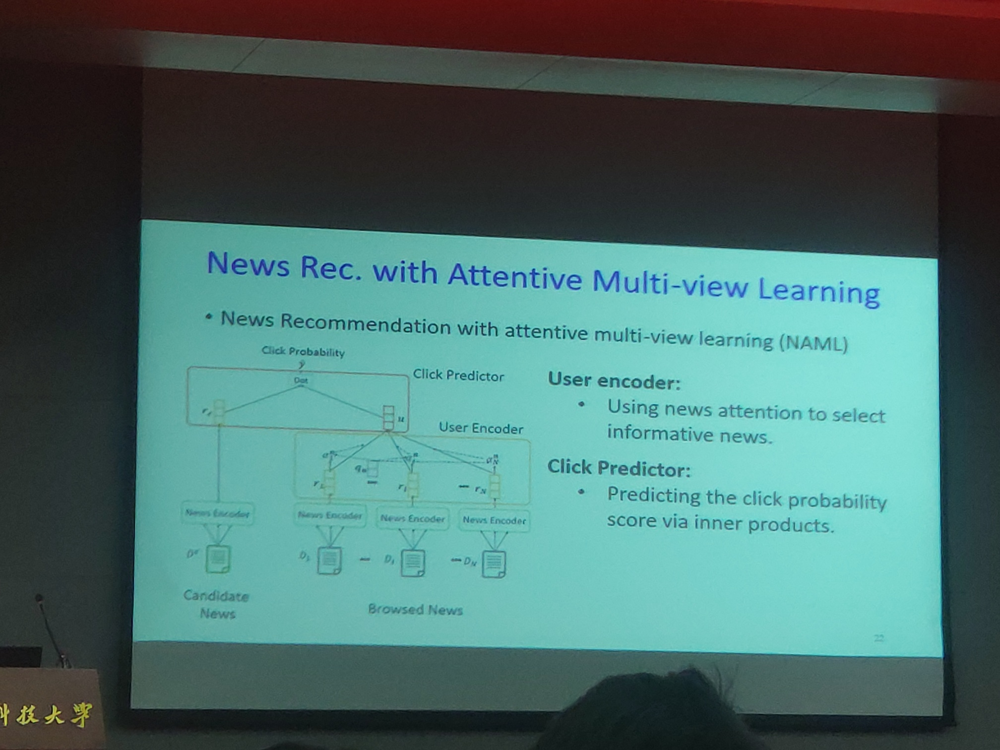
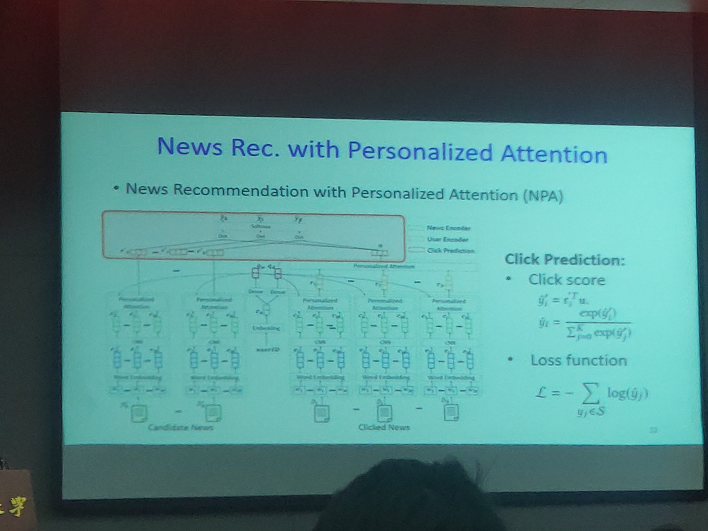
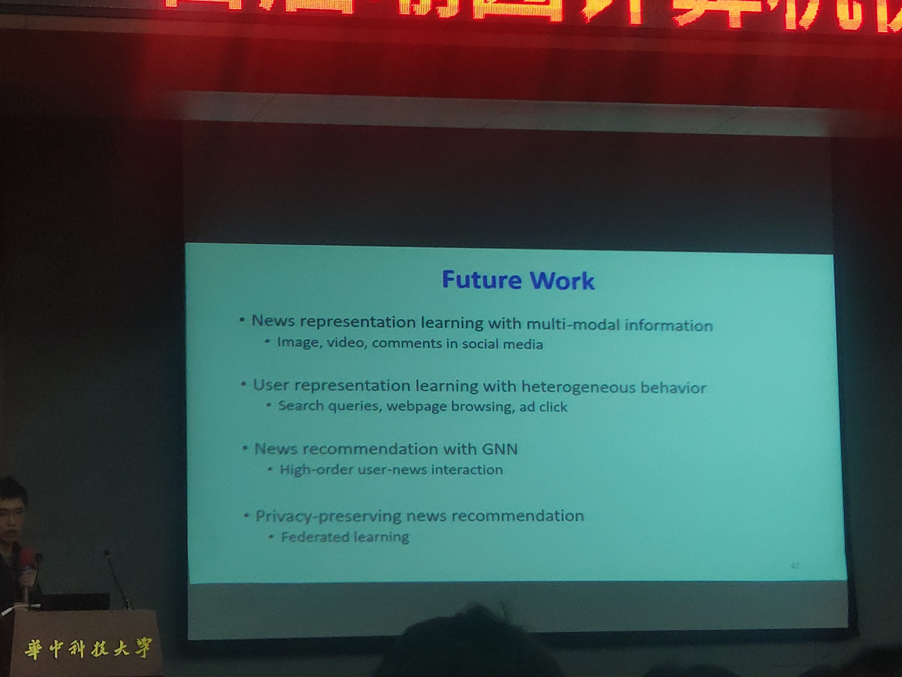

# 新闻推荐

*清华大学武楚涵博士*

## 相关工作

1. Google News Personalization: Scalable Online Collaborative Filtering”, WWW'07, pp. 271-280, 2007.

1. Jeong Woo Son, A.-Yeong Kim, Seong-Bae Park:
A location-based news article recommendation with explicit localized semantic analysis. SIGIR 2013: 293-302
2. Trapit Bansal, Mrinal Kanti Das, Chiranjib Bhattacharyya:
Content Driven User Profiling for Comment-Worthy Recommendations of News and Blog Articles. RecSys 2015: 195-202
3. Jianxun Lian, Fuzheng Zhang, Xing Xie, Guangzhong Sun:
Towards Better Representation Learning for Personalized News Recommendation: a Multi-Channel Deep Fusion Approach. IJCAI 2018: 3805-3811

1. Shumpei Okura, Yukihiro Tagami, Shingo Ono, Akira Tajima:
Embedding-based News Recommendation for Millions of Users. 1933-1942

1. Hongwei Wang, Fuzheng Zhang, Xing Xie, Minyi Guo:
DKN: Deep Knowledge-Aware Network for News Recommendation. WWW 2018: 1835-1844

1. Qiannan Zhu, Xiaofei Zhou, Zeliang Song, Jianlong Tan, Li Guo:
DAN: Deep Attention Neural Network for News Recommendation. AAAI 2019: 5973-5980

1. Dhruv Khattar, Vaibhav Kumar, Vasudeva Varma, Manish Gupta:
Weave&Rec: A Word Embedding based 3-D Convolutional Network for News Recommendation. CIKM 2018: 1855-1858

