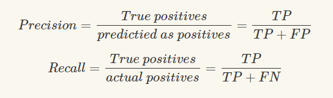

# Precison, Recall and F-score

今天偶然看到一篇讲到分类常用的指标的参数 `Pecision`，`Recall` 和 `F-Score` 的文章，这里记录下来

常见的关于 `P`，`R`，`F` 的文章应该是这样的，

这里常见的比较迷惑的地方就是关于 `positive`，总是套着这个公式计算。

其实从两个公式的概念上出发：

- `Precision`，查准率，用来度量预测出来的有多少是准确的；
- `Recall`，查全率，用来度量原本正确的有多少被预测出来；

这里的 **对的，也就是 Positive** 都是指带有标签的

- `查全率` 和 `查准率` 在一些情况下是相互矛盾的

    

    这里当 k > 1 时，查全率对 F 的作用更大；当 k < 1 时，查准率对 F 的作用更大。
    当 k = 1 时，两个的影响是相同的。

    

## 参考

- https://www.cnblogs.com/black-mamba/p/10528198.html