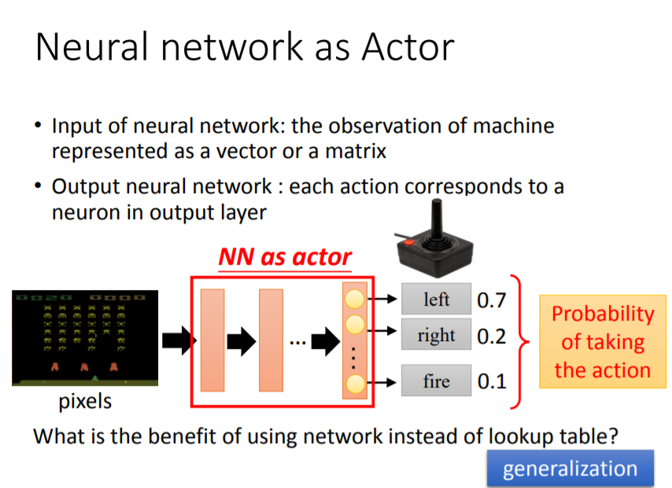
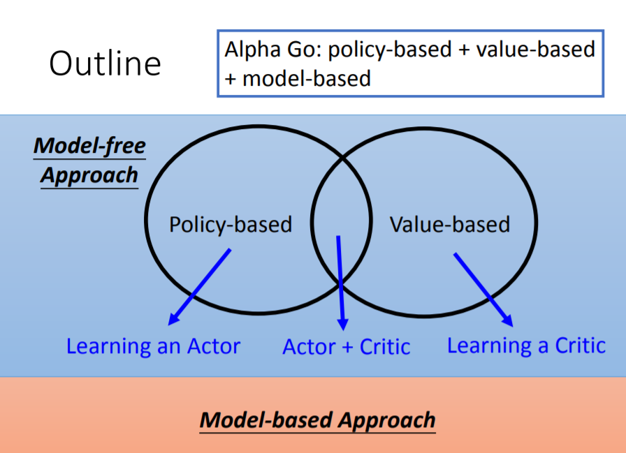
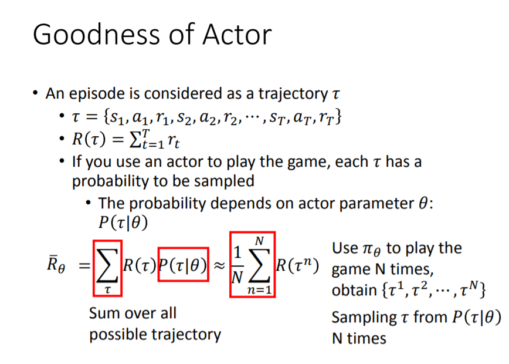
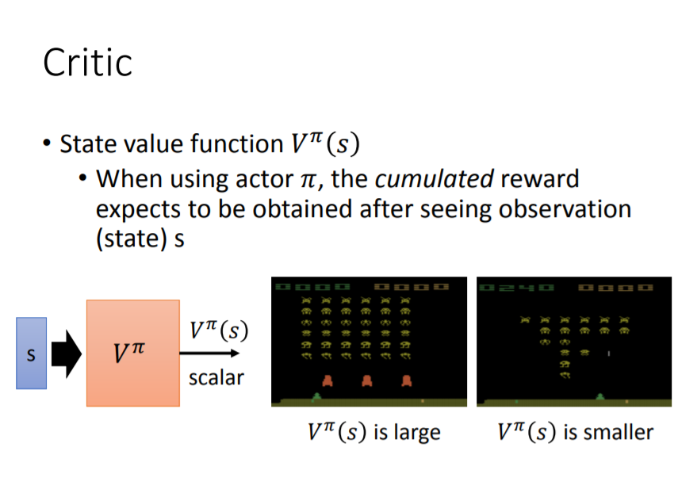

# 强化学习（Reinforcement Learning）

## 前言

强化学习（RL）为何伴随着深度学习又得到了发展？

强化学习并不是一个新的概念，其出现也较早，最近得到发展是因为可以用深度学习（DL）的Neural Network去解决强化学习的一部分问题，并且较之前的方法效果有所提升。

如在 `Policy-based Model`中，actor由原来的 `lookup table` 替换成了 NN，提升了 generalize 的能力。

## 分类

Reinforcemnet Learning：
- Model-based, 需要对环境进行建模
  - Policy-based, learn Critic
  - Value-based, learn Actor
- Model-free，不需要对环境进行建模

## Policy-based Approach

同 `supervised learning` 方法需要一个 `Loss function` 来评价 Actor 的好坏，这里需要评价Actor的方法是：使 Reward 最大的方法

## Value-based Approach

> A critic does not determine the action, given an actor pi, it evaluates the how good the actor is.

## 参考

- [李宏毅的机器学习视频](http://speech.ee.ntu.edu.tw/~tlkagk/courses_ML17.html)