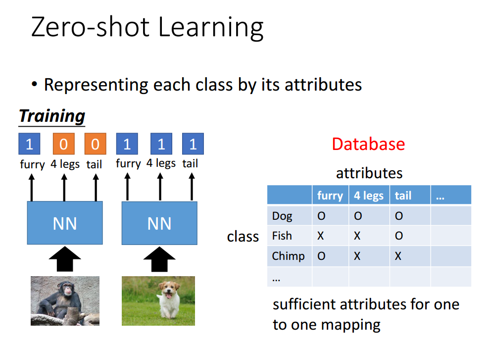

# 迁移学习（Transfer Learning）

refer: [李宏毅的机器学习课程](http://speech.ee.ntu.edu.tw/~tlkagk/courses_ML17.html)

前言：

迁移学习是通过 source data（往往具有丰富的训练数据）去构造得到一个在 target data（往往训练数据很少/几乎没有）效果比较好的Model。

## 分类

根据 source data 与 target data 的类型不同，可以将 transfer learning分为以下几个方面：

## source data(labelled) - target data(labelled)

对于这种情况，往往可以从 source data训练一个 Model，可以采用两种方式：

### Fine-tuning

通过 `transfer layer` 的方式将 source data对应 Model 的一部分迁移到 target data 的Model中，再使用 target data进行 Fine tune。

### Multitask Learning

除通过 `transfer layer`进行Model的layer迁移的方式外，还有一种通过多任务学习的方式进行。

## source data(labelled) - target data(unlabelled)

对于 target data是 unlabelled 的情况，往往关注点是如何提高 source data Model 的泛化能力，使其能应用到 target data上，可以采用以下两种方式：

### domain-adversarial training

domain-adversarial training，我们可以理解为领域特定的对抗训练，它主要是通过类似对抗学习的方式，对Model进行调整，任务如下：

如手写字符识别，主要是通过 MNIST 训练的模型，通过 domain-adversarial training使其能够运用到 MNIST-M 数据集上。

最重要的部分在于：label predictor与 Domain classifier。

domain classifier的作用是通过鉴别类别来backpropagate的方法来提高 Model 特别是 feature extractor 在该类别上的泛化能力。它的目的是保持输出的是统一类别，但只有该 domain classifier是不够的，往往物极必反，当 feature extractor输出都为0的时候，能够轻易地 cheat domain classifier。

因此会加入一个 label predictor，来保证feature extractor的调整不会影响到 label predictor的性能。

### zero-shot learning

> zero-shot unlabelled data
> one-shot few labelled data

通过将 image 与 attribute 映射到同一 vector space，再通过之间的距离来判断

但是 attribute 的缺少往往是很常见的情况，这时可以采用 word embedding的方法来代替

同样对于 zero shot learning 还可以采用当前最好的分类器，然后将分类结果进行 weight sum，使用 word vector的方法得到分类

