# Transformer

reference: https://www.youtube.com/watch?v=ugWDIIOHtPA

Seq2Seq model with self-attention

## Backgroud

RNN: Hard to parallel,  

### 1. Use CNN to replace RNN

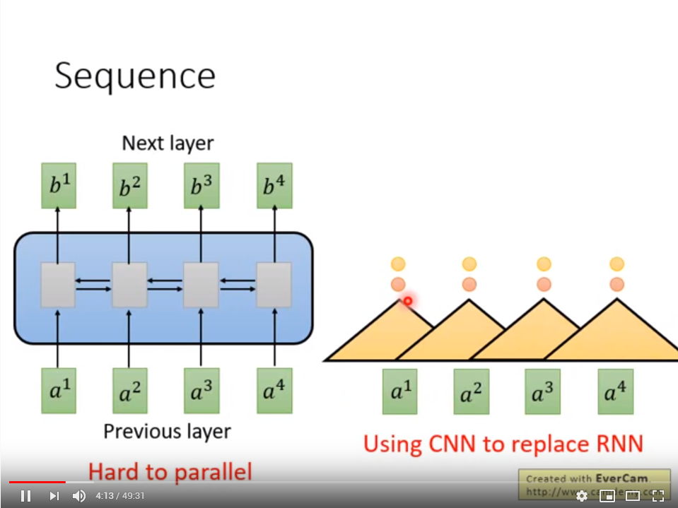

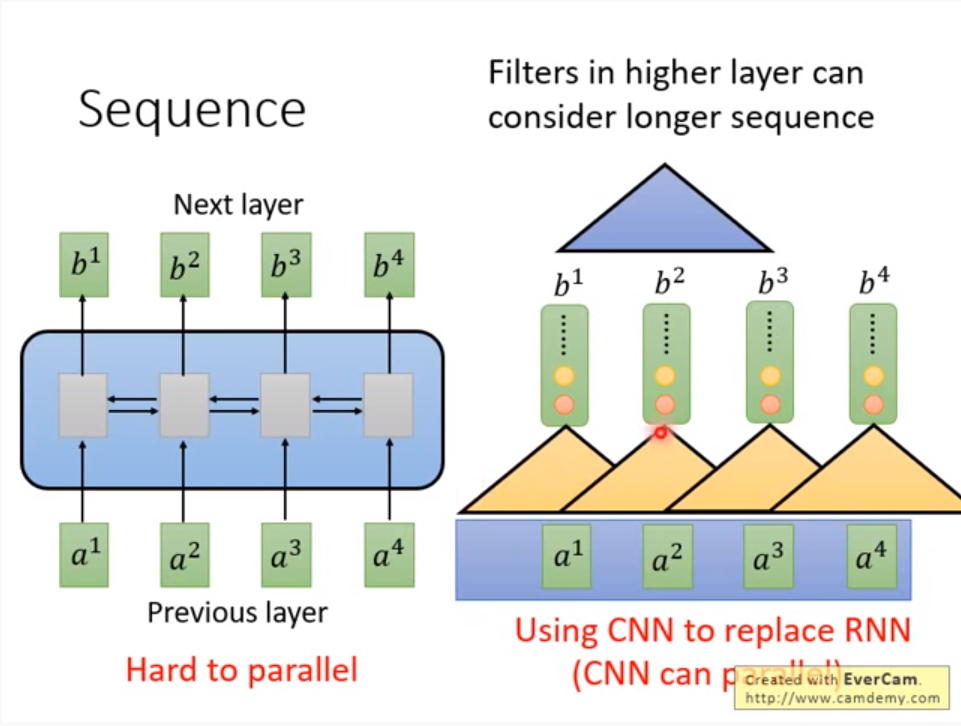

### 2. Self-attention

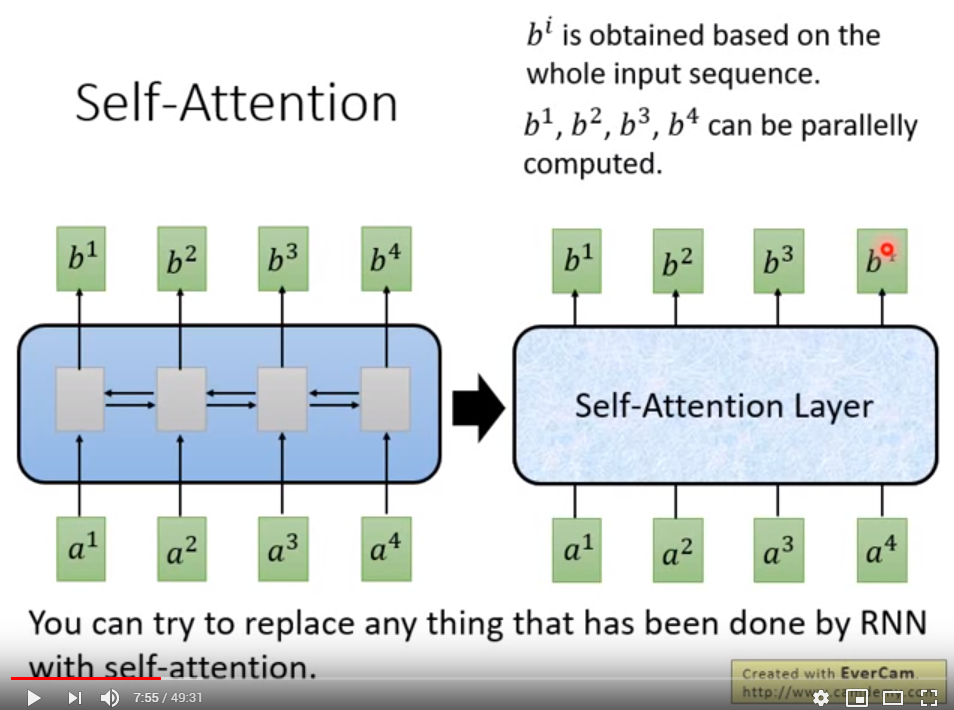

**Attention is all you need!**

不需要 RNN/CNN，所需的仅为 attention，输入为 seq 输出为 seq

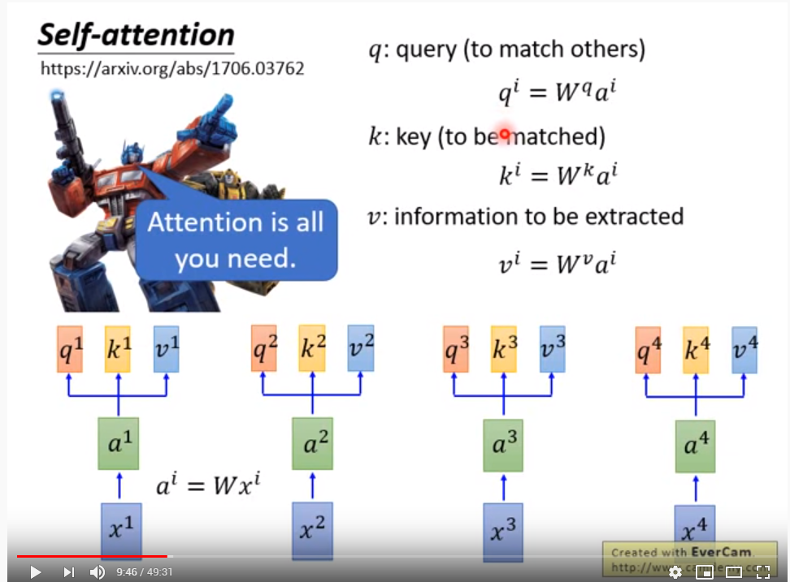

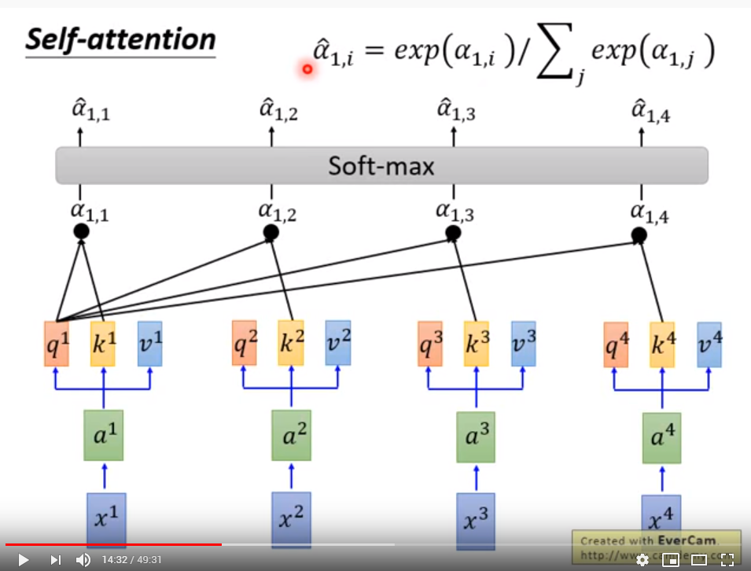

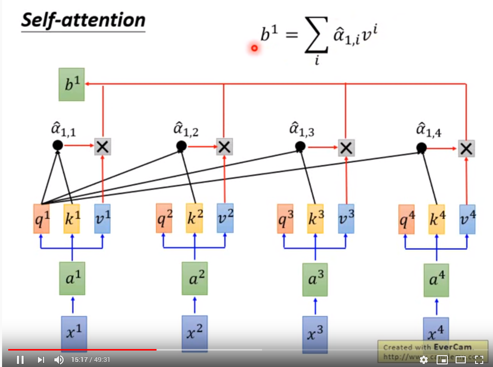

q 代表的是查询的 weight；k 代表的是被匹配的 weight

### 3. multi-head self-attention

多抽头的 self-attention：

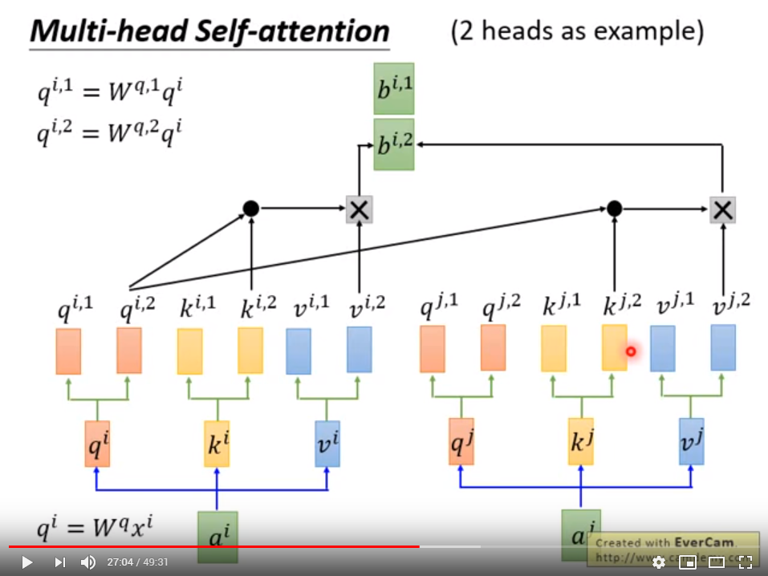

考虑进位置信息的 self-attention

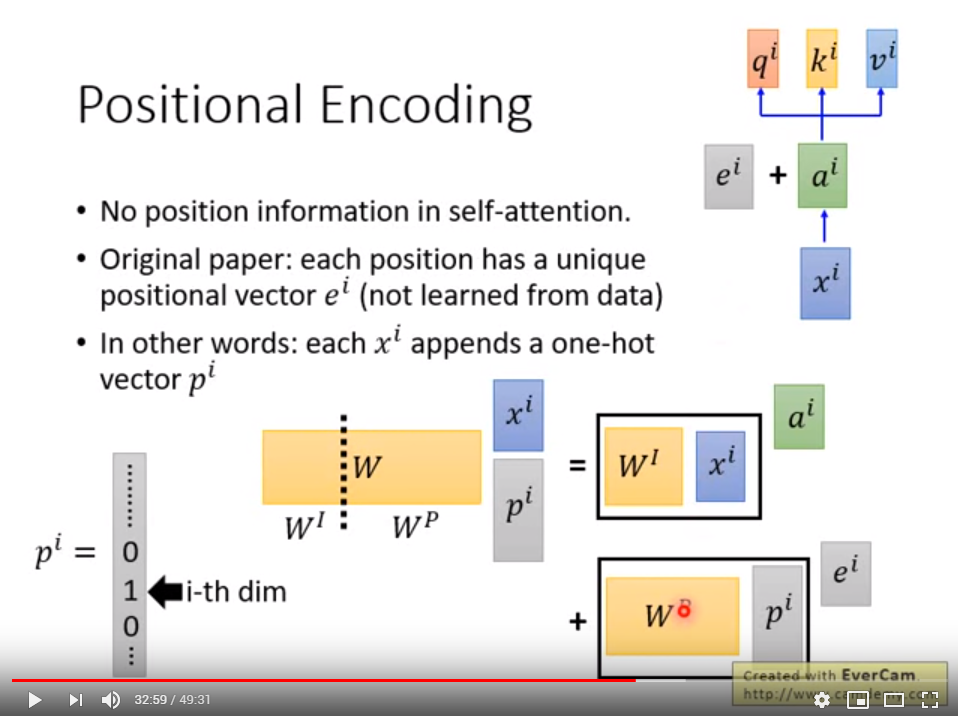

将 RNN 替换为 self-attention之后的 seq2seq model:

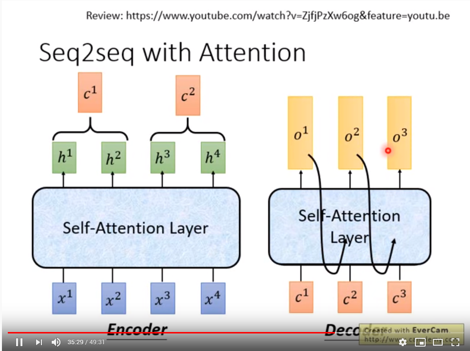

### 4. transformer -- Google AI Blog

- https://ai.googleblog.com/2017/08/transformer-novel-neural-network.html

### 5. 常见的 translation seq2seq model

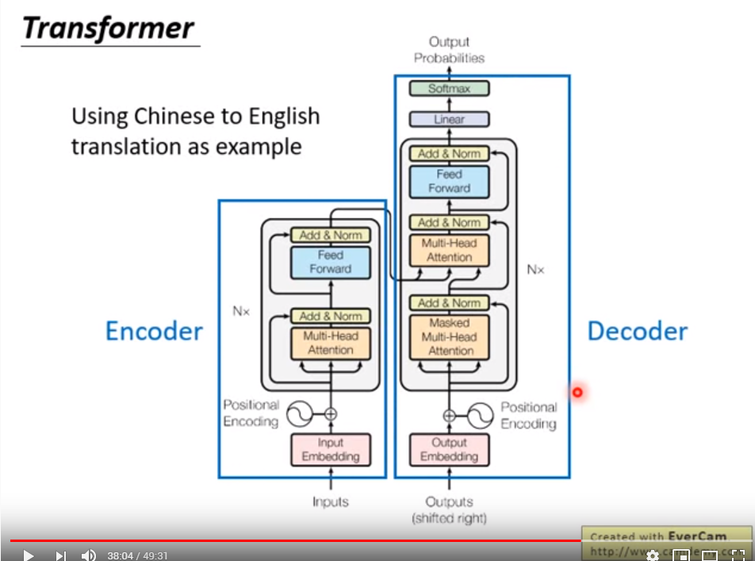

self-attention transformer encoder会将 input data 的信息看完，在 decoder 中，会看 input data 的 layer及前一个产生的 token .

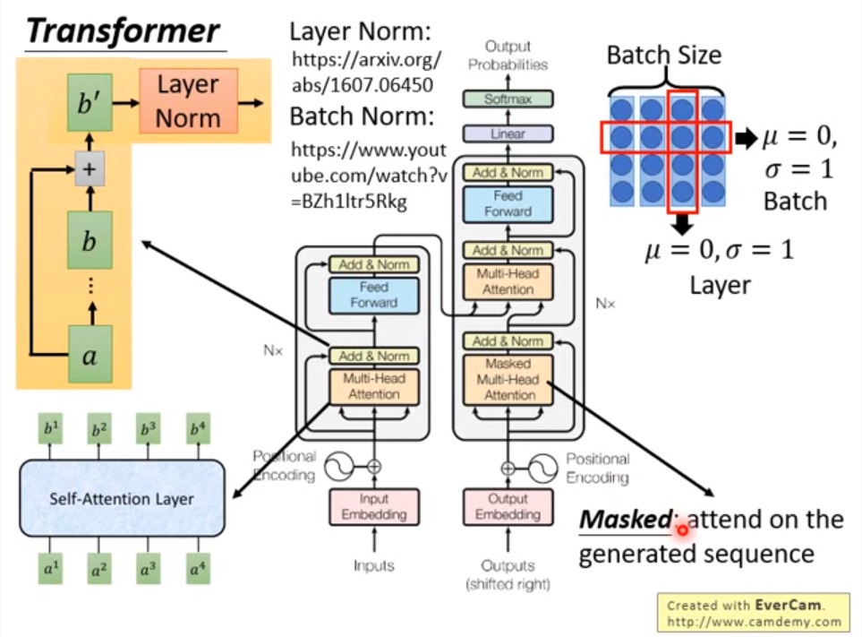

### 6. transformer 的常见应用

将传统 RNN 不能处理长的 sequence，应用到 transeformer，使其输入文章生成 wikepedia 型的sequence。

-reference: https://arxiv.org/pdf/1801.10198.pdf

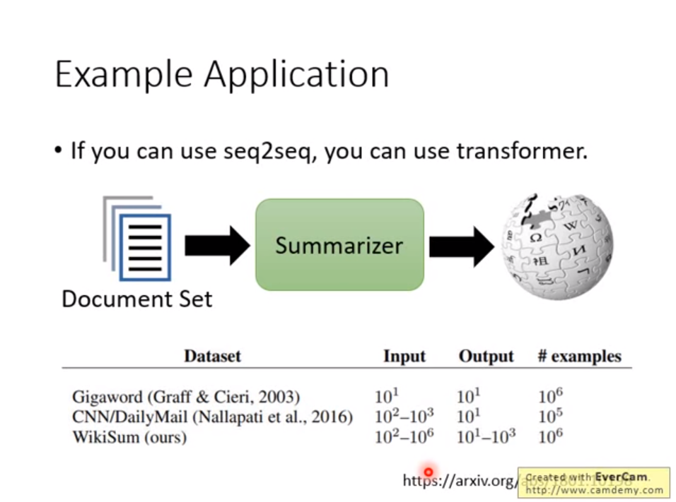

### 7. Universal Transformer

将 original tansformer 在时间上做 RNN，重复利用

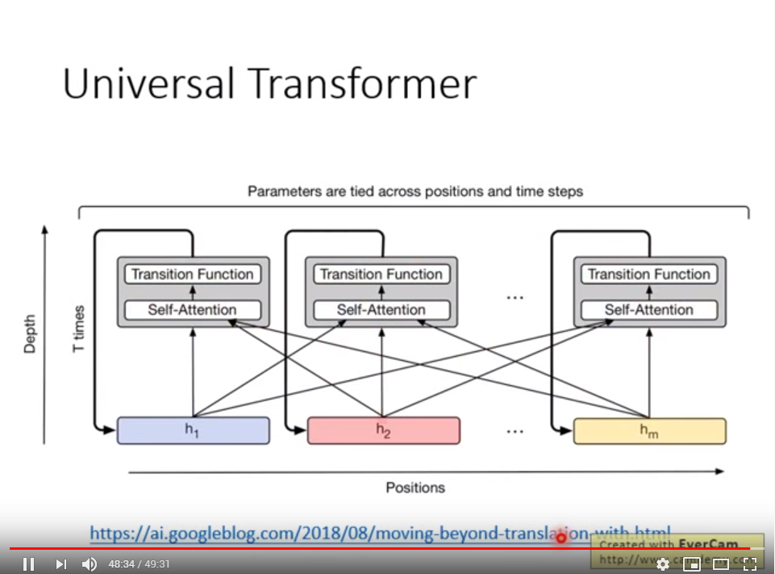