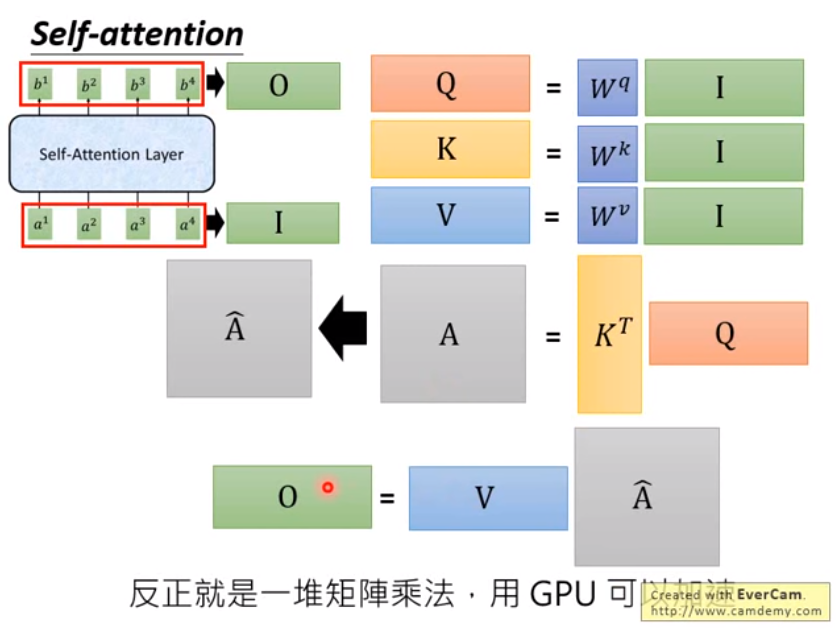

# Transformer

reference: https://www.youtube.com/watch?v=ugWDIIOHtPA

Seq2Seq model with self-attention

## Backgroud

RNN: Hard to parallel,  

### 1. Use CNN to replace RNN

### 2. Self-attention

**Attention is all you need!**

**不需要 RNN/CNN，所需的仅为 attention，输入为 seq 输出为 seq**

q 代表的是查询的 weight；k 代表的是被匹配的 weight，v 代表的当前位置的表示向量

从矩阵的并行运算来考虑整个运算过程是这样的：

### 3. multi-head self-attention

为什么会引入 `multihead self-attention`：

不同的 head 可关注不同层面的信息，以`2-head-self-attention`为例，1-head可能更关注 local 层面的信息，2-head 可能更关注 global 层面的信息。

多抽头的 self-attention：

这里对每个 a 得到多个 b_i_n 可以通过一个矩阵 transform 进行降维。

从上述可以看出，上述的 seq2seq 结构并没有考虑位置信息，有点像 BOW 一样，所以针对其进行改进，考虑进位置信息 `self-attention`

在 a_i 中加入 e_i（并不是从 data 中学习得到，人为设置）；
关于为何是把 e_i 直接相加，而不是 concatenate：将 e_i concatenate 上 a_i，乘上 W，经过矩阵分解运算，可以发现最终和直接加上一个vector的效果是一样的。

将 RNN 替换为 self-attention之后的 seq2seq model:

### 4. transformer -- Google AI Blog

- https://ai.googleblog.com/2017/08/transformer-novel-neural-network.html

### 5. 常见的 translation seq2seq model

self-attention transformer encoder会将 input data 的信息看完，在 decoder 中，会看 input data 的 layer及前一个产生的 token .

### 6. transformer 的常见应用

将传统 RNN 不能处理长的 sequence，应用到 transeformer，使其输入文章生成 wikepedia 型的sequence。

-reference: https://arxiv.org/pdf/1801.10198.pdf

### 7. Universal Transformer

将 original tansformer 在时间上做 RNN，重复利用

