# Word Embedding

## 1-of-N Encoding

## 2. Word Embeddding

- `unsupervised learning`
- `dimension reduction` wword embedding 的维度要比 1-of-N encoding 低很多

## 3. Training 的两种方法

### 3.1 Count-based 

通过计算 co-occurence frequency，并计算两个 vector 的 dot product，使其与 frequency 相似

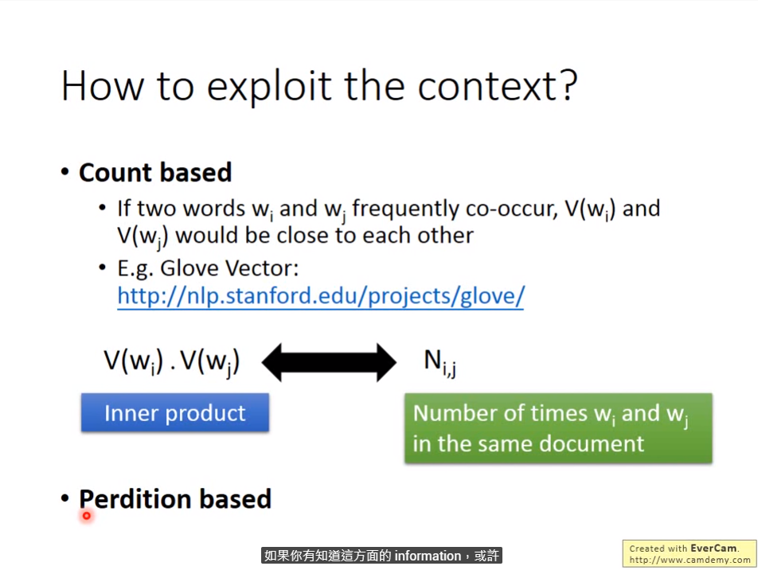
 
### 3.2 Prediction-based 

基于 prediction 的方法，通过学习上下文的信息来预测下一个输出，来保证下一个输出相同的输入具有相似的 input vector

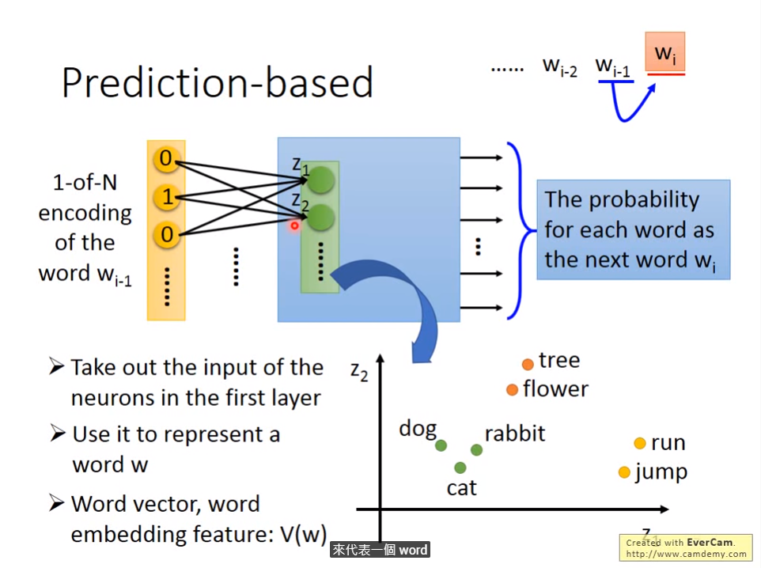

上述只是考虑到了前一个词汇的 vector 输入，当输入扩展到 n 的时候，采取的方法是将 weight metrix 强制相等

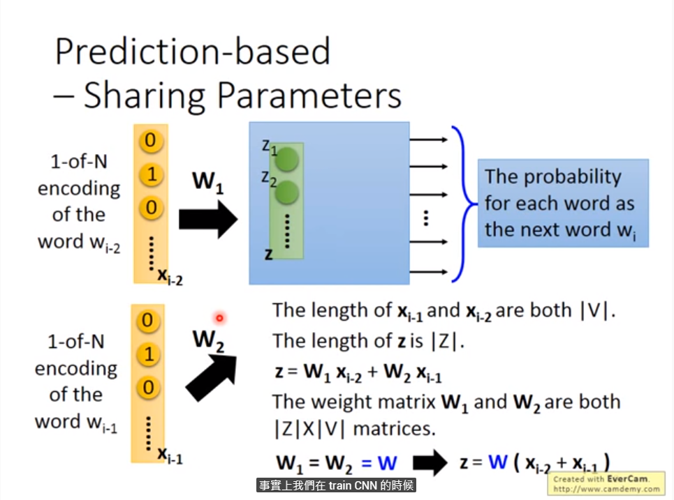

- 如何保证 weight metrix 是相等的呢？

保证每次 weight update 的时候减去相同的分量

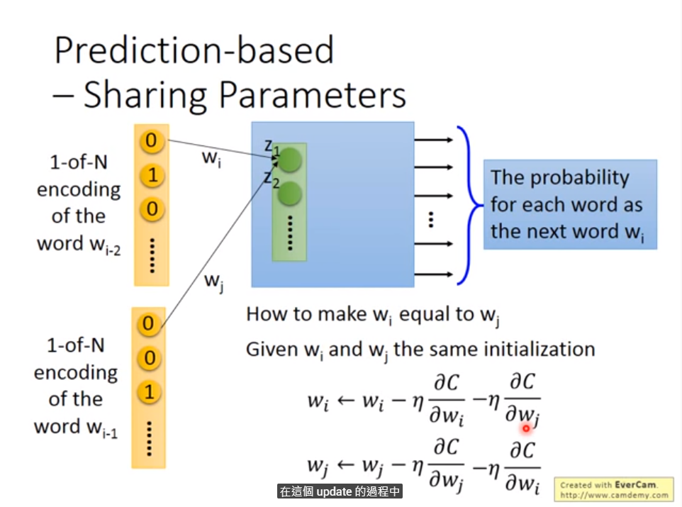

### 3.3 Prediction-based -- Various Architecture

- CBOW(Continuous bag of word)
- Skip-gram

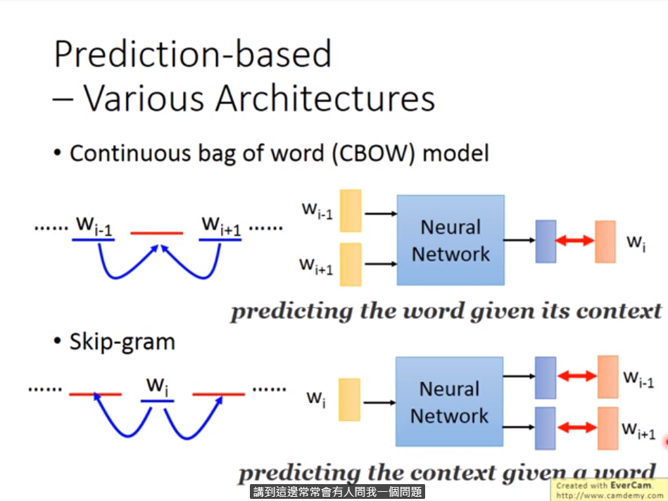

### 3.4 Word Embedding 的 hidden layer 为什么不是 deep 的

Tomas Mikolov

> word embeeding是个很早的概念，以前也是 deep 的做法，但是效果并不太好，Tomas 使用很多 trick ，并采用单个 hidden layer 的做法将效果训练的很好

### 3.5 word vector的一些有趣的东西

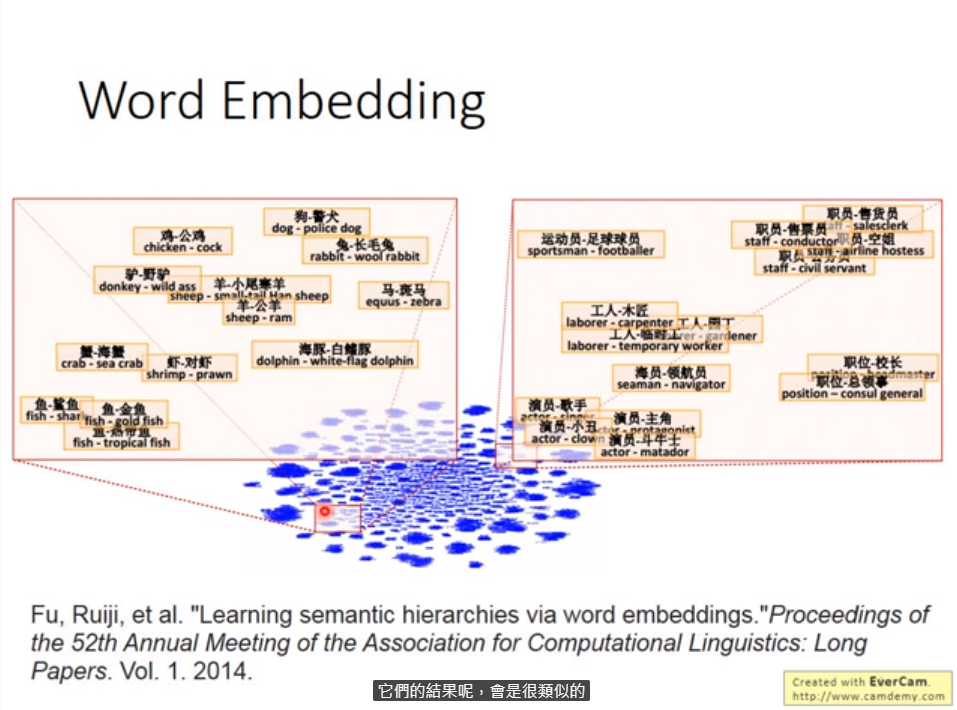

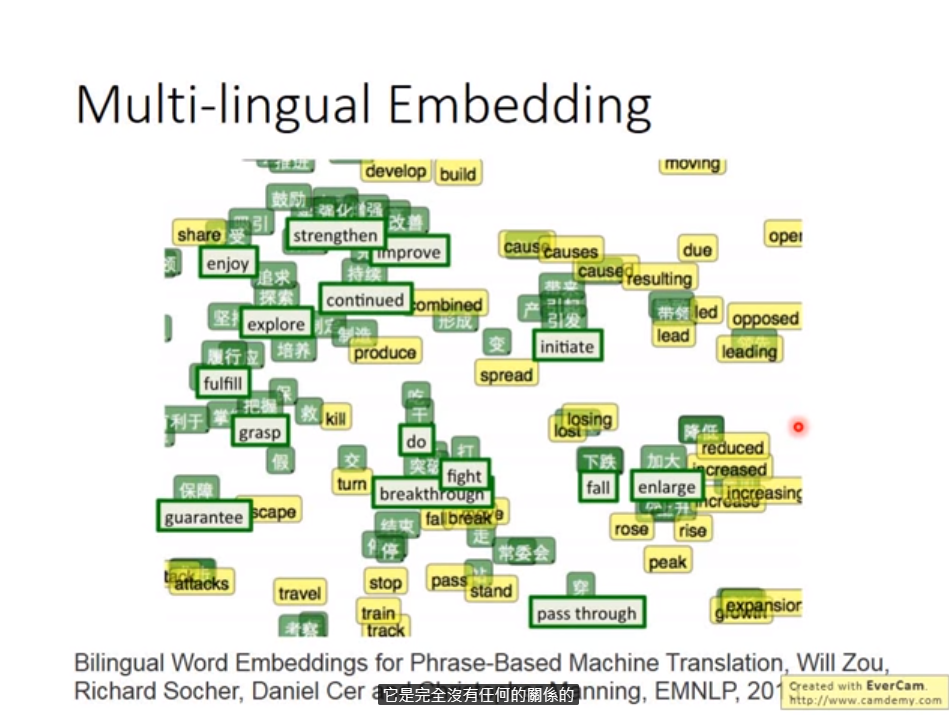

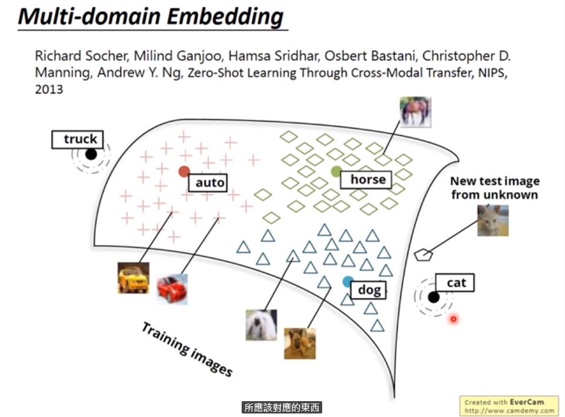

### 3. Document embedding

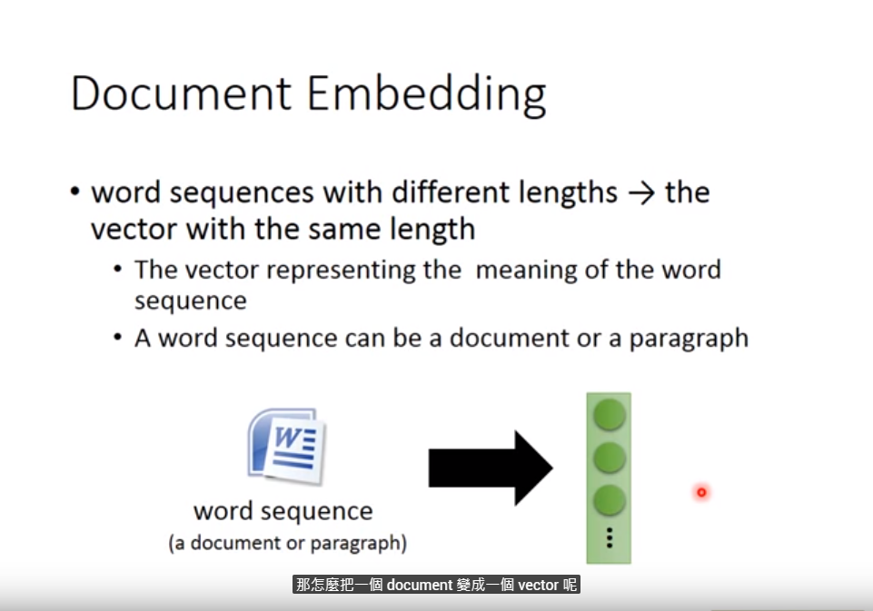

一种直观的想法是使用 Bag-of-word 的思路，将 word ebedding 组成 document 的 semantic，word 的位置信息也很重要

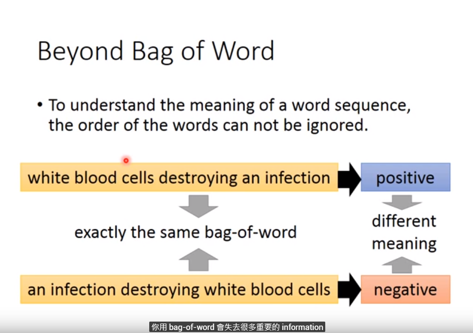

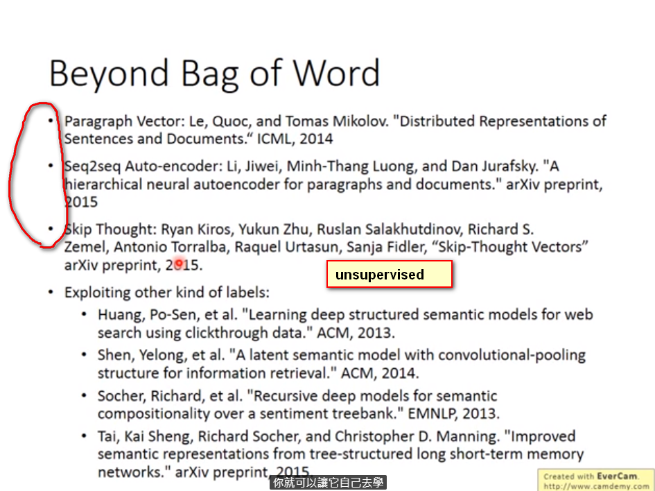
