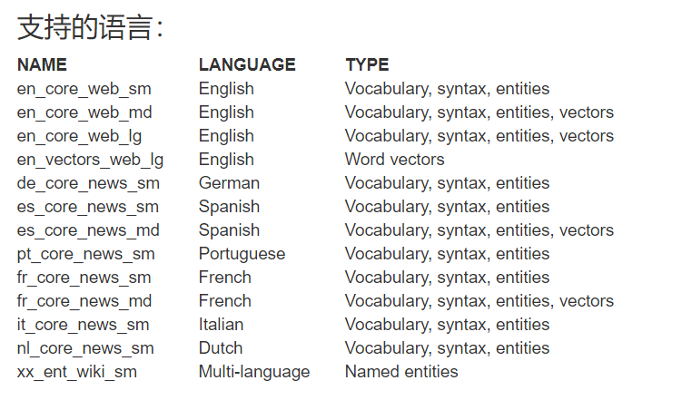

# NER工具

## NLTK

## spacy

### 支持的语言



### 语言模型的安装

```python
#命令行
python -m spacy download xx #xx表示上面表格中的的NAME
#pip
pip install https://github.com/explosion/spacy-models/releases/download/en_core_web_md-1.2.0/en_core_web_md-1.2.0.tar.gz
#本地文件
pip install /Users/you/en_core_web_md-1.2.0.tar.gz
```


```python
# coding=utf-8
# reference： https://towardsdatascience.com/named-entity-recognition-with-nltk-and-spacy-8c4a7d88e7da
import spacy
from spacy import displacy
from collections import Counter
import pprint
import en_core_web_sm

# nlp = spacy.load('en_core_web_sm')
nlp = en_core_web_sm.load()
text = '''
BEIJING • The seafood market in Wuhan may not be the only source of the novel coronavirus (2019-nCoV) outbreak, according to a Chinese pulmonary disease specialist. 
 Dr Huang Chaolin, vice-director of Wuhan Jinyintan Hospital, revealed in a recent interview with business magazine Caixin that there might be multiple places where the virus was first transmitted to humans. 
 Wuhan Jinyintan Hospital is one of the city's designated hospitals to admit patients infected with the new virus. 
 Dr Huang and his team re-cently published a paper in The Lancet, the world's leading general medical journal, about some early findings from the clinical data of the first 41 novel coronavirus cases. 
 The first patient, who was admitted to Dr Huang's hospital on Dec 1 last year, had no direct exposure to Wuhan's Huanan Seafood Wholesale Market, which was previously considered the source of the epidemic, and his family had no fever or respiratory symptoms, according to the paper. 
 Among the subsequent three patients who were admitted on Dec 10, two had no exposure to the seafood market. In total, only 27 of the 41 cases had exposure to the marketplace. 
 "Judging from the whole situation, the seafood market may not be the only source. (The origin of the novel coronavirus) might be multi-source," Dr Huang said. 
 But no clues about other sources have been discovered. 
 The Huanan seafood market is located in the downtown area of Wuhan city's Jianghan district, less than 1km away from the Hankou railway station in Hubei province. 
 Besides seafood, poultry and game meat were also sold in the market before it was shut down on Jan 1. 
 Experts at the Chinese Centre for Disease Control and Prevention had previously isolated the novel coronavirus successfully in the environmental samples collected from the market. Thirty-three of 585 samples from the market were found to contain the nucleic acid of the virus. 
 XINHUA'''

# doc = nlp('European authorities fined Google a record $5.1 billion on Wednesday for abusing its power in the mobile phone market and ordered the company to alter its practices')
doc = nlp(text)
pprint.pprint([(X.text, X.label_) for X in doc.ents])

pprint.pprint([(X, X.ent_iob_, X.ent_type_) for X in doc])

# 词性标注
doc = nlp(u'Apple is looking at buying U.K. startup for $1 billion')

for token in doc:
    print(token.text, token.lemma_, token.pos_, token.tag_, token.dep_,
          token.shape_, token.is_alpha, token.is_stop)
# 依存树
doc = nlp(u'Autonomous cars shift insurance liability toward manufacturers')
for token in doc:
    print(token.text, token.dep_, token.head.text, token.head.pos_,
          [child for child in token.children])

# 命名实体识别
doc = nlp(u'Apple is looking at buying U.K. startup for $1 billion')

for ent in doc.ents:
    print(ent.text, ent.start_char, ent.end_char, ent.label_)

# 标签化
for token in doc:
    print(token.text)

# displacy.serve(doc, style="ent")

# Crawl the article
from bs4 import BeautifulSoup
import requests
import re
def url_to_string(url):
    res = requests.get(url)
    html = res.text
    soup = BeautifulSoup(html, 'html5lib')
    for script in soup(["script", "style", 'aside']):
        script.extract()
    return " ".join(re.split(r'[\n\t]+', soup.get_text()))
ny_bb = url_to_string('https://www.nytimes.com/2018/08/13/us/politics/peter-strzok-fired-fbi.html?hp&action=click&pgtype=Homepage&clickSource=story-heading&module=first-column-region&region=top-news&WT.nav=top-news')
article = nlp(ny_bb)
len(article.ents)

labels = [x.label_ for x in article.ents]
Counter(labels)

items = [x.text for x in article.ents]
Counter(items).most_common(3)

sentences = [x for x in article.sents]
print(sentences[20])

displacy.render(nlp(str(sentences[20])), jupyter=True, style='ent')

displacy.render(nlp(str(sentences[20])), style='dep', jupyter = True, options = {'distance': 120})

[(x.orth_,x.pos_, x.lemma_) for x in [y
                                      for y
                                      in nlp(str(sentences[20]))
                                      if not y.is_stop and y.pos_ != 'PUNCT']]

dict([(str(x), x.label_) for x in nlp(str(sentences[20])).ents])

print([(x, x.ent_iob_, x.ent_type_) for x in sentences[20]])
```