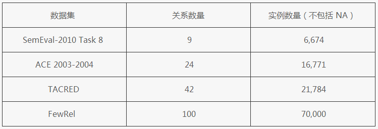

# 关系抽取数据集

## 常用的几种精标关系抽取数据集

- FewRel [github](https://github.com/thunlp/FewRel)
  
  > 以 wikipedia 作为语料库，以 wikipedia 作为知识图谱构建。由孙茂松教授领导的清华大学自然语言处理实验室发布了一个大规模精标注关系抽取数据集 FewRel。据了解，这是目前最大的精标注关系抽取数据集。该数据集包含 100 个类别、70,000 个实例，全面超越了以往的同类精标注数据集。FewRel 不仅可以应用在经典的监督/远监督关系抽取任务中，在新兴的少次学习（few-shot learning）任务上也有极大的探索价值和广阔的应用前景。相关论文《Classification Dataset with State-of-the-Art Evaluation》
- SemEval-2010 Task 8

    > SemEval(International Workshop on Semantic Evaluation) 国际语义评测大会，在会上有多个tasks，参赛人员完成相应的任务后可以投 paper 到 SemEval 2020.

    > SemEval-2010的任务8关注的是两个名词之间的语义关系。例如，茶和人参是在“从德里人参的杯子里”的一种物质来源关系中。语义关系的自动识别有许多应用，如信息提取、文档摘要、机器翻译、词汇和语义网络的构建等。它还可以促进辅助任务，如wordsense消除歧义、语言建模、语法分析和识别文本蕴涵。[来源](https://languageresources.github.io/2018/05/13/%E5%8D%A2%E6%A2%A6%E4%BE%9D_SemEval2010%20Task8%20%E5%85%B3%E7%B3%BB%E6%8A%BD%E5%8F%96%E6%95%B0%E6%8D%AE%E9%9B%86/) ， [download](http://semeval2.fbk.eu/semeval2.php?location=data)
- MUC（Message Understanding Conference) 关系抽取

    > MUC-7的五大评测任务分别是命名实体识别、共指消解、模板元素填充、模板关系确定和场景模板填充。数据语料主要来自新闻语料，限定领域为飞机失事报道和航天器发射事件报道。

- ACE 关系抽取数据集

    > MUC会议停开后，ACE将关系抽取任务作为一个子任务从2002至2007年共持续六年。关系抽取任务也被定义的更加规范和系统。其中，获得认可的一届关系抽取任务主要是ACE-2004，其数据来源于语言数据联盟（LDC），分成广播新闻和新闻专线两部分，总共包括451和文档和5702个关系实例。ACE20014提供了丰富的标注信息，从而为信息抽取中的实体识别、指代消解和关系抽取等子任务提供基准的训练和测试语料库。

- TAC-KBP 数据集：[stanford-nlp-tacred](https://nlp.stanford.edu/projects/tacred/)

    > TAC会议下的KBP评测下的ESF任务，可以视作是传统的关系抽取任务。该任务主要是抽取关于PER的25中属性和ORG的16中属性。主要是使用维基百科快照作为现有的知识库，从现有的新闻或者网络文本中获取关于实体的现有信息和更新信息，以构建知识库。

    > TACRED is a large-scale relation extraction dataset with 106,264 examples built over newswire and web text from the corpus used in the yearly TAC Knowledge Base Population (TAC KBP) challenges. Examples in TACRED cover 41 relation types as used in the TAC KBP challenges (e.g., per:schools_attended and org:members) or are labeled as no_relation if no defined relation is held. These examples are created by combining available human annotations from the TAC KBP challenges and crowdsourcing.

## 参考

- [CSDN-史上最大实体关系抽取数据集](https://blog.csdn.net/lusic01/article/details/94018455)