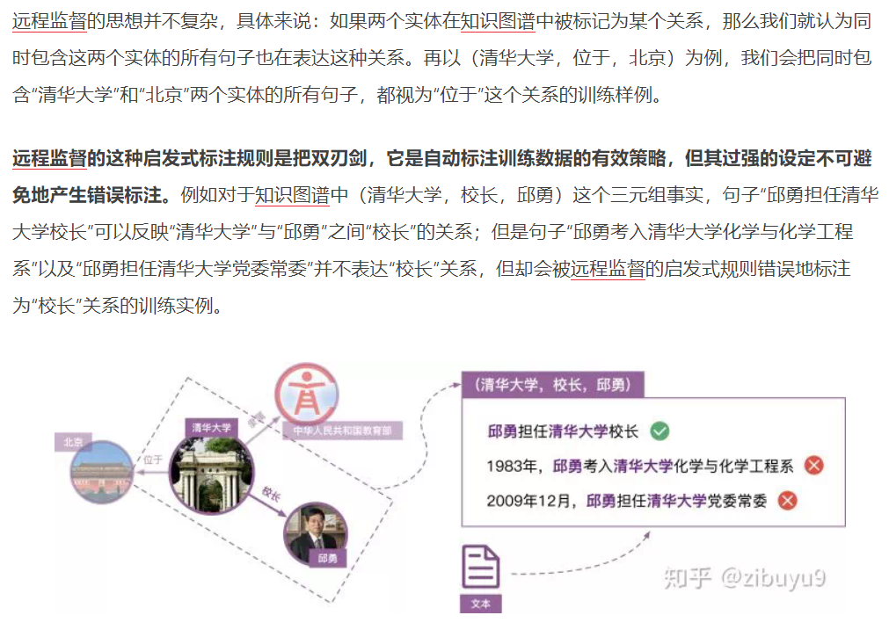
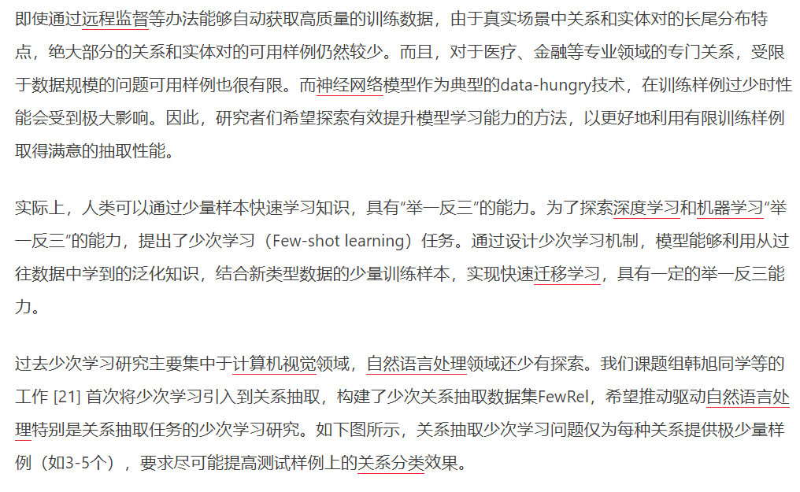

# 数据集扩展

介绍几种扩展训练数据的思想：

- 远程监督（Distant Supervision）
  > 远程监督将纯文本与现有知识图谱进行对齐，能够自动标注大规模训练数据；
  
  

- 少次学习（Few-shot learning）

  少次学习主要是针对远程监督的缺陷而设计的算法，
  

## 参考

- [知识图谱从哪里来：实体关系抽取的现状与未来](https://www.jiqizhixin.com/articles/2019-11-18-2)