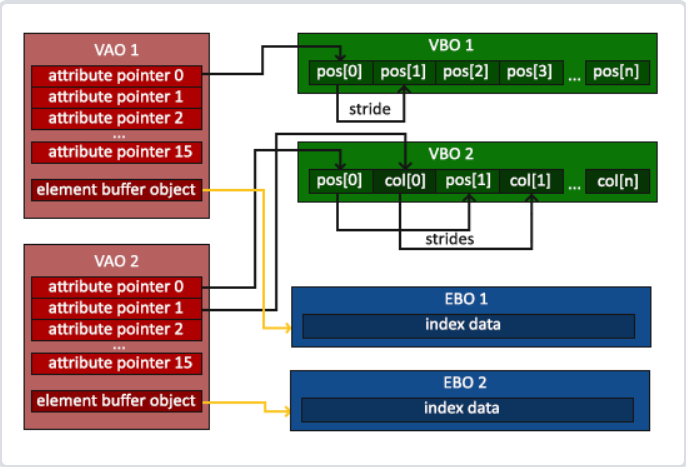

# OpenGL之数顶点数据对象

## 顶点数据的保存与解析

### `Vertex Buffer Object`

> 我们通过`顶点缓冲对象(Vertex Buffer Objects, VBO)`管理这个内存，它会在GPU内存（通常被称为显存）中储存大量顶点。使用这些缓冲对象的好处是我们可以一次性的发送一大批数据到显卡上，而不是每个顶点发送一次。从CPU把数据发送到显卡相对较慢，所以只要可能我们都要尝试尽量一次性发送尽可能多的数据。当数据发送至显卡的内存中后，顶点着色器几乎能立即访问顶点，这是个非常快的过程。

`VBO` 通过 `glVertexAttribPointer` 函数告诉 OpenGL 如何解析顶点数据，链接顶点属性供顶点着色器用作 `in`。

```c++
unsigned int VBO;
glGenBuffers(1, &VBO);
// OpenGL有很多缓冲对象类型，顶点缓冲对象类型是 GL_ARRAY_BUFFER，OpenGL允许同时绑定多个缓冲，只要他们是不同的缓冲类型
glBindBuffer(GL_ARRAY_BUFFER, VBO);
// 从这一刻起，我们使用的任何（在GL_ARRAY_BUFFER目标上的）缓冲调用都会用来配置当前绑定的缓冲(VBO)。
glBufferData(GL_ARRAY_BUFFER, sizeof(vertices), vertices, GL_STATIC_DRAW);
// GL_STATIC_DRAW ：数据不会或几乎不会改变。
// GL_DYNAMIC_DRAW：数据会被改变很多。
// GL_STREAM_DRAW ：数据每次绘制时都会改变。
```

### `Vertex Array Object`

*上述存在什么问题？*

每当我们绘制物体的时候都必须重复上述的过程，但如果当有超过5个顶点属性，上百个物体，绑定正确的缓冲对象，为每个物体配置所有顶点属性很快就变成一件麻烦事，因此考虑将这些所有状态都保存到一个对象中，状态的切换都通过这个对象进行，实现一劳永逸的效果。

> 顶点数组对象(Vertex Array Object, VAO)可以像顶点缓冲对象那样被绑定，任何随后的顶点属性调用都会储存在这个VAO中。这样的好处就是，当配置顶点属性指针时，你只需要将那些调用执行一次，之后再绘制物体的时候只需要绑定相应的VAO就行了。这使在不同顶点数据和属性配置之间切换变得非常简单，只需要绑定不同的VAO就行了

一个顶点数组对象会储存以下这些内容：
- `glEnableVertexAttribArray`和`glDisableVertexAttribArray`的调用。
- 通过`glVertexAttribPointer`设置的顶点属性配置。
- 通过`glVertexAttribPointer`调用与顶点属性关联的顶点缓冲对象。

`VAO` 的使用

```c++
unsigned int VAO;
glGenVertexArrays(1, &VAO);

// ..:: 初始化代码（只运行一次 (除非你的物体频繁改变)） :: ..
// 1. 绑定VAO
glBindVertexArray(VAO);
// 2. 把顶点数组复制到缓冲中供OpenGL使用
glBindBuffer(GL_ARRAY_BUFFER, VBO);
glBufferData(GL_ARRAY_BUFFER, sizeof(vertices), vertices, GL_STATIC_DRAW);
// 3. 设置顶点属性指针
glVertexAttribPointer(0, 3, GL_FLOAT, GL_FALSE, 3 * sizeof(float), (void*)0);
glEnableVertexAttribArray(0);

[...]

// ..:: 绘制代码（渲染循环中） :: ..
// 4. 绘制物体
glUseProgram(shaderProgram);
glBindVertexArray(VAO);
someOpenGLFunctionThatDrawsOurTriangle();
```

### `Element Buffer Object`

*还存在哪些问题？*

当使用上述三角形绘制的方法绘制一个矩形（两个三角形），需要保存这样的数据：

```c++
float vertices[] = {
    // 第一个三角形
    0.5f, 0.5f, 0.0f,   // 右上角
    0.5f, -0.5f, 0.0f,  // 右下角
    -0.5f, 0.5f, 0.0f,  // 左上角
    // 第二个三角形
    0.5f, -0.5f, 0.0f,  // 右下角
    -0.5f, -0.5f, 0.0f, // 左下角
    -0.5f, 0.5f, 0.0f   // 左上角
};
```
当模型较多时，顶点数据的大量重复绘产生大量的浪费，因此考虑使用`索引绘制（Indexed Drawing）`的解决方案。

使用方法与 `VBO` 类似：生成 `glGenBuffers`、绑定 `glBindBuffer`、复制数据 `glBufferData`、使用 `glDrawElements` 绘制。

这里我们知道与每次渲染相关的顶点数据对象有：`VBO` 和 `EBO`，既然 `VBO` 可以被 `VAO` 管理状态，同样的，`EBO` 也实现为可以被 `VAO` 管理状态。

```c++
// ..:: 初始化代码 :: ..
// 1. 绑定顶点数组对象
glBindVertexArray(VAO);
// 2. 把我们的顶点数组复制到一个顶点缓冲中，供OpenGL使用
glBindBuffer(GL_ARRAY_BUFFER, VBO);
glBufferData(GL_ARRAY_BUFFER, sizeof(vertices), vertices, GL_STATIC_DRAW);
// 3. 复制我们的索引数组到一个索引缓冲中，供OpenGL使用
glBindBuffer(GL_ELEMENT_ARRAY_BUFFER, EBO);
glBufferData(GL_ELEMENT_ARRAY_BUFFER, sizeof(indices), indices, GL_STATIC_DRAW);
// 4. 设定顶点属性指针
glVertexAttribPointer(0, 3, GL_FLOAT, GL_FALSE, 3 * sizeof(float), (void*)0);
glEnableVertexAttribArray(0);

[...]

// ..:: 绘制代码（渲染循环中） :: ..
glUseProgram(shaderProgram);
glBindVertexArray(VAO);
glDrawElements(GL_TRIANGLES, 6, GL_UNSIGNED_INT, 0)
glBindVertexArray(0);
```

### 三者关系



## 参考

- [learnOpenGL](https://learnopengl-cn.github.io/01%20Getting%20started/04%20Hello%20Triangle/)