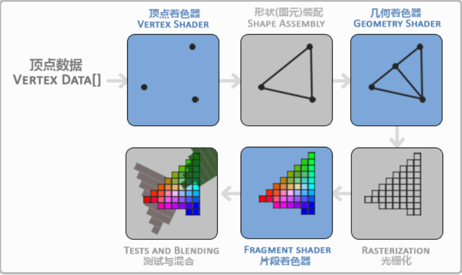

# 着色器（Shader）

>在OpenGL中，任何事物都在3D空间中，而屏幕和窗口却是2D像素数组，这导致OpenGL的大部分工作都是关于把3D坐标转变为适应你屏幕的2D像素。3D坐标转为2D坐标的处理过程是由OpenGL的图形渲染管线（Graphics Pipeline，大多译为管线，实际上指的是一堆原始图形数据途经一个输送管道，期间经过各种变化处理最终出现在屏幕的过程）管理的。图形渲染管线可以被划分为两个主要部分：第一部分把你的3D坐标转换为2D坐标，第二部分是把2D坐标转变为实际的有颜色的像素。
>
> 图形渲染管线接受一组3D坐标，然后把它们转变为你屏幕上的有色2D像素输出。图形渲染管线可以被划分为几个阶段，每个阶段将会把前一个阶段的输出作为输入。所有这些阶段都是高度专门化的（它们都有一个特定的函数），并且很容易并行执行。正是由于它们具有并行执行的特性，当今大多数显卡都有成千上万的小处理核心，它们在GPU上为每一个（渲染管线）阶段运行各自的小程序，从而在图形渲染管线中快速处理你的数据。这些小程序叫做着色器(Shader)。

- OpenGL着色器使用的是 `OpenGL着色器语言（OpenGL Shading Language,GLSL）`

## Graphics Pipeline



- 顶点着色器（Vertex Shader）

顶点着色器主要的目的是把3D坐标转为另一种3D坐标（后面会解释），同时顶点着色器允许我们对顶点属性进行一些基本处理。

- 图元装配（Shape Assembly）

将顶点着色器输出的所有顶点作为输入（如果是GL_POINTS，那么就是一个顶点），并所有的点装配成指定图元的形状；本节例子中是一个三角形。

- 几何着色器（Geometry Shader）

几何着色器把图元形式的一系列顶点的集合作为输入，它可以通过产生新顶点构造出新的（或是其它的）图元来生成其他形状。例子中，它生成了另一个三角形。

- 光栅化（Rasterization）

这里它会把图元映射为最终屏幕上相应的像素，生成供片段着色器(Fragment Shader)使用的片段(Fragment)。在片段着色器运行之前会执行裁切(Clipping)。裁切会丢弃超出你的视图以外的所有像素，用来提升执行效率

- 片段着色器（Fragment Shader）

主要目的是计算一个像素的最终颜色，这也是所有OpenGL高级效果产生的地方。通常，片段着色器包含3D场景的数据（比如光照、阴影、光的颜色等等），这些数据可以被用来计算最终像素的颜色。

- 测试与混合（Tests and Blending）

Alpha测试和混合(Blending)阶段。该阶段主要检测片段的深度，即该像素是位于其它物体的前面还是后面，同时也会检查alpha值（即透明度）并对物体进行混合。

对于大多数场景，只需要配置顶点和片段着色器即可，几何着色器是可选的，在现代 OpenGL中你必须至少定义一个顶点着色器和一个片段着色器。

## 顶点着色器

**创建着色器的一般步骤**

```
1. 将着色器源码存入字符串
2. 创建着色器对象
3. 将源码字符串赋予着色器对象
4. 编译着色器
5. 创建着色器程序对象
6. 将编译好的着色器附加到程序对象上
7. 链接生成程序
```

## 片段着色器

## 着色器之间的数据传输

使用 `in`、`out`进行传输，GPU内部的数据传输
使用 `uniform` 可以用来在 CPU 与 GPU之间数据传输

```
#version version_number
in type in_variable_name
out type out_variable_name
uniform type uniform_name

void main() {
    // 处理输入并进行一些图像操作
    ...
    // 输出处理过的结果到输出变量
    out_variable_name = weird_stuff_we_processed;
}
```