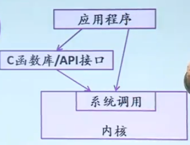
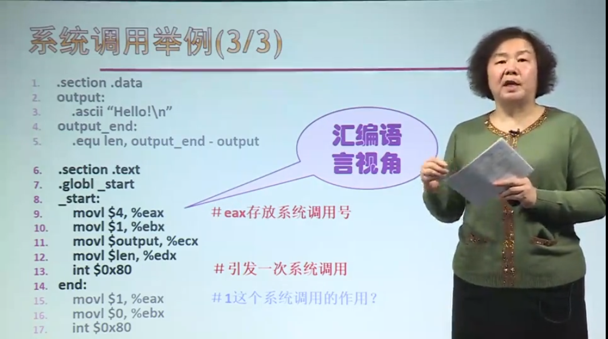
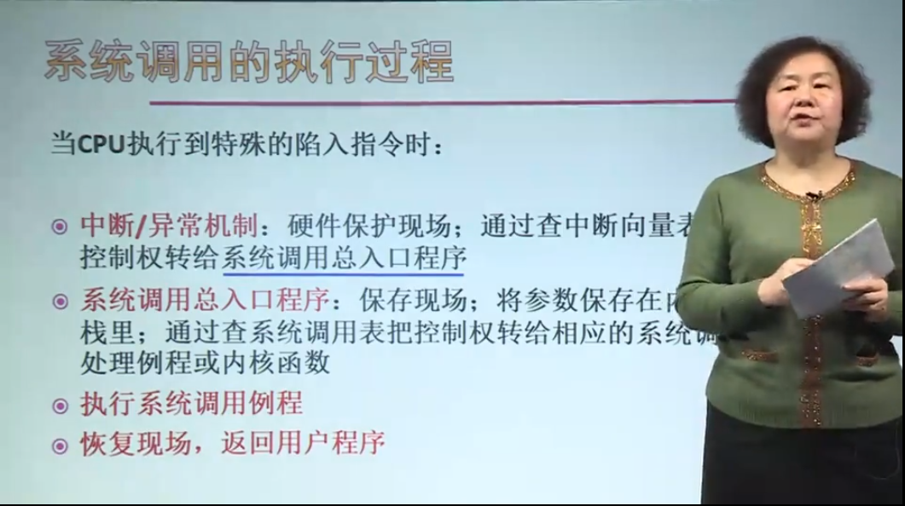
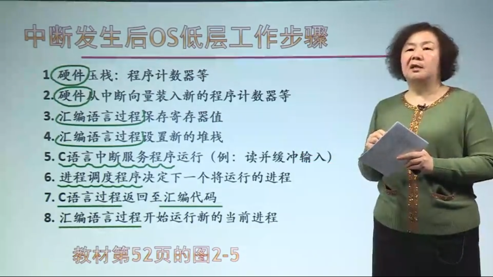

# system call（系统调用）  

## 概述 
系统调用往往是对一些内核函数的封装，函数实现在内核态，往往由C/C++编写，当涉及到对硬件进行操作时由汇编语言编写；  
系统调用在内核实现，在C/C++函数库里进行封装成API，当然用户程序也可以直接调用系统调用。  

关于系统调用，API，内核函数，库函数的关系:  

## 系统调用类别：
- 进程控制：对进程的一些操作；
- 文件管理：对文件的一些操作；
- 设备管理：对设备的一些操作；
- 信息维护：读取一些系统数据，进程信息，时间等信息；
- 通信：进程间通信的实现，如Soket。

## 系统调用的实现机制  
### 设计
1.中断/异常机制：支持系统调用服务的实现 
2.选择一条特殊指令：陷入指令（访管指令）：引发异常，用户态-->内核态切换    
3.系统调用号和参数：每个系统调用都事先给定一个编号（功能号）   
4.系统调用表：存放系统调用服务例程的入口地址   
### 参数传递问题
**用户态如何实现传递参数到内核态？**   
- 由陷入指令自带参数  
- 通过通用寄存器传递参数  
- 在内存中开辟专用堆栈区（带有共享内存的意味）
### 示例

## 系统调用的执行过程  

（图片为看mooc时截屏照片，仅供学习，侵即删）

