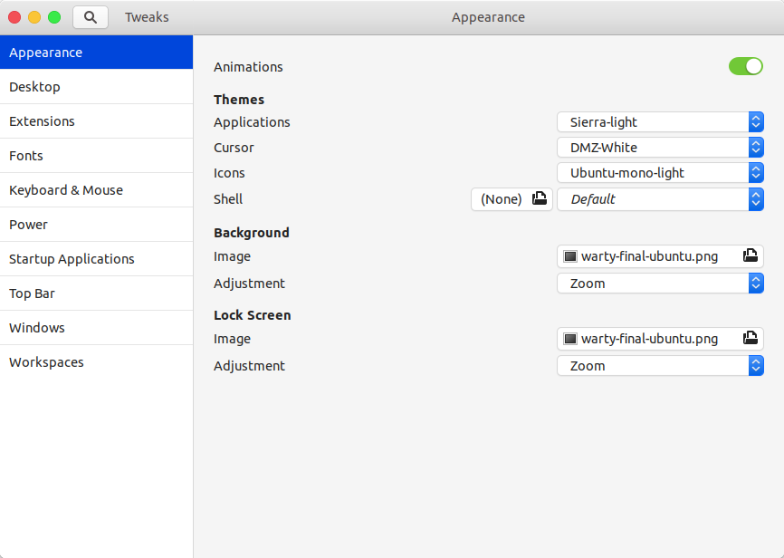
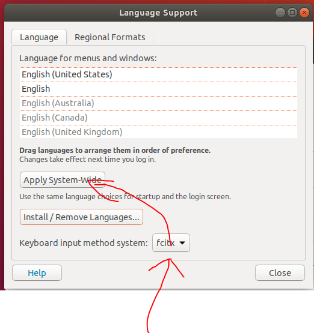

# ubuntu 18.04 简单配置

ubuntu 18.04 系统代号：bionic

## 系统安装

- 从 https://ubuntu.com/download/alternative-downloads 下载选择的系统版本（这里我选择的是 18.04）
- 使用 UtralISO 找一个空U盘制作启动盘
- 重启电脑，进入BIOS，更改启动项，安装即可

## 桌面环境

ubuntu 的桌面环境大概有：KDE，gnome，Unity三种，ubuntu 18.04 默认桌面环境为 gnome

查看当前桌面环境：`echo $XDG_CURRENT_DESKTOP`

### 工具安装

```shell
sudo apt-get update
sudo apt-get install gnome-tweak-tool   # tweak 用来管理主题和插件
sudo apt-get install gnome-shell-extensions
sudo apt-get install gnome-shell-extension-dashtodock   # dashtodock 用来管理dock
```

### 主题安装

这里参考：[ubuntu18.04美化总结](https://www.jianshu.com/p/6ef16e3b0a3e) 选用 Sierra Gtk Theme 主题进行安装

```shell
sudo add-apt-repository ppa:dyatlov-igor/sierra-theme
sudo apt update
sudo apt install sierra-gtk-theme       # point releases
```

*这里 `add-apt-repository` 都会在/etc/apt/sources.list.d/下创建一个.list文件，可以通过删除该文件来移除对应仓库的公钥链接ppa* 

### 桌面环境管理

在 tweaks 工具中，可对整个桌面环境的组件进行管理，如：主题，字体，键盘，窗口，扩展组件等



我的设置主要参考：[ubuntu18.04美化总结](https://www.jianshu.com/p/6ef16e3b0a3e)

## 输入法

- 安装 fcitix 输入框架（ubuntu默认的是ibus，比较难用）
`sudo apt install fcitix`
- 下载安装 搜狗输入法
- 在系统设置（右上角的电源选项中）-> Region & language -> 安装中文语言-> 将输入法系统设置为 fcitix


- 重启电脑，选择屏幕窗口上方的 fcitix 的键盘图标，添加 Sogou Pin 输入法即可

## 其它常用软件

- VLC media player 多媒体播放器
- sublime text 编辑器
- Chrome 浏览器
- VS code
- tilix 终端模拟器
- thunderbird 邮箱客户端
- ...

### 设置桌面启动器

ubuntu 的 dash home 中的每个图标都对应 `/usr/share/applications` 中的一个 .desktop 的配置文件

只有在 dash 中的可执行程序才可以在 dock 中 add to favorites

- `dpkg -i xxx.deb` 的方式安装，会自动建立桌面启动器对应的 .desktop 文件
- 使用 tar 包解压的方式，直接运行可执行文件，需自己手动设置启动器

```
sudo vim /usr/share/applications/xxx.desktop

# 复制以下内容，修改对应的 exec 和 icon 选项

[Desktop Entry]

Version=1.0

Name=eclipse

Exec=/PATH/TO/EXEC/FILE

Termina=false

Icon=/PATH/TO/ICON

Type=Application

Categories=Development
```

或许还需要重启下 Gnome `alt` + `F2`，`r` + `Enter`

### 磁盘挂载

一般会选择将一块大的磁盘挂载到 `/home` 目录

1. 先在其他目录下新建一个备份目录，将要挂载的盘挂载到该新建目录上
   `mount /dev/sdb1 /new`
2. 将现有目录的所有文件（包含隐含文件）复制到新建目录：
   `cp -r /home/. /new` 
   （注：删除一个目录下的所有文件，包括隐含文件：先删除非隐藏文件： rm -rf /home/\*；再删除隐藏文件： rm -rf /home/.*）
3. 将 /dev/sdb1 与 /new 目录取消挂载，可能出现 target busy 的情况
   `umount /dev/sdb1 -fl`
4. 将 /dev/sdb1 挂载到 /home
   `mount /dev/sdb1 /home`
5. 将挂载命令写到 `\etc\fstab`
   
## FAQ

### 快捷键不work

键盘快捷键的设置在 settings -> Devices -> Keyboard 中，可以在这里更改已有的快捷键或新建快捷键选项